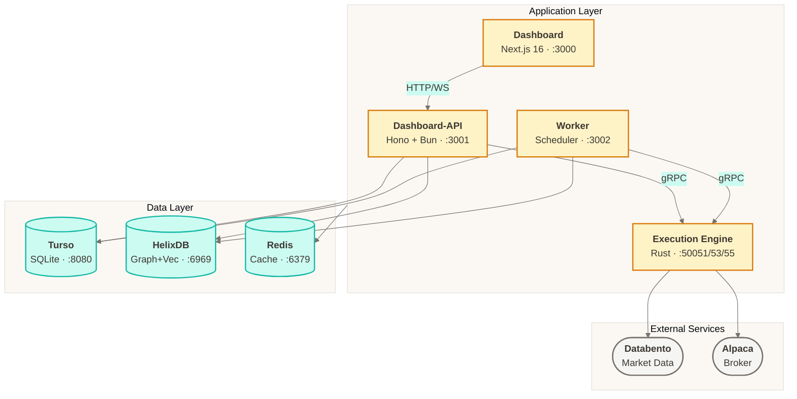
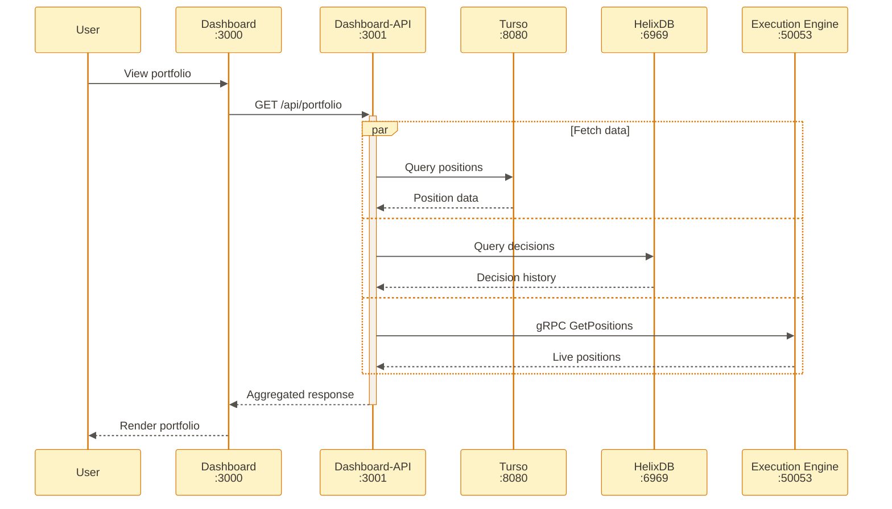
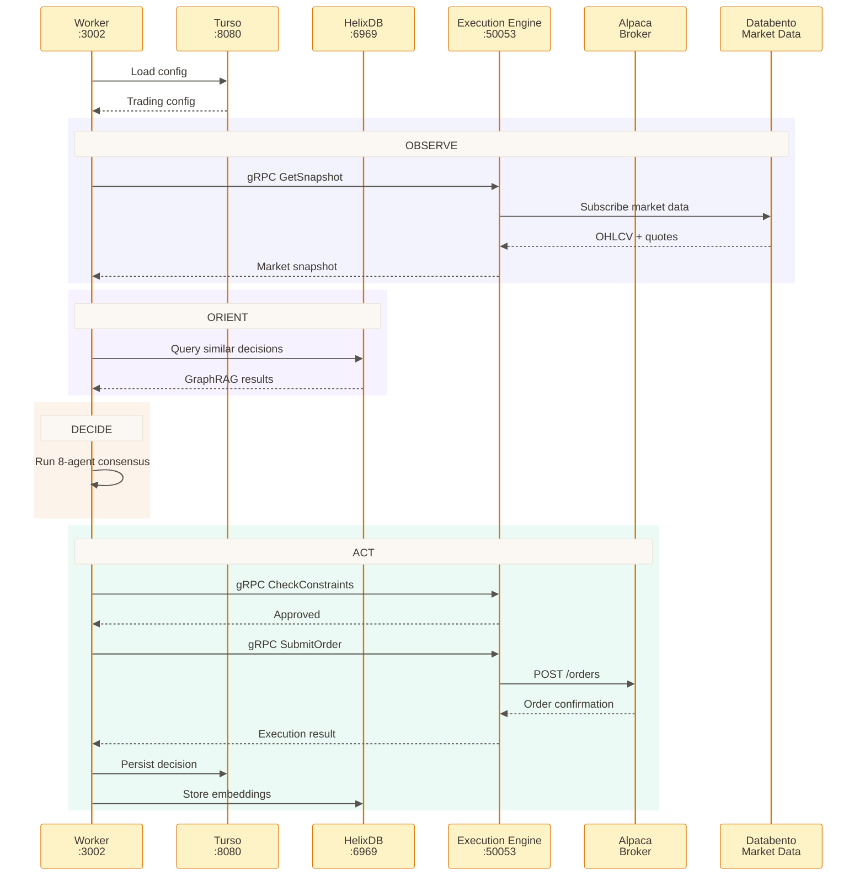
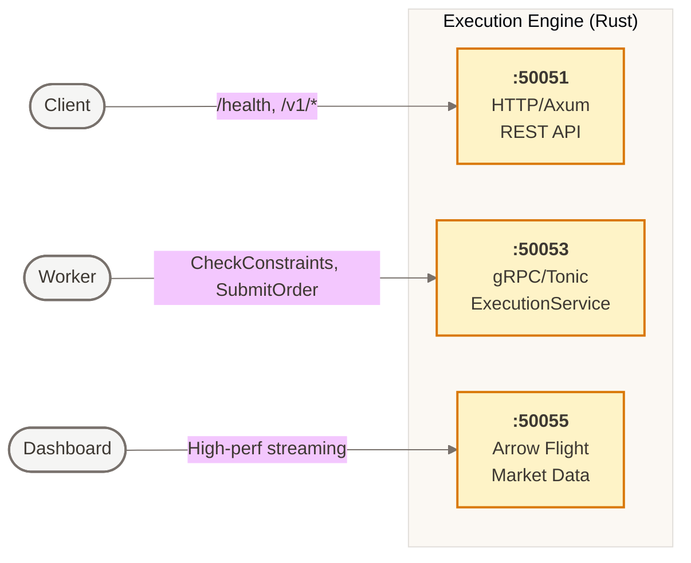
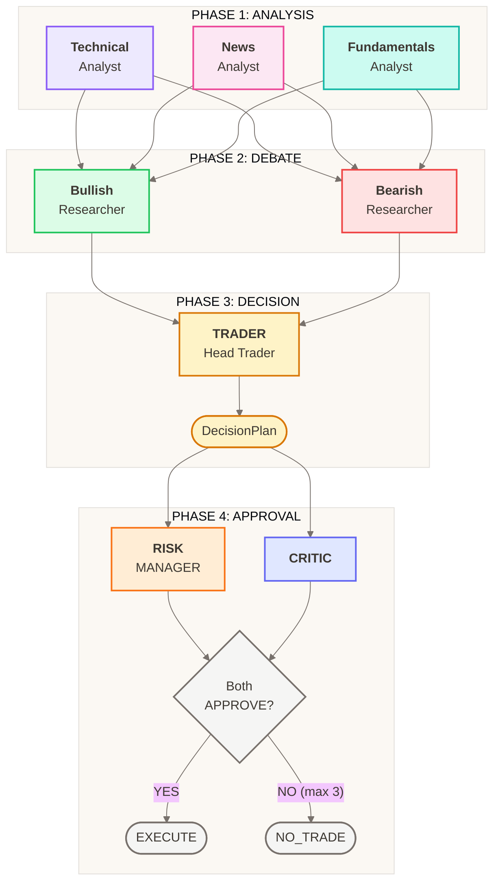
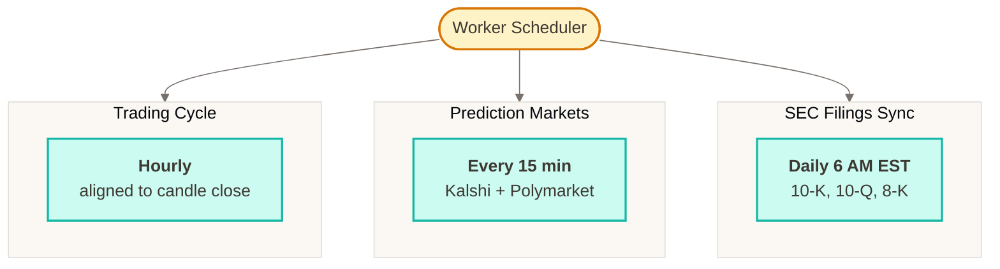
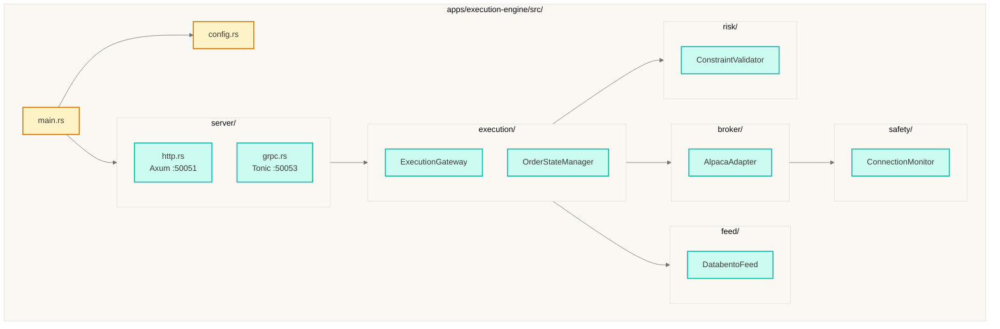
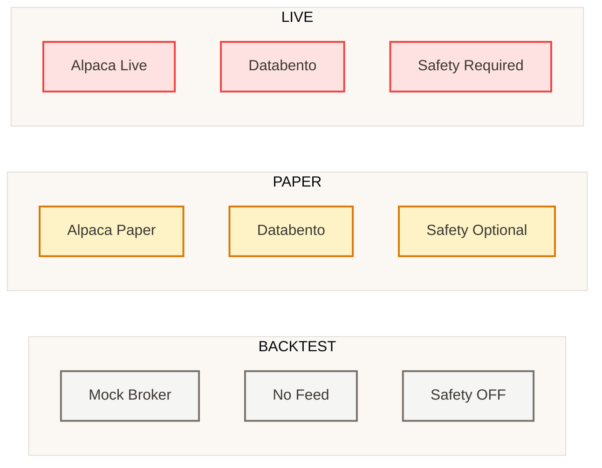

# Cream Technical Architecture

> Agentic trading system for US equities and options combining LLM reasoning with deterministic Rust execution. Runs hourly OODA loops (Observe → Orient → Decide → Act).

---

## Table of Contents

1. [System Overview](#1-system-overview)
2. [Service Architecture](#2-service-architecture)
3. [Agent Architecture](#3-agent-architecture)
4. [OODA Loop Data Flow](#4-ooda-loop-data-flow)
5. [Rust Execution Engine](#5-rust-execution-engine)

---

## 1. System Overview

Cream is a multi-language monorepo implementing an autonomous trading system:

- **8-Agent Consensus Network**: LLM agents (Gemini) analyze markets, debate positions, and reach consensus before execution
- **Deterministic Execution**: Rust engine validates decisions against risk constraints and routes orders
- **Hourly OODA Cycles**: Scheduled trading cycles with checkpoint-based recovery
- **Multi-Asset Support**: US equities and options (up to 4-leg strategies)
- **Environment Isolation**: Complete separation of BACKTEST, PAPER, and LIVE modes
- **GraphRAG Memory**: HelixDB stores trade decisions for case-based reasoning



---

## 2. Service Architecture

### Dashboard Request Flow



### Trading Cycle Flow



### Execution Engine Ports



---

## 3. Agent Architecture

### 8-Agent Consensus Network

The system implements a multi-agent debate architecture in 4 phases:



### Agent Configuration

| Agent | Model | Role |
|-------|-------|------|
| Technical Analyst | Gemini 3 Pro | Price action, indicators, key levels |
| News Analyst | Gemini 3 Pro | News impact, sentiment, event timing |
| Fundamentals Analyst | Gemini 3 Pro | Valuation, macro context, prediction markets |
| Bullish Researcher | Gemini 3 Pro | Long thesis with conviction score |
| Bearish Researcher | Gemini 3 Pro | Short thesis with conviction score |
| Trader | Gemini 3 Pro | Synthesizes all inputs, sizes positions |
| Risk Manager | Gemini 3 Flash | Constraint validation, position limits |
| Critic | Gemini 3 Flash | Logic validation, hallucination detection |

### Decision Rules

```
delta = bullish_conviction - bearish_conviction

|delta| < 0.2  → HOLD (insufficient edge)
delta > 0.3    → BUY/LONG with Kelly-inspired sizing
delta < -0.3   → SELL/SHORT or CLOSE existing

Every decision requires:
  - Stop-loss at Technical Analyst's invalidation levels
  - Risk/reward minimum 1.5:1
  - Sizing adjusted for macro events (prediction markets)
```

---

## 4. OODA Loop Data Flow

### Trading Cycle (Hourly)

```mermaid
%%{init: {'theme': 'base', 'themeVariables': { 'primaryColor': '#FEF3C7', 'primaryTextColor': '#3D3832', 'lineColor': '#78716C', 'tertiaryColor': '#FBF8F3'}}}%%
flowchart LR
    subgraph OBSERVE["OBSERVE"]
        Market[["`**Market Snapshot**
        OHLCV, quotes, options`"]]
        Context[["`**External Context**
        news, earnings, macro`"]]
    end

    subgraph ORIENT["ORIENT"]
        Memory[["`**GraphRAG**
        Retrieval`"]]
        Regimes[["`**Regime**
        Classification`"]]
        PredictionMkt[["`**Prediction**
        Markets`"]]
    end

    subgraph DECIDE["DECIDE"]
        Analysts[["`**3 Analysts**
        parallel`"]]
        Debate[["`**Bull vs Bear**
        parallel`"]]
        TraderStep[["`**Trader**
        DecisionPlan`"]]
        Consensus[["`**Risk + Critic**
        approval`"]]
    end

    subgraph ACT["ACT"]
        Constraints[["`**checkConstraints**
        gRPC → Rust`"]]
        Submit[["`**submitOrders**
        Rust → Alpaca`"]]
        Persist[["`**persistDecisions**
        Turso + HelixDB`"]]
    end

    OBSERVE --> ORIENT --> DECIDE --> ACT

    classDef observe fill:#E0E7FF,stroke:#6366F1,stroke-width:2px,color:#3D3832
    classDef orient fill:#EDE9FE,stroke:#8B5CF6,stroke-width:2px,color:#3D3832
    classDef decide fill:#FEF3C7,stroke:#D97706,stroke-width:2px,color:#3D3832
    classDef act fill:#D1FAE5,stroke:#10B981,stroke-width:2px,color:#3D3832

    class Market,Context observe
    class Memory,Regimes,PredictionMkt orient
    class Analysts,Debate,TraderStep,Consensus decide
    class Constraints,Submit,Persist act
```



### Scheduled Workflows



---

## 5. Rust Execution Engine

### Module Structure



### Environment-Based Behavior



### Constraint Checks

The execution engine validates every decision against:

- Position size limits (% of account)
- Sector concentration limits
- Options Greeks limits (portfolio delta/gamma/vega)
- PDT rule compliance
- Stop-loss requirement (every decision must have one)
