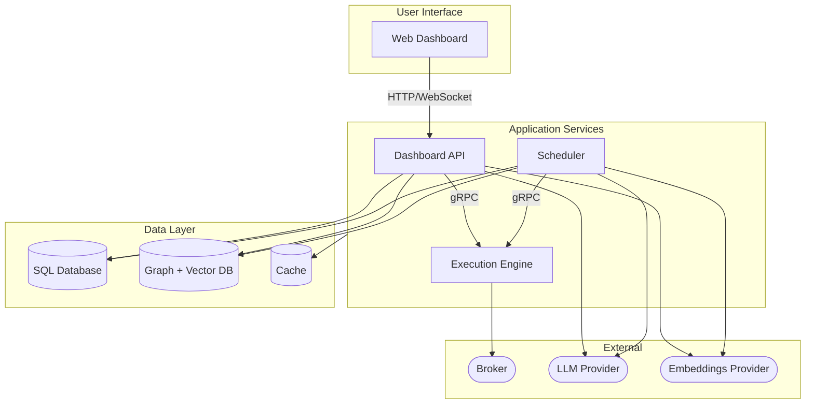
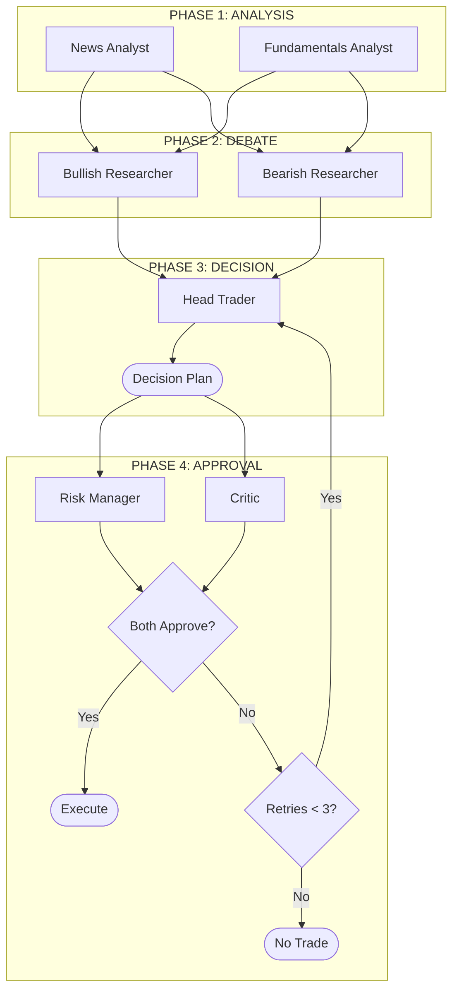
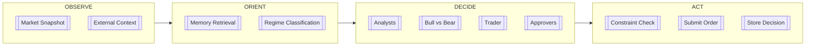
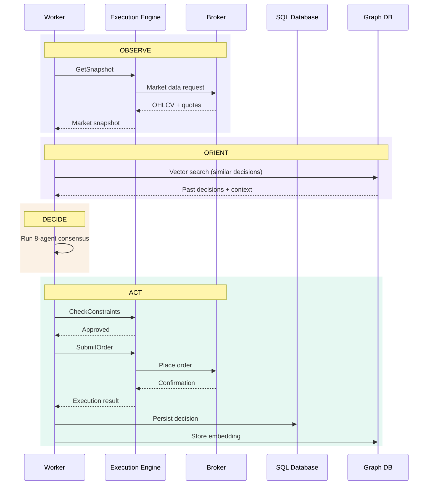
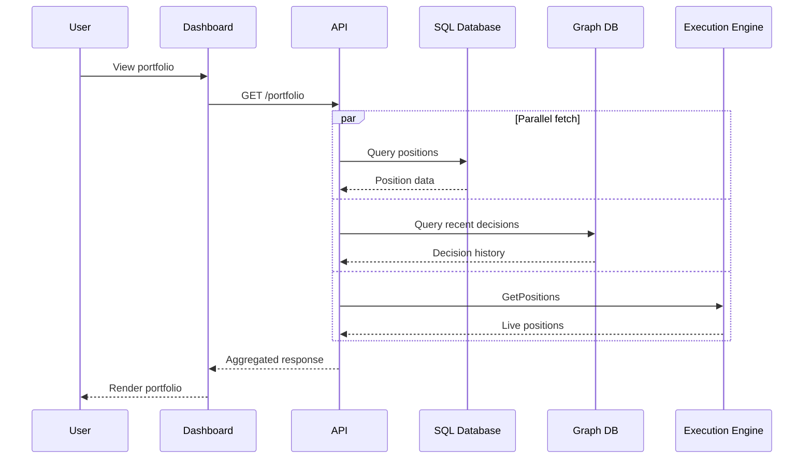
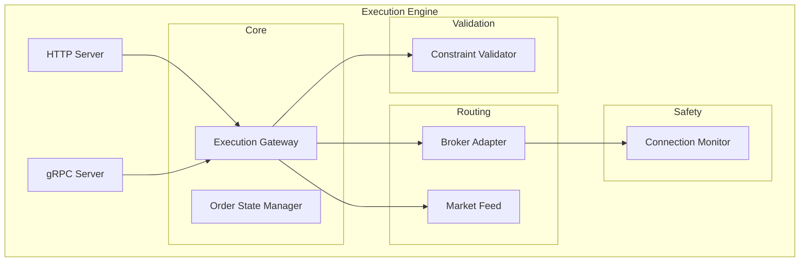
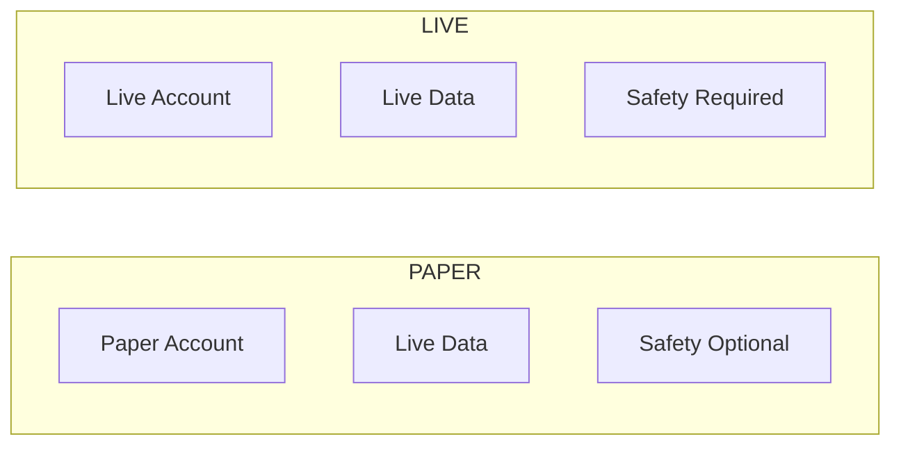
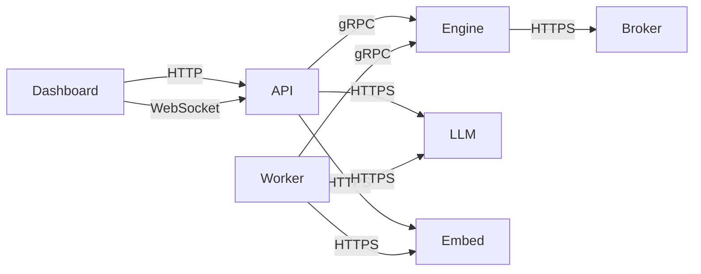

# Cream Architecture

> Agentic trading system for US equities and options. Runs hourly OODA loops (Observe → Orient → Decide → Act) with an 8-agent consensus network.

---

## System Overview

---

## Services

| Service | Role | Ports | Protocol |
|---------|------|-------|----------|
| **Dashboard** | Real-time trading UI, portfolio view, decision history | 3000 | HTTP |
| **Dashboard API** | Gateway, authentication, data aggregation | 3001 | HTTP/WebSocket |
| **API** | Agent orchestration, workflow engine | 4111 | HTTP |
| **Worker** | Hourly trading cycles, background jobs | 3002 | HTTP |
| **Execution Engine** | Order validation, risk constraints, broker routing | 50051, 50053 | HTTP, gRPC |

---

## Agent Network

The system uses an 8-agent debate architecture in 4 phases:

### Decision Rules

$$
\delta = S_{\text{bull}} - S_{\text{bear}}
$$

$$
\text{action} = \left\{ \begin{array}{lcr}
\text{HOLD} & |\delta| < & 0.2 \\
\text{BUY}  & \delta > & 0.3 \\
\text{SELL} & \delta < & -0.3
\end{array} \right.
$$

**Requirements:**
- Stop-loss at thesis invalidation price
- $\dfrac{\text{reward}}{\text{risk}} \geq 1.5$

---

## OODA Loop

### Scheduled Workflows

| Workflow | Schedule | Purpose |
|----------|----------|---------|
| Prediction Markets | Every 15 minutes | Fetch probability data |
| Trading Cycle | Hourly (aligned to candle close) | Full OODA loop execution |
| Sentiment | Hourly 9 AM - 4 PM ET (Mon-Fri) | News sentiment aggregation |
| SEC Filings | Daily 6 AM ET | Ingest 10-K, 10-Q, 8-K documents |
| Corporate Actions | Daily 6 AM ET | Dividends, splits, spinoffs |
| Short Interest | Daily 6 PM ET | FINRA short interest data |
| Indicator Synthesis | Daily 6 AM ET (Mon-Fri) | Generate new indicators via agents |

---

## Data Flow

### Trading Cycle

### Dashboard Request

---

## Execution Engine

### Constraint Checks

Every decision is validated against:

- Position size limits (% of account equity)
- Sector concentration limits
- Options Greeks limits (delta, gamma, vega)
- Pattern day trader rule compliance
- Stop-loss requirement (mandatory)
- Buying power validation

---

## Environment Isolation

| Environment | Auth Required | Real Money | Safety Checks |
|-------------|---------------|------------|---------------|
| PAPER | Yes | No | Optional |
| LIVE | Yes + MFA | Yes | Required |

---

## Storage

### SQL Database

Structured data with indexed queries:

- **decisions** - Trading decisions from OODA cycles
- **orders** - Order lifecycle tracking
- **positions** - Current open positions
- **indicators** - Technical indicators
- **runtime_config** - Active trading configuration

### Graph + Vector Database

Memory and case-based reasoning:

- **Nodes**: Decisions, Markets, Instruments, Events
- **Edges**: INFLUENCED_DECISION, SIMILAR_MARKET, CORRELATED_WITH
- **Vectors**: Decision embeddings for semantic similarity search

---

## Service Communication

| From | To | Protocol | Purpose |
|------|----|----------|---------|
| Dashboard | API | HTTP/WebSocket | UI data, real-time updates |
| API | Engine | gRPC | Position queries, account state |
| API | LLM | HTTPS | Agent streaming, direct inference |
| API | Embeddings | HTTPS | Vector generation for queries |
| Worker | Engine | gRPC | Constraint checks, order submission |
| Worker | LLM | HTTPS | Agent inference |
| Worker | Embeddings | HTTPS | Vector generation for storage |
| Engine | Broker | HTTPS | Order execution, market data |
