# Cream Architecture

> Agentic trading system for US equities and options. Combines LLM-driven reasoning with deterministic Rust execution, running hourly OODA loops (Observe → Orient → Decide → Act) with an 8-agent consensus network.

---

## System Overview

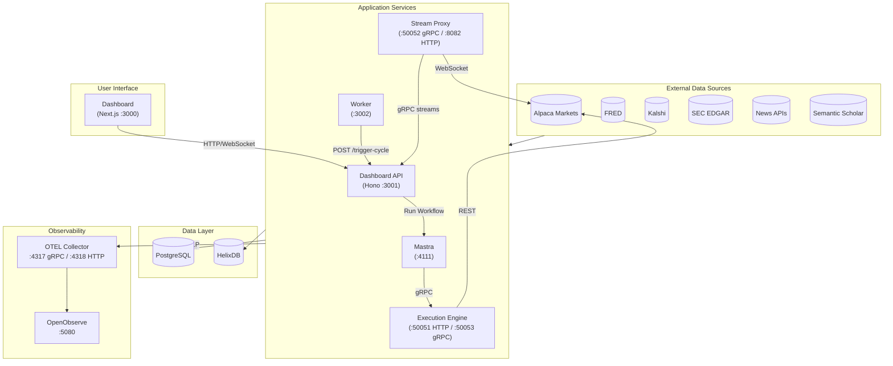

---

## Services

| Service | Role | Ports | Protocol |
|---------|------|-------|----------|
| **Dashboard** | Real-time trading UI, portfolio view, OODA cycle visualization | 3000 | HTTP |
| **Dashboard API** | Gateway, authentication (better-auth OAuth + 2FA), data aggregation | 3001 | HTTP/WebSocket |
| **Worker** | Hourly trading cycles, background data ingestion jobs | 3002 | HTTP |
| **Mastra** | Agent orchestration, OODA workflow engine (Mastra v1.0) | 4111 | HTTP |
| **Execution Engine** | Order validation, risk constraints, broker routing (Rust) | 50051 HTTP, 50053 gRPC | HTTP, gRPC |
| **Stream Proxy** | Alpaca WebSocket multiplexer, market data distribution (Rust) | 50052 gRPC, 8082 HTTP | gRPC, HTTP |

---

## Agent Network

The system uses an 8-agent debate architecture in 4 phases:

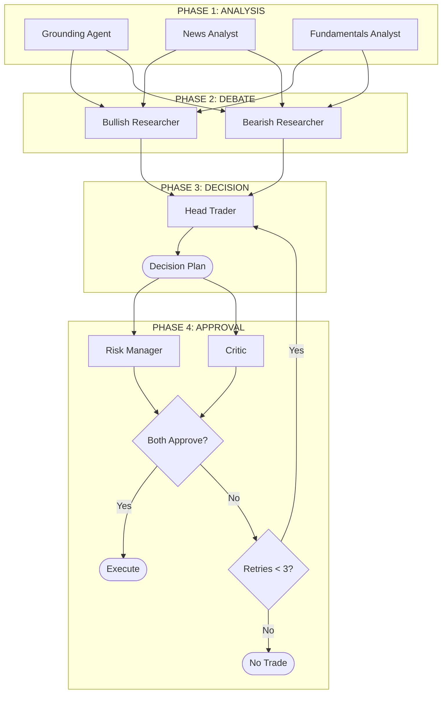

### Agent Responsibilities

| Agent | Model | Role | Key Tools |
|-------|-------|------|-----------|
| **Grounding** | xAI Grok | Real-time web/X search for market context | Live search |
| **News Analyst** | Gemini 3 Flash | Event impact assessment, sentiment analysis | `extractNewsContext`, `graphragQuery` |
| **Fundamentals** | Gemini 3 Flash | Valuation, macro context, prediction signals | `fredEconomicCalendar`, `getPredictionSignals` |
| **Bullish Researcher** | Gemini 3 Flash | Long thesis construction, IV analysis | `helixQuery`, `searchAcademicPapers` |
| **Bearish Researcher** | Gemini 3 Flash | Short thesis construction, IV analysis | `helixQuery`, `searchAcademicPapers` |
| **Trader** | Gemini 3 Flash | Decision plan synthesis, PDT compliance | `getQuotes`, `optionChain`, `getGreeks` |
| **Risk Manager** | Gemini 3 Flash | Constraint validation, position sizing | `getEnrichedPortfolioState` |
| **Critic** | Gemini 3 Flash | Logical consistency, evidence tracing | Context-driven |

### Decision Rules

| Metric | Formula |
|--------|---------|
| Conviction delta | δ = S_bull − S_bear |
| HOLD | \|δ\| < 0.2 |
| BUY | δ > 0.3 |
| SELL | δ < −0.3 |

**Requirements:**
- Stop-loss at thesis invalidation price
- Reward/risk ratio ≥ 1.5

---

## OODA Loop

```mermaid
flowchart LR
    subgraph OBSERVE
        Market[[Market Snapshot]]
        Context[[External Context]]
    end

    subgraph ORIENT
        Memory[[Memory Retrieval]]
        Regime[[Regime Classification]]
        Grounding[[Web Search]]
    end

    subgraph DECIDE
        Analysts[[Analysts]]
        Debate[[Bull vs Bear]]
        Trade[[Trader]]
        Approve[[Approvers]]
    end

    subgraph ACT
        Validate[[Constraint Check]]
        Submit[[Submit Order]]
        Persist[[Store Decision]]
    end

    OBSERVE --> ORIENT --> DECIDE --> ACT
```

### OODA Step Details

| Step | Phase | Description | Components |
|------|-------|-------------|------------|
| `observe` | Observe | Fetch quotes, candles, regime classification | Alpaca, @cream/marketdata, @cream/regime |
| `orient` | Orient | Load memory context, prediction signals | HelixDB, @cream/helix |
| `grounding` | Orient | Real-time web/X search for context | xAI Grok |
| `analysts` | Decide | Parallel news + fundamentals analysis | newsAnalyst, fundamentalsAnalyst |
| `debate` | Decide | Parallel bull/bear thesis construction | bullishResearcher, bearishResearcher |
| `trader` | Decide | Synthesize into decision plan | trader |
| `consensus` | Decide | Dual approval gate | riskManager, critic |
| `act` | Act | Submit approved orders | Execution Engine gRPC |

### Scheduled Workflows

| Workflow | Schedule | Purpose |
|----------|----------|---------|
| Trading Cycle | Hourly (aligned to candle close) | Full OODA loop execution |
| Prediction Markets | Every 15 minutes | Kalshi/Polymarket probability data |
| Sentiment | Hourly 9 AM - 4 PM ET (Mon-Fri) | News sentiment aggregation |
| SEC Filings | Daily 6 AM ET | 10-K, 10-Q, 8-K document ingestion |
| Economic Calendar | 6 AM / 6 PM ET | FRED event cache refresh |
| Short Interest | Daily 6 PM ET | FINRA short interest data |
| Corporate Actions | Daily 6 AM ET | Dividends, splits, spinoffs |

---

## Data Flow

### Trading Cycle

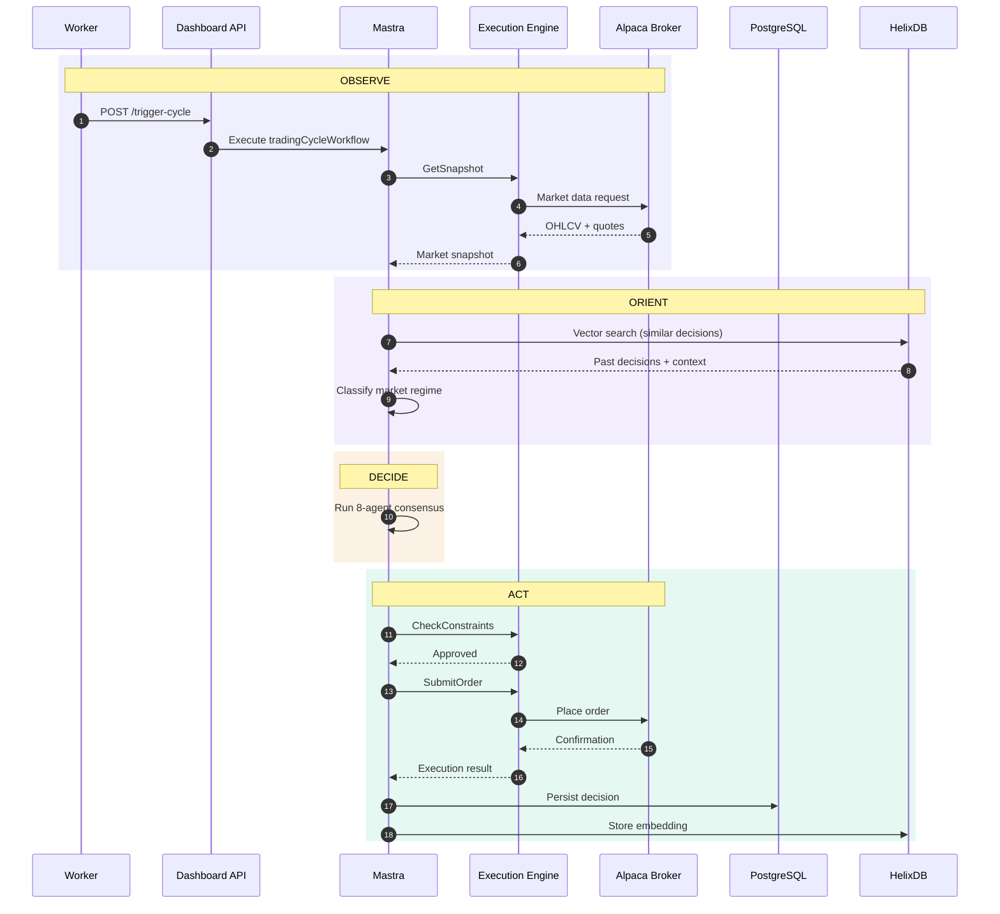

### Dashboard Request

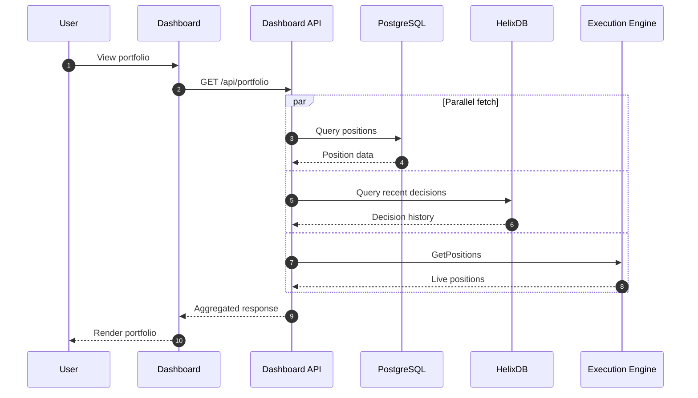

### Market Data Streaming

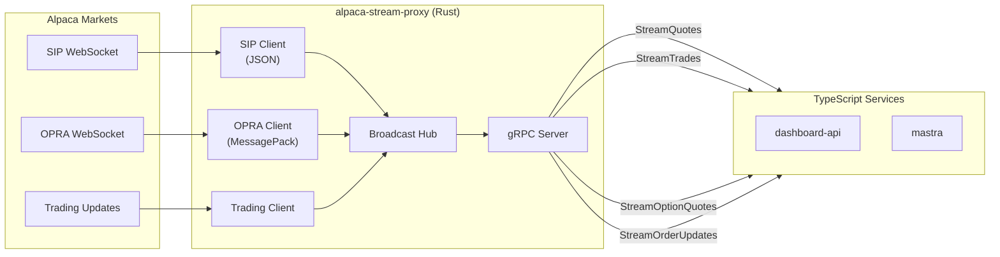

---

## Execution Engine

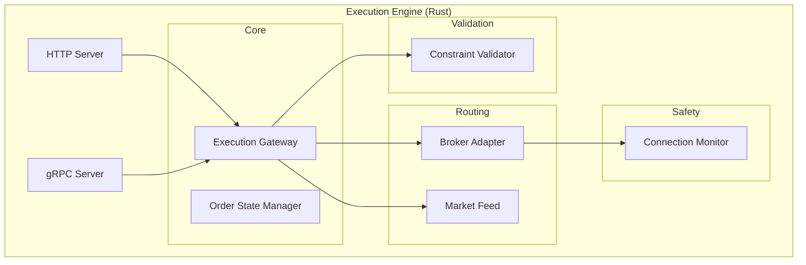

### Risk Validation Pipeline

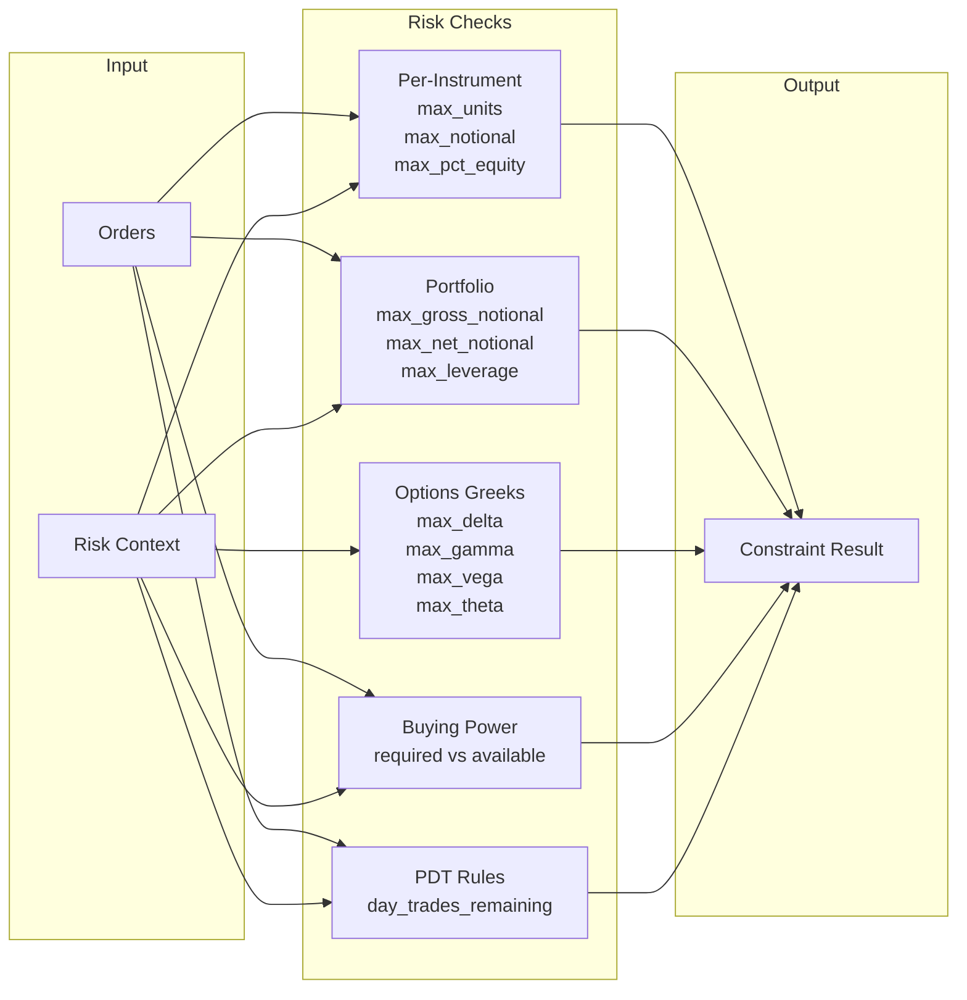

### Order State Machine

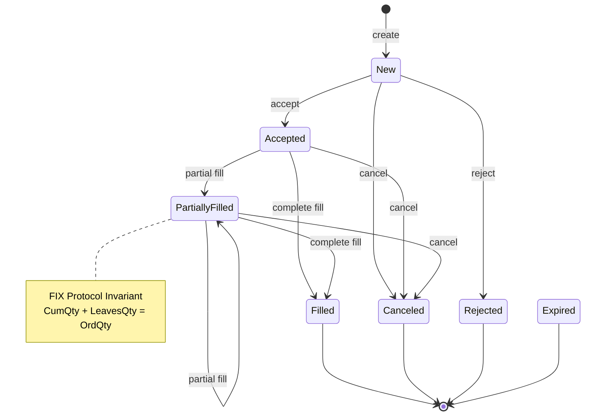

### gRPC Services

**ExecutionService (port 50053)**

| RPC | Description |
|-----|-------------|
| `CheckConstraints` | Validate DecisionPlan against risk limits |
| `SubmitOrder` | Submit single order to broker |
| `GetOrderState` | Query order by ID |
| `CancelOrder` | Request order cancellation |
| `StreamExecutions` | Real-time execution updates |
| `GetAccountState` | Account equity, buying power |
| `GetPositions` | Current positions |

**StreamProxyService (port 50052)**

| RPC | Description |
|-----|-------------|
| `StreamQuotes` | Real-time stock quotes (SIP feed) |
| `StreamTrades` | Real-time stock trades |
| `StreamBars` | Real-time OHLCV bars |
| `StreamOptionQuotes` | Real-time option quotes (OPRA feed) |
| `StreamOptionTrades` | Real-time option trades |
| `StreamOrderUpdates` | Order fill/cancel/reject events |
| `GetConnectionStatus` | Feed health and subscription counts |

---

## Environment Isolation

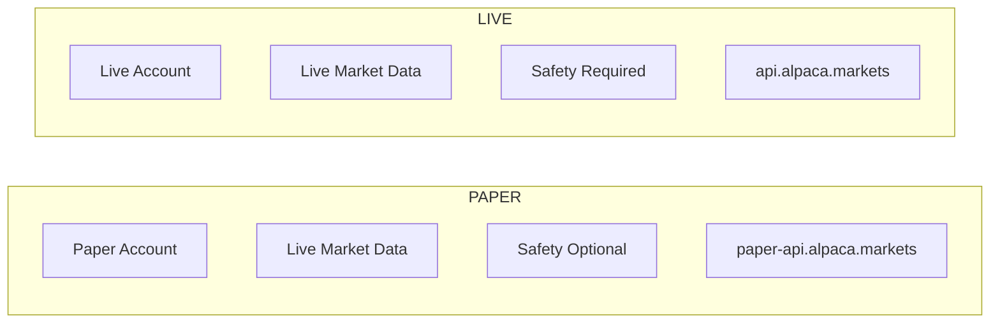

| Environment | Auth Required | Real Money | 2FA Required | Safety Checks |
|-------------|---------------|------------|--------------|---------------|
| PAPER | Yes | No | No | Optional |
| LIVE | Yes | Yes | Yes | Required |

### Safety Mechanisms

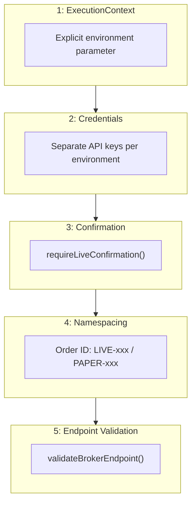

---

## Storage

### Dual Database Architecture

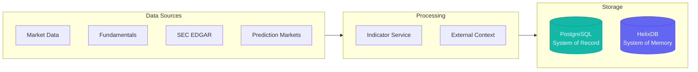

### PostgreSQL (Drizzle ORM)

Structured data with indexed queries:

| Domain | Tables |
|--------|--------|
| **Core Trading** | decisions, orders, positions, cycles, cycle_events, portfolio_snapshots |
| **Thesis** | thesis_state, thesis_state_history |
| **Configuration** | trading_config, agent_configs, universe_configs, constraints_config |
| **Auth** | user, session, account, verification, two_factor |
| **Market Data** | candles, corporate_actions, features, regime_labels |
| **Indicators** | fundamental_indicators, short_interest, sentiment, options_cache |
| **External** | prediction_market_snapshots, external_events, filings, macro_watch |

### HelixDB (Graph + Vector)

Semantic memory and case-based reasoning:

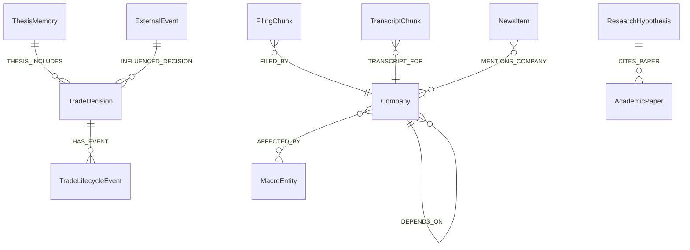

**Node Types:**
- `TradeDecision` - Trading decisions with rationale embeddings
- `ThesisMemory` - Post-hoc trade analysis with lessons learned
- `ExternalEvent` - Discrete market events
- `FilingChunk` / `TranscriptChunk` - Document chunks from SEC filings
- `NewsItem` - News articles with sentiment
- `Company` / `MacroEntity` - Domain entities
- `ResearchHypothesis` / `AcademicPaper` - Research knowledge base

---

## Service Communication

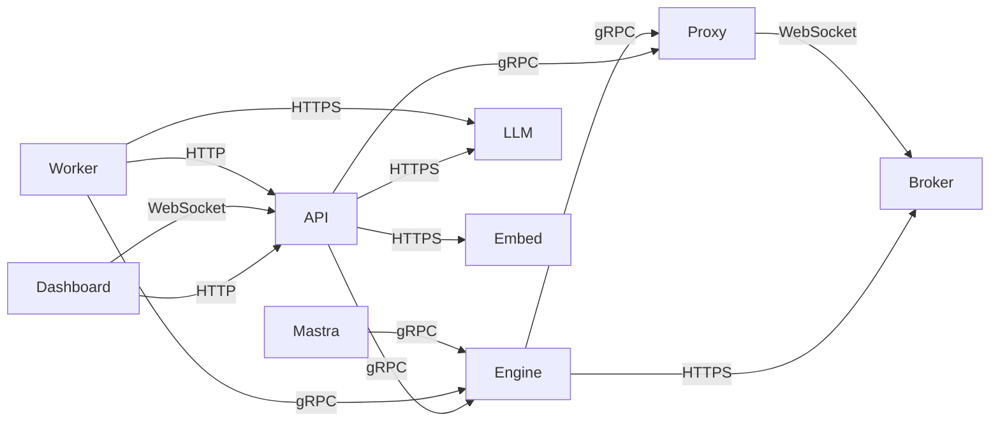

| From | To | Protocol | Purpose |
|------|----|----------|---------|
| Dashboard | Dashboard API | HTTP/WebSocket | UI data, real-time updates |
| Dashboard API | Execution Engine | gRPC | Position queries, account state |
| Dashboard API | Stream Proxy | gRPC | Market data streaming (quotes, trades, bars) |
| Dashboard API | LLM | HTTPS | Agent streaming, direct inference |
| Dashboard API | Embeddings | HTTPS | Vector generation for queries |
| Worker | Dashboard API | HTTP | Cycle triggers |
| Worker | Execution Engine | gRPC | Constraint checks, order submission |
| Mastra | Execution Engine | gRPC | Order execution after consensus |
| Execution Engine | Alpaca | HTTPS | Order execution |
| Execution Engine | Stream Proxy | gRPC | Market data for position monitoring |
| Stream Proxy | Alpaca | WebSocket | Single upstream connection |

---

## Observability

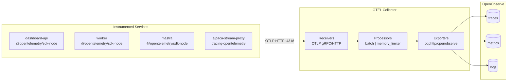

### Telemetry Data

| Type | Content |
|------|---------|
| **Traces** | Agent runs, LLM generations, tool calls, workflow transitions |
| **Metrics** | WebSocket connections, message throughput, cache hit rates |
| **Logs** | Structured pino logs with automatic redaction |

---

## Technical Indicators

60+ indicators across 8 categories computed by `@cream/indicators`:

| Category | Update Frequency | Key Indicators |
|----------|-----------------|----------------|
| **Price** | Real-time | RSI, ATR, SMA, EMA, MACD, Bollinger, Stochastic |
| **Liquidity** | Real-time | Bid-ask spread, VWAP, Amihud illiquidity |
| **Options** | Real-time | IV skew, Put/Call ratio, VRP, Greeks |
| **Value** | Nightly | P/E, P/B, EV/EBITDA, Earnings yield |
| **Quality** | Nightly | ROE, ROA, Beneish M-Score |
| **Short Interest** | Bi-weekly | Days to cover, Short % float |
| **Sentiment** | Hourly | Sentiment score, News volume |
| **Corporate** | Daily | Dividend yield, Ex-div days |

---

## Market Regime Classification

Five regimes inform position sizing and strategy selection:

| Regime | Characteristics | Trading Implications |
|--------|-----------------|---------------------|
| `BULL_TREND` | Fast MA > Slow MA, sustained upward momentum | Favor long positions, trend-following |
| `BEAR_TREND` | Fast MA < Slow MA, sustained downward momentum | Reduce exposure, defensive positioning |
| `RANGE` | MAs converged, low-normal volatility | Mean-reversion strategies |
| `HIGH_VOL` | ATR >80th percentile | Reduce sizes, wider stops |
| `LOW_VOL` | ATR <20th percentile | Breakout setups |

---

## Technology Stack

| Layer | Technology |
|-------|------------|
| TypeScript Runtime | Bun |
| Rust | Edition 2024 |
| Databases | PostgreSQL (Drizzle ORM), HelixDB |
| Serialization | Protobuf (Buf CLI) + Zod |
| Monorepo | Turborepo |
| Linting | Biome, Clippy |
| Infrastructure | OpenTofu, Hetzner |
| Observability | OpenTelemetry, OpenObserve |
| Frontend | Next.js 16, React 19, TanStack Query 5, Zustand 5 |
| API Framework | Hono |
| Authentication | better-auth (OAuth + 2FA) |
| Agent Framework | Mastra v1.0 |
