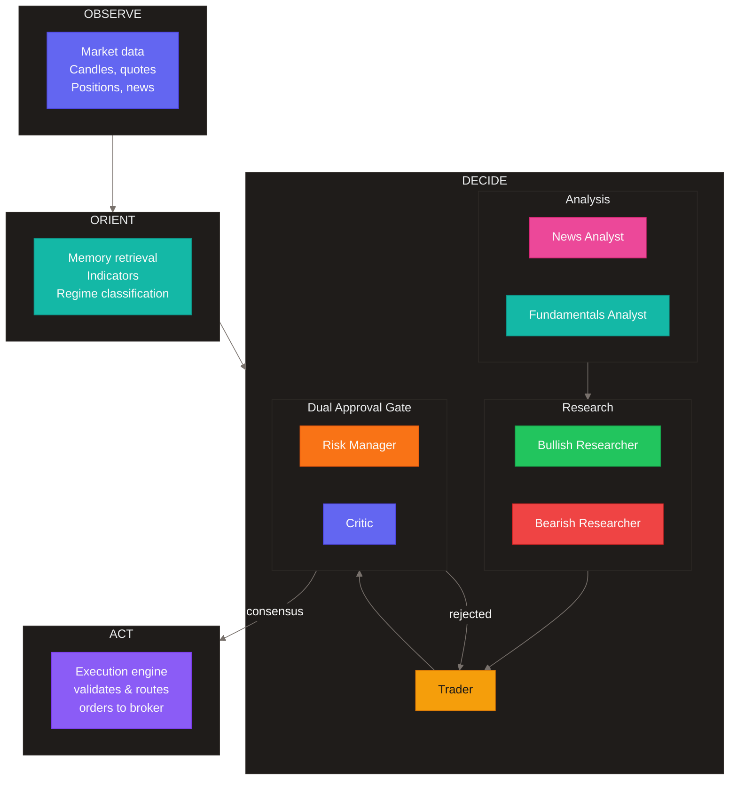
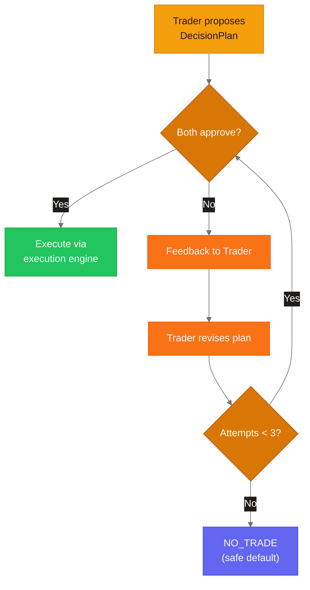
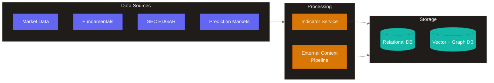

# Cream

Cream is an agentic trading system for US equities and options. It combines LLM-driven reasoning with deterministic execution, running hourly decision cycles that synthesize market data, sentiment, fundamentals, and technical analysis into structured trading decisions.

---

## The OODA Loop

Every hour, Cream runs a complete decision cycle based on the military OODA framework (Observe → Orient → Decide → Act). This isn't just a metaphor — the system literally implements each phase as a distinct workflow step.



### Observe

The system gathers a comprehensive market snapshot:

- **Price data** — 1-hour candles with 120-bar lookback, current quotes with bid/ask spreads
- **Technical indicators** — RSI, SMA, EMA, ATR, MACD, Bollinger Bands, Stochastic oscillators
- **Options data** — Implied volatility, Greeks, put/call ratios
- **External context** — Breaking news, earnings announcements, SEC filings, macro events

Data flows in from market data providers, fundamentals APIs, FRED macro indicators, and SEC EDGAR filings.

### Orient

Raw data becomes decision context:

- **Memory retrieval** — GraphRAG searches for similar past decisions and their outcomes
- **Regime classification** — Is this a bull trend, bear trend, range-bound, or volatile market?
- **Prediction signals** — Prediction market contracts provide market-implied probabilities
- **Thesis state** — Current positions, entry prices, unrealized P&L

Every agent receives this enriched context, ensuring no information silos.

### Decide

This is where the 8-agent consensus network operates. Agents run in a structured sequence:

**Analysis Stage** (parallel)
- **News Analyst** extracts events, scores sentiment, assesses market impact
- **Fundamentals Analyst** evaluates valuations, macro conditions, and guidance

**Research Stage** (parallel)
- **Bullish Researcher** builds the strongest case for going long
- **Bearish Researcher** builds the strongest case for going short, with counterarguments

**Decision Stage** (sequential)
- **Trader** synthesizes all inputs into a structured DecisionPlan with specific actions, position sizes, stop-losses, and profit targets

**Approval Stage** (parallel)
- **Risk Manager** validates against position limits, leverage constraints, and margin requirements
- **Critic** checks for logical consistency, hallucinations, and missing justifications

### The Consensus Gate

No trade executes without dual approval. Both the Risk Manager and Critic must approve, or the Trader revises the plan based on their feedback. After three revision attempts, the system defaults to NO_TRADE — a safe fallback that prevents rogue decisions.



### Act

Approved orders flow to the execution engine:

1. **Final validation** — One last constraint check before submission
2. **Order routing** — Sent to the broker (live/paper)
3. **State persistence** — Decision records stored with embeddings for future retrieval
4. **Monitoring** — Stop-loss and take-profit enforcement, mass cancel on disconnect

---

## The Agent Network

Each agent is a specialized reasoner powered by an LLM. They share a common toolkit of 30+ functions but apply different analytical lenses.

**What agents can do:**
- Query market data (quotes, candles, option chains)
- Calculate technical indicators on demand
- Search SEC filings and earnings transcripts
- Run semantic searches across news and documents
- Check portfolio state and thesis progress
- Access prediction market probabilities

The key insight is that agents don't just analyze — they debate. The Bullish and Bearish Researchers construct opposing cases, and the Trader must synthesize these into a coherent decision that accounts for both perspectives.

---

## Memory and Learning

Cream uses a combined graph and vector database as its memory system.

**Vector search** finds similar past decisions based on market conditions. If today's setup resembles a pattern from three months ago, the system retrieves what it decided then and what happened.

**Graph traversal** follows relationships: Decision → Events → Outcomes. This enables case-based reasoning: "In similar conditions, what strategies worked and which failed?"

The memory layer implements a forgetting curve — recent decisions have high weight, older decisions fade unless they were particularly significant (large profit or loss).

---

## The Execution Engine

Agents propose trades; the execution engine disposes. All execution flows through a deterministic core that enforces hard constraints:

- **Financial precision** — Exact decimal arithmetic, no floating-point rounding errors
- **Crash recovery** — State snapshots enable reconciliation after unexpected shutdowns
- **Risk enforcement** — Hard limits enforced at the execution layer, not just the reasoning layer

The engine supports multiple execution tactics:
- **PASSIVE_LIMIT** — Patient limit orders
- **TWAP** — Time-weighted average price
- **VWAP** — Volume-weighted average price
- **ICEBERG** — Hidden size for large orders

The agent layer and execution layer communicate through typed schemas ensuring decisions are validated before execution.

---

## Two Operating Modes

A single environment variable (`CREAM_ENV`) switches the entire system:

| Mode | Agents | Market Data | Execution |
|------|--------|-------------|-----------|
| **PAPER** | Full LLM reasoning | Live market data | Paper orders |
| **LIVE** | Full LLM reasoning | Live market data | Real money |

The same codebase runs in both modes with identical agent reasoning.

---

## Data Architecture

Cream maintains two databases with distinct purposes:

The **relational database** handles structured data — decisions, orders, positions, configuration. It's the system of record for what happened.

The **graph + vector database** handles semantic data — document embeddings, decision context vectors, relationship graphs. It's the system of memory for why things happened.



---

## Project Structure

```
cream/
├── apps/
│   ├── api/                  # Agent orchestration server
│   ├── worker/               # Hourly scheduler
│   ├── dashboard/            # Trading dashboard
│   ├── dashboard-api/        # REST + WebSocket API
│   └── execution-engine/     # Order validation and routing
│
├── packages/
│   ├── agents/               # 8 agents, 30+ tools, consensus gate
│   ├── broker/               # Broker integration
│   ├── domain/               # Schemas, environment config
│   ├── external-context/     # News/sentiment extraction
│   ├── helix/                # Memory system client
│   ├── indicators/           # Technical indicator engine
│   ├── marketdata/           # Market data providers
│   ├── regime/               # Market regime classification
│   ├── storage/              # Data repositories
│   ├── universe/             # Trading universe resolution
│   └── ...                   # 23 packages total
```

---

## Risk Management

Risk controls operate at multiple levels:

**Per-instrument limits**
- Maximum notional value
- Maximum units (shares/contracts)
- Maximum percentage of equity

**Portfolio limits**
- Gross leverage cap
- Net leverage bounds
- Margin requirement validation

**Options risk**
- Aggregated Greeks (delta, gamma, vega, theta)
- Multi-leg strategy validation

**Circuit breakers**
- API failure backoff
- Mass cancel on disconnect
- Safe defaults on timeout
