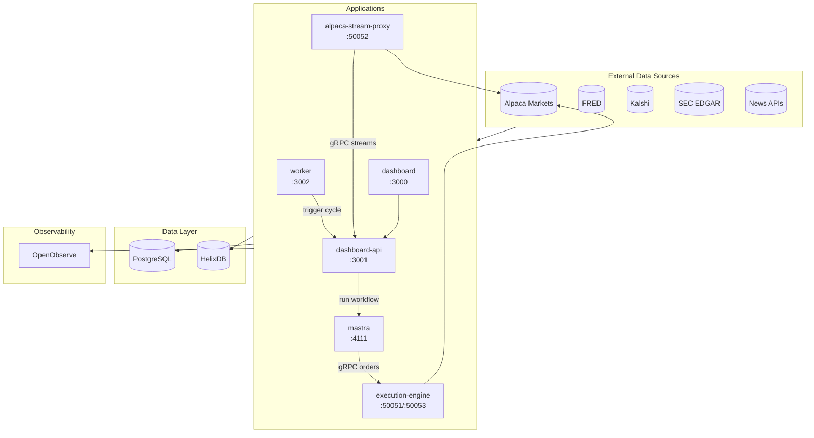
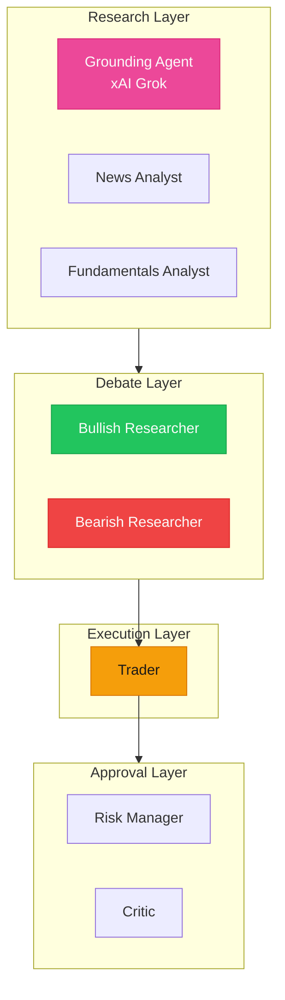
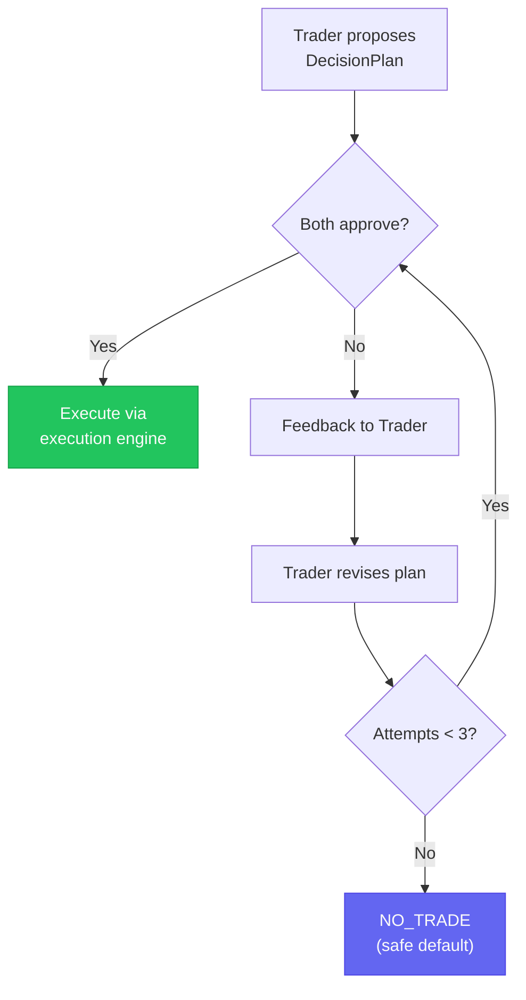
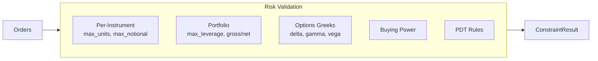
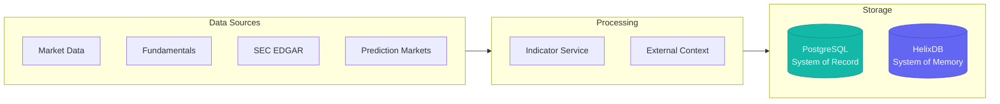

# Cream

Cream is an agentic trading system for US equities and options. It combines LLM-driven reasoning with deterministic Rust execution, running hourly decision cycles that synthesize market data, sentiment, fundamentals, and technical analysis into structured trading decisions.

---

## System Architecture



---

## The OODA Loop

Every hour during market hours, Cream runs a complete decision cycle based on the military OODA framework (Observe, Orient, Decide, Act). Each phase is implemented as distinct workflow steps with specialized agents.

```mermaid
flowchart LR
    subgraph Observe
        O1["Market Snapshot<br/>Quotes, candles, regime"]
    end

    subgraph Orient
        O2["Memory + Context<br/>HelixDB, prediction signals"]
        O3["Grounding<br/>Live web search"]
    end

    subgraph Decide
        D1["Analysts<br/>News + Fundamentals"]
        D2["Debate<br/>Bull vs Bear"]
        D3["Trader<br/>Decision Plan"]
        D4["Consensus<br/>Risk + Critic"]
    end

    subgraph Act
        A1["Execute<br/>Order routing"]
    end

    O1 --> O2 --> O3 --> D1 --> D2 --> D3 --> D4 --> A1

    style Observe fill:#6366F1,stroke:#4F46E5,color:#FAFAF9
    style Orient fill:#14B8A6,stroke:#0D9488,color:#FAFAF9
    style Decide fill:#D97706,stroke:#B45309,color:#FAFAF9
    style Act fill:#8B5CF6,stroke:#7C3AED,color:#FAFAF9
```



### The 8-Agent Network



| Agent | Role | Key Tools |
|-------|------|-----------|
| **Grounding** | Real-time web/X search | xAI Grok live search |
| **News Analyst** | Event impact assessment | `extractNewsContext`, `graphragQuery` |
| **Fundamentals** | Valuation + macro | `fredEconomicCalendar`, `getPredictionSignals` |
| **Bullish Researcher** | Long thesis construction | `helixQuery`, `searchAcademicPapers` |
| **Bearish Researcher** | Short thesis construction | `helixQuery`, `searchAcademicPapers` |
| **Trader** | Decision plan synthesis | `getQuotes`, `optionChain`, `getGreeks` |
| **Risk Manager** | Constraint validation | `getEnrichedPortfolioState` |
| **Critic** | Logical consistency | Context-driven |

### Consensus Gate

No trade executes without dual approval from both Risk Manager and Critic. After three revision attempts, the system defaults to NO_TRADE.



---

## Applications

### worker

Hourly scheduler orchestrating trading cycles and data ingestion pipelines.

| Job | Schedule | Description |
|-----|----------|-------------|
| Trading Cycle | Hourly | OODA loop via dashboard-api |
| Prediction Markets | 15 min | Kalshi/Polymarket signals |
| Filings Sync | Daily 6 AM ET | SEC EDGAR ingestion |
| Economic Calendar | 6 AM / 6 PM ET | FRED event cache |
| Short Interest | Daily 6 PM ET | FINRA data |

### dashboard-api

REST + WebSocket API server (Hono) providing real-time market data, cycle visibility, and portfolio management. Features better-auth OAuth with 2FA required for LIVE environment.

### dashboard

Next.js 16 trading dashboard with React 19, TanStack Query 5, Zustand 5. Real-time updates via WebSocket for quotes, positions, and OODA cycle progress.

### mastra

Mastra v1.0 server implementing the OODA trading loop with 9 agents and 3 workflows (trading-cycle, prediction-markets, macro-watch).

### execution-engine

Deterministic Rust execution engine for order routing and risk management. Receives DecisionPlan messages via gRPC/HTTP, validates against risk constraints, routes to Alpaca Markets.



### alpaca-stream-proxy

Rust gRPC proxy maintaining persistent WebSocket connections to Alpaca's SIP/OPRA/Trading feeds, multiplexing to downstream TypeScript services.

---

## Packages

### Core Domain

| Package | Purpose |
|---------|---------|
| **domain** | Core primitives, Zod schemas, ExecutionContext, time utilities |
| **config** | Runtime configuration, secrets management, health checks |
| **storage** | PostgreSQL + Drizzle ORM repositories |

### Trading

| Package | Purpose |
|---------|---------|
| **agents** | 8-agent network prompts, tools, configurations |
| **broker** | Alpaca Markets TypeScript client |
| **universe** | Trading universe resolution with filters |
| **indicators** | 60+ technical indicators (RSI, ATR, MACD, etc.) |
| **regime** | Market regime classification (BULL_TREND, BEAR_TREND, RANGE, HIGH_VOL, LOW_VOL) |
| **metrics** | Risk-adjusted performance (Sharpe, Sortino, Calmar) |

### Data Sources

| Package | Purpose |
|---------|---------|
| **marketdata** | Unified Alpaca market data provider |
| **external-context** | News, sentiment, fundamentals extraction |
| **filings** | SEC EDGAR ingestion (10-K, 10-Q, 8-K) |
| **prediction-markets** | Kalshi/Polymarket integration |

### Memory

| Package | Purpose |
|---------|---------|
| **helix** | HelixDB client for GraphRAG trade memory |
| **helix-schema** | HelixDB schema definitions, CBR, RRF |

### Infrastructure

| Package | Purpose |
|---------|---------|
| **proto** | Protobuf schema definitions |
| **schema-gen** | Generated TypeScript + Rust stubs |
| **infra** | OpenTofu IaC, OpenTelemetry config |
| **logger** | Structured pino logging with redaction |

### Shared

| Package | Purpose |
|---------|---------|
| **dashboard-types** | Shared frontend/backend types |
| **tsconfig** | TypeScript configurations |
| **test-utils** | Test assertion helpers |

---

## Data Architecture

Cream maintains two databases with distinct purposes:



**PostgreSQL** handles structured data: decisions, orders, positions, configuration, cycles.

**HelixDB** (graph + vector) handles semantic data: trade memories, document embeddings, thesis tracking, GraphRAG retrieval.

---

## Technology Stack

| Layer | Technology |
|-------|------------|
| TypeScript Runtime | Bun |
| Rust | Edition 2024 |
| Databases | PostgreSQL (Drizzle), HelixDB |
| Serialization | Protobuf (Buf CLI) + Zod |
| Monorepo | Turborepo |
| Linting | Biome, Clippy |
| Infrastructure | OpenTofu, Hetzner |
| Observability | OpenTelemetry, OpenObserve |

---

## Environment Switch

Single environment variable controls all behavior:

| `CREAM_ENV` | Orders | Market Data | API Endpoint |
|-------------|--------|-------------|--------------|
| `PAPER` | Simulated | Real | paper-api.alpaca.markets |
| `LIVE` | Real | Real | api.alpaca.markets |

---

## Risk Management

Risk controls operate at multiple levels:

**Per-Instrument Limits**
- Maximum notional value
- Maximum units (shares/contracts)
- Maximum percentage of equity

**Portfolio Limits**
- Gross/net leverage caps
- Margin requirement validation
- Maximum positions

**Options Risk**
- Aggregated Greeks (delta, gamma, vega, theta)
- Multi-leg strategy validation

**Circuit Breakers**
- API failure backoff
- Mass cancel on disconnect
- Safe defaults on timeout

---

## Commands

```bash
# Development
bun install                    # Install TS dependencies
cargo build --workspace        # Build Rust packages
CREAM_ENV=PAPER bun run db:push  # Sync database schema

# Testing
bun run test                   # Run all tests via Turborepo
bun run check                  # TypeScript linting & formatting
bun run lint                   # All linters (TS + Rust)
bun run typecheck              # TypeScript type checking

# Code Generation
buf generate                   # Protobuf to TS + Rust stubs
```

---

## Project Structure

```
cream/
├── apps/
│   ├── alpaca-stream-proxy/   # Rust gRPC WebSocket multiplexer
│   ├── dashboard/             # Next.js 16 trading dashboard
│   ├── dashboard-api/         # Hono REST + WebSocket API
│   ├── execution-engine/      # Rust order routing + risk
│   ├── mastra/                # Mastra agent orchestration
│   └── worker/                # Hourly scheduler
│
├── packages/
│   ├── agents/                # 8 agents, 30+ tools
│   ├── broker/                # Alpaca trading client
│   ├── config/                # Configuration + secrets
│   ├── dashboard-types/       # Shared frontend types
│   ├── domain/                # Core primitives + schemas
│   ├── external-context/      # News/sentiment extraction
│   ├── filings/               # SEC EDGAR ingestion
│   ├── helix/                 # HelixDB client
│   ├── helix-schema/          # HelixDB schema definitions
│   ├── indicators/            # Technical indicators
│   ├── infra/                 # OpenTofu + OTEL config
│   ├── logger/                # Structured logging
│   ├── marketdata/            # Market data providers
│   ├── metrics/               # Performance metrics
│   ├── prediction-markets/    # Kalshi/Polymarket
│   ├── proto/                 # Protobuf definitions
│   ├── regime/                # Market regime classification
│   ├── schema-gen/            # Generated Protobuf stubs
│   ├── storage/               # PostgreSQL repositories
│   ├── test-utils/            # Test helpers
│   ├── tsconfig/              # TypeScript configs
│   └── universe/              # Universe resolution
```
