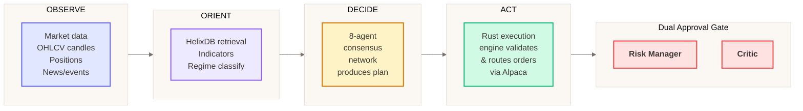
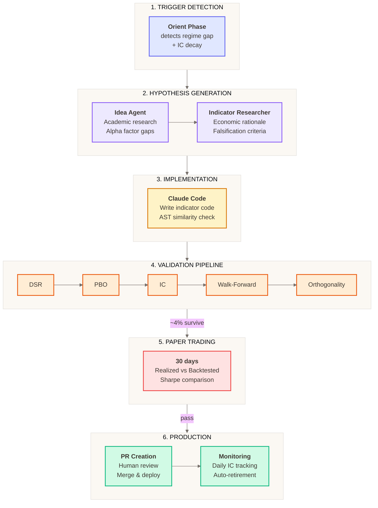
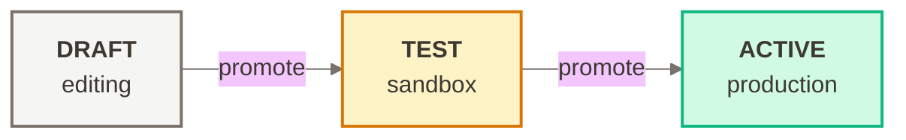
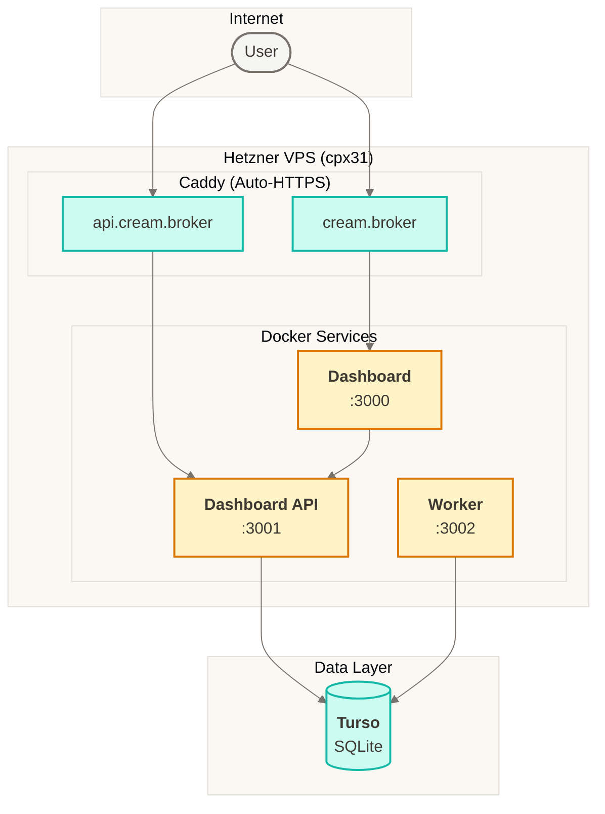

# Cream

Agentic trading system for US equities and options combining LLM-based reasoning with deterministic Rust execution. Runs hourly OODA loops (Observe → Orient → Decide → Act) through a 7-agent consensus network, plus 2 specialized agents for dynamic indicator synthesis (9 total).

## Status

**Pre-production** - Core infrastructure implemented, agents in development (Phase 4).

## Architecture Overview



### Agent Consensus Network (7 Agents)

| Phase | Agent | Role |
|-------|-------|------|
| **Analysis** (parallel) | News Analyst | Breaking news, social sentiment |
| | Fundamentals Analyst | Earnings, economic indicators, prediction markets |
| **Research** (parallel) | Bullish Researcher | Constructs strongest bull case |
| | Bearish Researcher | Constructs strongest bear case with counterarguments |
| **Decision** (sequential) | Trader | Synthesizes inputs into DecisionPlan |
| **Approval** (parallel) | Risk Manager | Validates against risk constraints |
| | Critic | Validates logical consistency, anti-hallucination |

**Consensus Rule**: Plans execute only when **both** Risk Manager and Critic approve. Up to 3 revision iterations if rejected.

### Dynamic Indicator Synthesis (2 Additional Agents)

Two specialized agents operate **outside** the trading consensus network to autonomously generate, validate, and deploy new technical indicators when existing signals fail to capture market dynamics.

| Agent | Role |
|-------|------|
| **Idea Agent** | Generates novel alpha factor hypotheses based on regime gaps and academic research |
| **Indicator Researcher** | Formulates indicator hypotheses with economic rationale and falsification criteria |



**Trigger Conditions** (all must be met):
- Regime gap detected (market phenomenon not captured)
- Rolling 30-day IC < 0.02 for 5+ days
- 30+ days since last generation attempt
- Capacity available (< 20 active indicators)

**Validation Gates** (~4% survival rate):
- **DSR** (Deflated Sharpe Ratio) - p-value > 0.95
- **PBO** (Probability of Backtest Overfitting) - < 0.50
- **IC** (Information Coefficient) - mean > 0.02, std < 0.03
- **Walk-Forward** - efficiency > 0.50
- **Orthogonality** - max correlation < 0.70, VIF < 5

**Retirement Conditions**: IC decay (< 0.01 for 30 days), signal crowding, capacity limits.

---

## Technology Stack

| Layer | Technology | Version |
|-------|------------|---------|
| **TypeScript Runtime** | Bun | 1.3+ |
| **TypeScript Compiler** | tsgo (`@typescript/native-preview`) | 7.0+ |
| **Rust** | Edition 2024 | 1.92+ |
| **Python** | uv package manager | 3.14+ |
| **Agent Orchestration** | Mastra | 1.0.0-beta.14 |
| **LLM Provider** | Google Gemini | gemini-3-pro-preview, gemini-3-flash-preview |
| **Graph + Vector DB** | HelixDB | HNSW indexing, 3072D embeddings |
| **Relational DB** | Turso (SQLite) | turso |
| **Serialization** | Protobuf (Buf CLI) + Zod v4 | - |
| **Monorepo** | Turborepo | 2.7+ |
| **Linting** | Biome (TS), Clippy (Rust), Ruff (Python) | - |

---

## Project Structure

```
cream/
├── apps/                           # Applications
│   ├── api/                        # Mastra server (agents + workflows)
│   ├── worker/                     # Hourly scheduler
│   ├── dashboard/                  # Next.js 16 trading dashboard
│   ├── dashboard-api/              # Hono REST + WebSocket API
│   └── execution-engine/           # Rust gRPC server
│
├── packages/                       # Shared libraries (23 packages)
│   ├── domain/                     # Zod schemas, environment, gRPC clients
│   ├── config/                     # Runtime config service, secrets
│   ├── schema/                     # Protobuf definitions (.proto files)
│   ├── schema-gen/                 # Generated Protobuf stubs (TS/Rust/Python)
│   ├── storage/                    # Turso client, 25+ repositories
│   ├── helix/                      # HelixDB client (vector search, GraphRAG)
│   ├── helix-schema/               # HelixDB schema, CBR, memory management
│   ├── broker/                     # Alpaca Markets integration
│   ├── marketdata/                 # Alpaca/Polygon/FMP adapters
│   ├── universe/                   # Trading universe resolution
│   ├── indicators/                 # Technical indicators (RSI, ATR, SMA)
│   ├── regime/                     # Market regime classification
│   ├── metrics/                    # Risk-adjusted performance metrics
│   ├── mastra-kit/                 # 8 agents, 30+ tools, consensus gate
│   ├── external-context/           # News/sentiment extraction pipeline
│   ├── filings/                    # SEC EDGAR filing ingestion
│   ├── prediction-markets/         # Kalshi/Polymarket integration
│   ├── dashboard-types/            # Shared dashboard/API types
│   ├── logger/                     # Pino-based structured logging
│   ├── validation/                 # Research-to-production parity
│   ├── tsconfig/                   # Shared TypeScript configs
│   ├── infra/                      # OpenTofu infrastructure
│   └── research/                   # Python backtesting (VectorBT)
```

---

## Applications

### API (`apps/api`)

Mastra orchestration server running the hourly OODA loop with 7-agent consensus (+2 for indicator synthesis).

**Port**: 4111

**Workflows**:
- Trading Cycle - 5-phase OODA loop (analysts → researchers → trader → consensus)
- Prediction Markets - 15-minute macro signal fetching

**Mode Selection**:
| Mode | Agents | Market Data | Execution |
|------|--------|-------------|-----------|
| BACKTEST | Stub (no LLM) | Fixtures | Mock |
| PAPER | Mastra + Gemini | Live | Paper orders |
| LIVE | Mastra + Gemini | Live | Real orders |

### Worker (`apps/worker`)

Scheduler triggering three workflows:

- **Trading Cycle** (~hourly) - Full OODA loop
- **Prediction Markets** (~15 min) - Kalshi/Polymarket signals
- **SEC Filings** (daily 6 AM ET) - Filing ingestion

**Port**: 3002 (health endpoint)

### Dashboard (`apps/dashboard`)

Trading control center built with Next.js 16.1, React 19, and Turbopack.

**Tech**: TanStack Query 5, Zustand, Lightweight Charts, Tailwind CSS 4, better-auth

**Port**: 3000

**Pages**: `/dashboard`, `/portfolio`, `/decisions`, `/charts/[symbol]`, `/agents`, `/config`, `/risk`, `/options`, `/backtest/[id]`

### Dashboard API (`apps/dashboard-api`)

Hono REST + WebSocket API for the dashboard.

**Port**: 3001

**Routes** (14): system, decisions, portfolio, alerts, agents, config, market, options, risk, backtests, theses, indicators, filings

**WebSocket Channels**: quote, backtest, system

**Auth**: Google OAuth via better-auth, TOTP 2FA required for LIVE

### Execution Engine (`apps/execution-engine`)

Rust gRPC server for deterministic order validation and routing.

**Ports**: 50051 (HTTP), 50053 (gRPC)

**Capabilities**:
- DecisionPlan validation against risk constraints
- Order routing to Alpaca Markets
- Position sizing (shares, contracts, dollars, % equity)
- Execution tactics (PASSIVE_LIMIT, TWAP, VWAP, ICEBERG)
- Backtest simulation with configurable fill/slippage models
- Crash recovery and reconciliation
- Options Greeks and multi-leg validation

---

## Key Packages

### Core Domain

| Package | Purpose |
|---------|---------|
| `@cream/domain` | Zod schemas, ExecutionContext, gRPC/Arrow clients |
| `@cream/config` | RuntimeConfigService, secrets, startup validation |
| `@cream/schema` | Protobuf definitions (common, decision, execution, events) |
| `@cream/schema-gen` | Generated stubs for TS, Rust, Python |
| `@cream/logger` | Pino structured logging with redaction |
| `@cream/validation` | Research-to-production parity checks |

### Data Layer

| Package | Purpose |
|---------|---------|
| `@cream/storage` | Turso client, 25+ repositories, migrations |
| `@cream/helix` | HelixDB client (vector search ~2ms, graph <1ms) |
| `@cream/helix-schema` | 10 node types, 11 edge types, CBR, forgetting |
| `@cream/marketdata` | Alpaca, Polygon, FMP, Alpha Vantage adapters |

### Trading Logic

| Package | Purpose |
|---------|---------|
| `@cream/broker` | Alpaca adapter with multi-leg options |
| `@cream/indicators` | RSI, SMA, EMA, ATR, Bollinger Bands, transforms |
| `@cream/regime` | Rule-based and GMM classification |
| `@cream/universe` | Index constituents, screeners, point-in-time |
| `@cream/metrics` | Sharpe, Sortino, Calmar, drawdown |

### Agent System

| Package | Purpose |
|---------|---------|
| `@cream/mastra-kit` | 9 agents, 30+ tools, dual-approval consensus |
| `@cream/external-context` | Claude extraction pipeline for news/sentiment |
| `@cream/filings` | SEC EDGAR ingestion (10-K, 10-Q, 8-K) |
| `@cream/prediction-markets` | Kalshi/Polymarket clients, arbitrage detection |

### Research

| Package | Purpose |
|---------|---------|
| `@cream/research` | VectorBT, NautilusTrader, model calibration |

---

## Database Architecture

### Dual Database Design

| Database | Purpose | Data |
|----------|---------|------|
| **HelixDB** | Graph + Vector | Trade memory, semantic relationships, document embeddings |
| **Turso** | Relational | Decisions, orders, positions, config, backtests |

---

## Commands

### Development

```bash
bun install                         # Install TS dependencies
cargo build --workspace             # Build Rust
uv pip install -e ".[dev]"          # Install Python (in app/package dir)
bun run dev                         # Start all services (Turborepo)
```

### Testing

```bash
bun test                            # All TS tests (CREAM_ENV=BACKTEST)
bun test packages/domain            # Single package
cargo test --workspace              # Rust tests
pytest                              # Python tests
```

### Linting & Formatting

```bash
bun run lint                        # All linters
bun run format                      # All formatters
biome check .                       # TS/JS only
cargo clippy --all-targets          # Rust only
ruff check                          # Python only
```

### Coverage

```bash
cargo cov                           # Rust → lcov.info
cargo cov-html                      # Rust → coverage/
cargo cov-check                     # Verify threshold
```

### Code Generation

```bash
buf generate                        # Protobuf → TS + Rust + Python stubs
```

### Database

```bash
bun run db:migrate                  # Run migrations
bun run db:status                   # Check status
bun run db:seed                     # Seed config
```

---

## Environment Variables

### Core

```bash
CREAM_ENV=BACKTEST                  # BACKTEST | PAPER | LIVE
```

### Databases

```bash
TURSO_DATABASE_URL=                 # Self-hosted Turso URL
HELIX_URL=http://localhost:6969    # HelixDB endpoint
```

### Market Data

```bash
POLYGON_KEY=                        # Candles and options (legacy)
FMP_KEY=                            # Fundamentals
ALPHAVANTAGE_KEY=                   # Macro indicators
```

### Broker

```bash
ALPACA_KEY=                         # Alpaca API key
ALPACA_SECRET=                      # Alpaca API secret
```

### LLM

```bash
GOOGLE_API_KEY=                     # Gemini models
ANTHROPIC_API_KEY=                  # Claude extraction
```

### Prediction Markets

```bash
KALSHI_API_KEY_ID=                  # Kalshi API key ID
KALSHI_PRIVATE_KEY_PATH=            # Path to RSA private key
```

### Authentication

```bash
GOOGLE_CLIENT_ID=                   # Google OAuth
GOOGLE_CLIENT_SECRET=               # Google OAuth
BETTER_AUTH_URL=                    # OAuth callbacks
```

### Dashboard API

```bash
PORT=3001                           # Server port
ALLOWED_ORIGINS=                    # CORS origins
```

---

## Configuration System

Runtime configuration stored in database (no YAML fallback):

### Promotion Workflow



### Config Tables

- `trading_config` - Consensus thresholds, position sizing
- `agent_configs` - Model selection, temperature, prompts
- `universe_configs` - Symbol sources, filters

---

## Testing Infrastructure

### Test Frameworks

| Language | Framework |
|----------|-----------|
| TypeScript | bun:test |
| Rust | cargo test + mockall |
| Python | pytest + pytest-asyncio |

### Coverage Tiers

| Tier | Packages | Target |
|------|----------|--------|
| Critical | execution-engine, broker, domain | 90% |
| Core | indicators, helix, schema | 80% |
| Standard | api, research | 70% |
| Agent | mastra-kit | 60% |

---

## CI/CD

### GitHub Actions

- **test.yml** - Path-based filtering, parallel jobs
- **buf-check.yml** - Proto linting, breaking changes
- **deploy.yml** - Hetzner deployment via Docker Compose

---

## Infrastructure

### Deployment (Hetzner + Vercel DNS)


