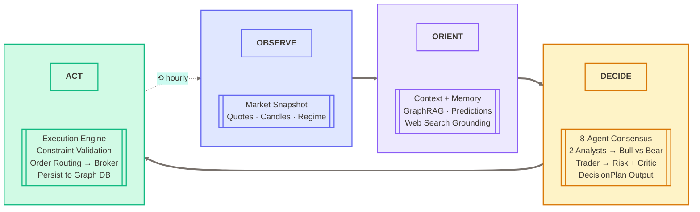

    <a href="./PROJECT.md">Project Overview</a> · <a href="./ARCHITECTURE.md">Architecture</a>

    

```mermaid
%%{init: {'theme': 'base', 'themeVariables': { 'primaryColor': '#FEF3C7', 'primaryTextColor': '#3D3832', 'primaryBorderColor': '#D97706', 'lineColor': '#78716C', 'secondaryColor': '#CCFBF1', 'tertiaryColor': '#FBF8F3'}}}%%
flowchart LR
    subgraph O1[" "]
        direction TB
        O1T["`**OBSERVE**`"]
        O1C[["`Market Snapshot
Quotes · Candles · Regime`"]]
        O1T ~~~ O1C
    end

    subgraph O2[" "]
        direction TB
        O2T["`**ORIENT**`"]
        O2C[["`Context + Memory
GraphRAG · Predictions
Web Search Grounding`"]]
        O2T ~~~ O2C
    end

    subgraph D[" "]
        direction TB
        DT["`**DECIDE**`"]
        DC[["`8-Agent Consensus
2 Analysts → Bull vs Bear
Trader → Risk + Critic
DecisionPlan Output`"]]
        DT ~~~ DC
    end

    subgraph A[" "]
        direction TB
        AT["`**ACT**`"]
        AC[["`Execution Engine
Constraint Validation
Order Routing → Broker
Persist to Graph DB`"]]
        AT ~~~ AC
    end

    O1 ==> O2 ==> D ==> A
    A -.->|⟲ hourly| O1

    classDef observe fill:#E0E7FF,stroke:#6366F1,stroke-width:2px,color:#3D3832
    classDef orient fill:#EDE9FE,stroke:#8B5CF6,stroke-width:2px,color:#3D3832
    classDef decide fill:#FEF3C7,stroke:#D97706,stroke-width:2px,color:#3D3832
    classDef act fill:#D1FAE5,stroke:#10B981,stroke-width:2px,color:#3D3832
    classDef title fill:none,stroke:none,color:#3D3832,font-weight:bold

    class O1,O1T,O1C observe
    class O2,O2T,O2C orient
    class D,DT,DC decide
    class A,AT,AC act
```
