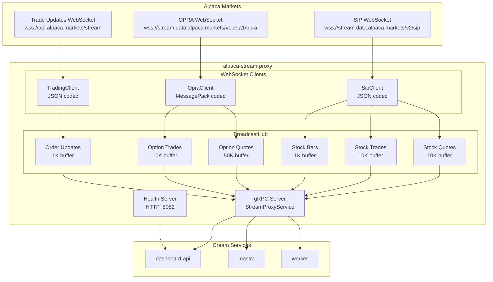
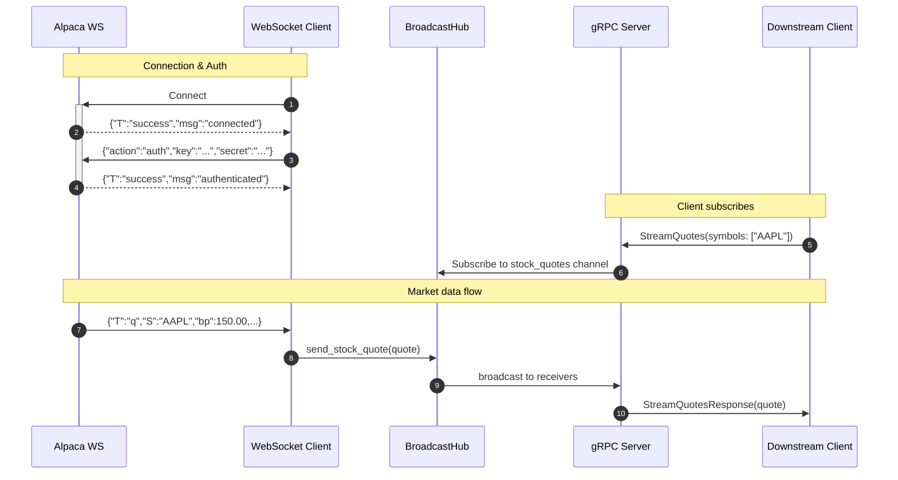
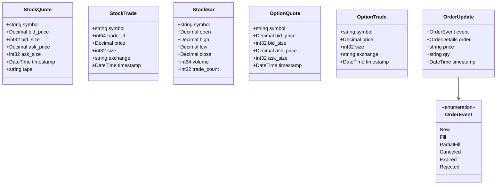
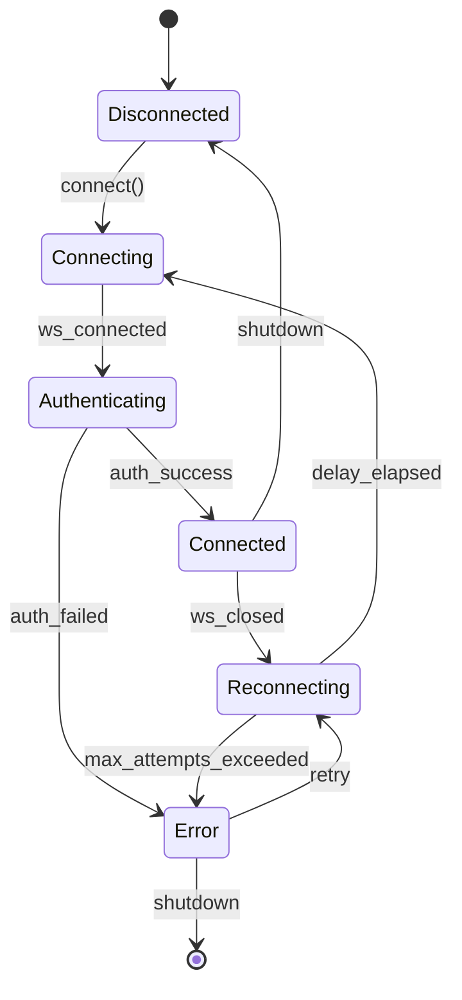
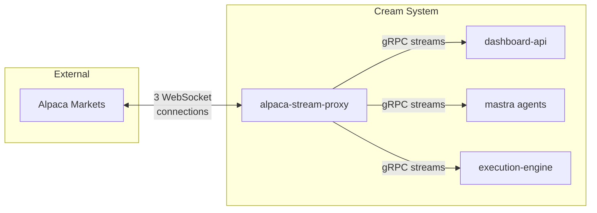

# Alpaca Stream Proxy

A Rust gRPC proxy that maintains persistent WebSocket connections to Alpaca's market data feeds and multiplexes data to multiple downstream clients. Part of the Cream agentic trading system.

## Architecture



## Data Flow



## Message Types



## Connection State Machine



## Layer Structure

```
src/
├── domain/                    # Core types, no external dependencies
│   ├── streaming/             # Market data types
│   └── subscription/          # Subscription tracking with refcounting
│
├── application/               # Use cases and port definitions
│   ├── ports/                 # Interface traits
│   └── services/              # Application services
│
└── infrastructure/            # Adapters and implementations
    ├── alpaca/                # WebSocket clients
    │   ├── sip.rs             # Stock data (JSON)
    │   ├── opra.rs            # Options data (MessagePack)
    │   ├── trading.rs         # Order updates (JSON)
    │   ├── auth.rs            # Authentication handler
    │   ├── codec.rs           # JSON/MessagePack codecs
    │   ├── heartbeat.rs       # Connection health monitoring
    │   ├── messages.rs        # Wire format types
    │   └── reconnect.rs       # Exponential backoff policy
    ├── grpc/                  # gRPC server
    │   └── server.rs          # StreamProxyService implementation
    ├── broadcast/             # Tokio broadcast channels
    ├── config/                # Configuration from env vars
    ├── health/                # HTTP health endpoints
    ├── metrics/               # Prometheus instrumentation
    └── telemetry/             # OpenTelemetry integration
```

## gRPC API

| RPC | Description | Filter Support |
|-----|-------------|----------------|
| `StreamQuotes` | Real-time stock quotes (NBBO) | By symbol |
| `StreamTrades` | Real-time stock trades | By symbol |
| `StreamBars` | Real-time minute bars | By symbol |
| `StreamOptionQuotes` | Real-time option quotes | By symbol or underlying |
| `StreamOptionTrades` | Real-time option trades | By symbol or underlying |
| `StreamOrderUpdates` | Order lifecycle events | By order ID or symbol |
| `GetConnectionStatus` | Proxy health and feed states | N/A |

Proto definition: `packages/proto/cream/v1/stream_proxy.proto`

## Configuration

### Required Environment Variables

| Variable | Description |
|----------|-------------|
| `ALPACA_KEY` | Alpaca API key |
| `ALPACA_SECRET` | Alpaca API secret |

### Optional Environment Variables

| Variable | Default | Description |
|----------|---------|-------------|
| `CREAM_ENV` | `PAPER` | `PAPER` or `LIVE` |
| `ALPACA_FEED` | `sip` | `sip` (full) or `iex` (free tier) |
| `STREAM_PROXY_GRPC_PORT` | `50052` | gRPC server port |
| `STREAM_PROXY_HEALTH_PORT` | `8082` | Health check HTTP port |
| `STREAM_PROXY_METRICS_PORT` | `9090` | Prometheus metrics port |
| `OTEL_ENABLED` | `true` | Enable OpenTelemetry tracing |
| `OTEL_EXPORTER_OTLP_ENDPOINT` | `http://localhost:4318` | OTLP collector endpoint |
| `RUST_LOG` | `info` | Log level filter |

### WebSocket Tuning

| Variable | Default | Description |
|----------|---------|-------------|
| `STREAM_PROXY_HEARTBEAT_INTERVAL_SECS` | `30` | Ping interval |
| `STREAM_PROXY_HEARTBEAT_TIMEOUT_SECS` | `60` | Pong timeout |
| `STREAM_PROXY_RECONNECT_DELAY_INITIAL_MS` | `500` | Initial backoff delay |
| `STREAM_PROXY_RECONNECT_DELAY_MAX_SECS` | `30` | Max backoff delay |
| `STREAM_PROXY_MAX_RECONNECT_ATTEMPTS` | `0` | Max retries (0 = unlimited) |

### Broadcast Channel Capacities

| Variable | Default | Description |
|----------|---------|-------------|
| `STREAM_PROXY_STOCK_QUOTES_CAPACITY` | `10000` | Stock quote buffer |
| `STREAM_PROXY_STOCK_TRADES_CAPACITY` | `10000` | Stock trade buffer |
| `STREAM_PROXY_STOCK_BARS_CAPACITY` | `1000` | Stock bar buffer |
| `STREAM_PROXY_OPTIONS_QUOTES_CAPACITY` | `50000` | Option quote buffer |
| `STREAM_PROXY_OPTIONS_TRADES_CAPACITY` | `10000` | Option trade buffer |
| `STREAM_PROXY_ORDER_UPDATES_CAPACITY` | `1000` | Order update buffer |

## Health Endpoints

| Endpoint | Purpose | Response |
|----------|---------|----------|
| `GET /health` | Detailed status | JSON with feed states, uptime, client count |
| `GET /healthz` | Kubernetes liveness | `200 OK` if process running |
| `GET /readyz` | Kubernetes readiness | `200 OK` if any feed connected |
| `GET /metrics` | Prometheus metrics | Text format metrics |

### Health Response Schema

```json
{
  "status": "healthy|degraded|unhealthy",
  "version": "0.1.0",
  "uptime_secs": 3600,
  "feeds": {
    "sip": { "state": "connected", "connected": true, "messages_received": 1234567 },
    "opra": { "state": "connected", "connected": true, "messages_received": 9876543 },
    "trading": { "state": "connected", "connected": true, "messages_received": 42 }
  },
  "subscriptions": { "broadcast_receivers": 5 }
}
```

## Alpaca Stream Protocols

### SIP (Stock Data)
- URL: `wss://stream.data.alpaca.markets/v2/{sip|iex}`
- Encoding: JSON
- Auth: `{"action":"auth","key":"...","secret":"..."}`
- Messages: Quotes (`q`), Trades (`t`), Bars (`b`), Status (`s`)

### OPRA (Options Data)
- URL (indicative): `wss://stream.data.alpaca.markets/v1beta1/indicative`
- URL (full OPRA): `wss://stream.data.alpaca.markets/v1beta1/opra`
- Encoding: MessagePack (binary)
- Auth: Same structure, MessagePack encoded
- Messages: Quotes (`q`), Trades (`t`)

### Trade Updates (Orders)
- URL (paper): `wss://paper-api.alpaca.markets/stream`
- URL (live): `wss://api.alpaca.markets/stream`
- Encoding: JSON
- Auth: `{"action":"authenticate","data":{"key_id":"...","secret_key":"..."}}`
- Listen: `{"action":"listen","data":{"streams":["trade_updates"]}}`

## Commands

```bash
# Development
cargo run                       # Start with .env from workspace root

# Testing
cargo test                      # Unit + integration tests
cargo test --test grpc_streaming  # gRPC integration tests only

# Linting & Formatting
cargo clippy --all-targets -- -D warnings
cargo fmt

# Build
cargo build --release           # Optimized binary

# Docker
docker build -t cream/alpaca-stream-proxy -f apps/alpaca-stream-proxy/Dockerfile .
docker run -p 50052:50052 -p 8082:8082 \
  -e ALPACA_KEY=... \
  -e ALPACA_SECRET=... \
  cream/alpaca-stream-proxy
```

## Metrics

Prometheus metrics exposed at `/metrics`:

| Metric | Type | Description |
|--------|------|-------------|
| `alpaca_proxy_messages_received_total` | Counter | Messages from Alpaca by feed/type |
| `alpaca_proxy_messages_sent_total` | Counter | Messages sent to gRPC clients |
| `alpaca_proxy_messages_dropped_total` | Counter | Dropped due to slow consumers |
| `alpaca_proxy_websocket_connections` | Gauge | Active WebSocket connections |
| `alpaca_proxy_grpc_clients` | Gauge | Active gRPC client streams |
| `alpaca_proxy_subscriptions_total` | Gauge | Active subscriptions by feed |
| `alpaca_proxy_websocket_errors_total` | Counter | WebSocket errors by type |
| `alpaca_proxy_reconnects_total` | Counter | Reconnection attempts by feed |
| `alpaca_proxy_message_processing_seconds` | Histogram | Processing latency |

## Integration with Cream

This proxy serves as the single point of connection to Alpaca's streaming APIs for the Cream trading system:



**Benefits of centralized proxy:**
- Single set of Alpaca credentials
- Reduced API rate limit consumption
- Consistent connection management
- Shared reconnection logic with exponential backoff
- Unified metrics and observability
