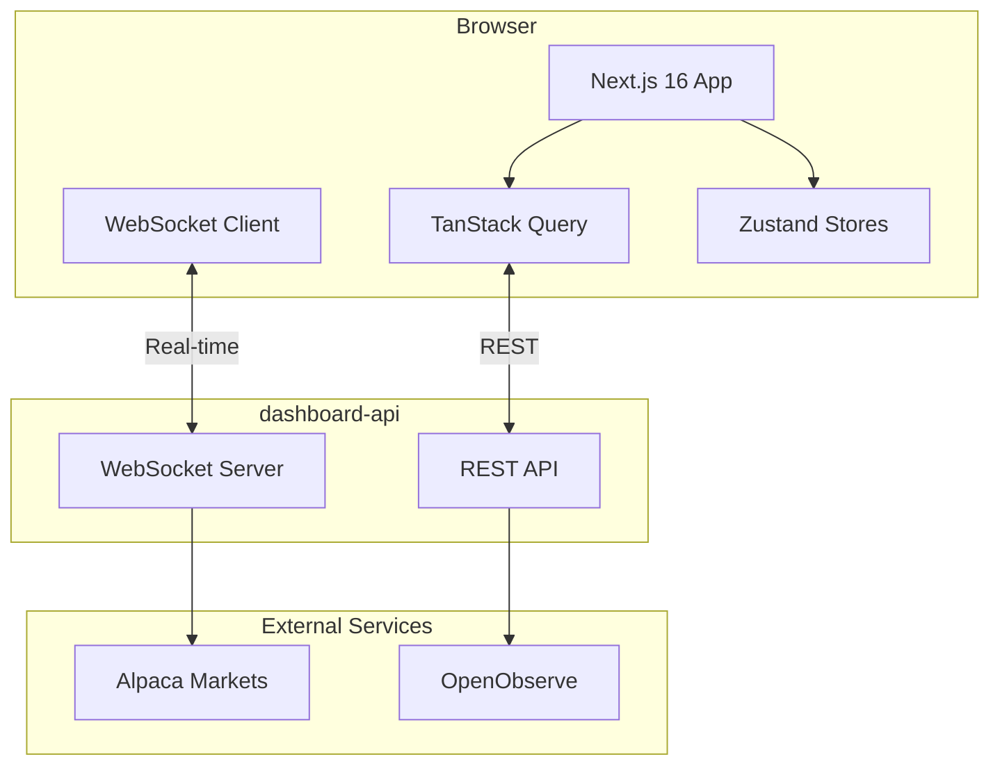
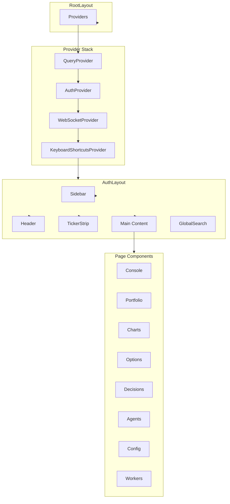
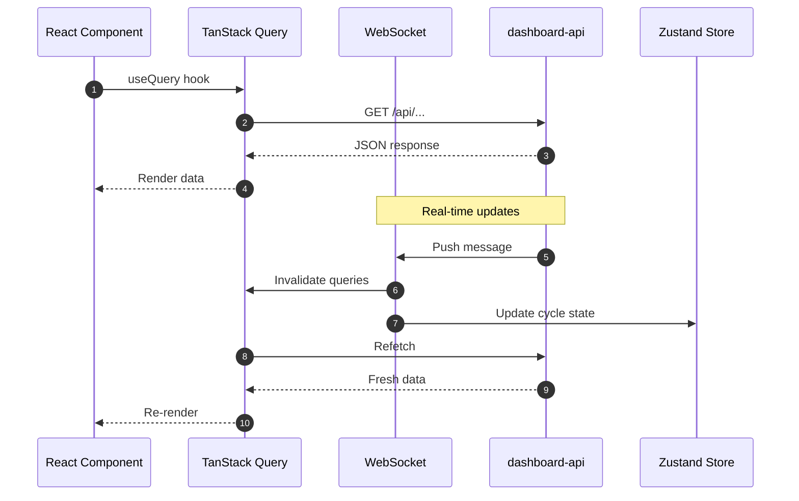
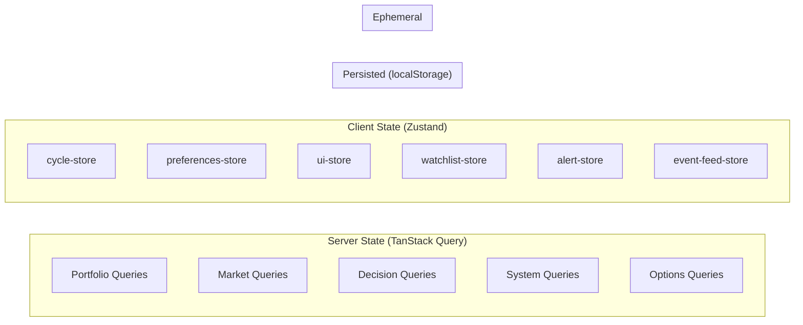

# Dashboard

Next.js 16 trading dashboard for the Cream agentic trading system. Provides real-time portfolio monitoring, OODA cycle visualization, decision management, and options trading interfaces.

## Architecture



## Tech Stack

| Layer | Technology |
|-------|------------|
| Framework | Next.js 16.1 (App Router, React Compiler, Turbopack) |
| React | 19.2 with `use` hook for params |
| State | TanStack Query 5 (server) + Zustand 5 (client) |
| Styling | Tailwind CSS 4 with design tokens |
| Charts | Lightweight Charts 5 + Recharts 3 |
| Auth | better-auth with Google OAuth + 2FA |
| Calendar | Schedule-X 4 |
| Animations | Framer Motion 12 |

## Project Structure

```
src/
├── app/
│   ├── (auth)/              # Protected routes (requires authentication)
│   │   ├── agents/          # Agent activity timeline
│   │   ├── calendar/        # Economic calendar
│   │   ├── charts/[symbol]/ # Candle charts + indicators
│   │   ├── config/          # System configuration
│   │   ├── console/         # Main dashboard (OODA cycle control)
│   │   ├── cycles/          # Cycle history + analytics
│   │   ├── decisions/       # Trading decisions timeline
│   │   ├── feed/            # Real-time event stream
│   │   ├── options/         # Options chain viewer
│   │   ├── portfolio/       # Positions + P&L
│   │   ├── risk/            # Exposure monitoring
│   │   ├── theses/          # Investment theses
│   │   └── workers/         # Background job control
│   ├── login/               # Login page
│   ├── layout.tsx           # Root layout
│   └── providers.tsx        # Client providers
├── components/
│   ├── agents/              # Agent output components
│   ├── charts/              # Chart components
│   ├── cycles/              # Cycle analytics
│   ├── dashboard/           # Dashboard widgets
│   ├── indicators/          # Technical indicator displays
│   ├── layout/              # Sidebar, NavDrawer, MobileNav
│   ├── options/             # Options chain table
│   ├── portfolio/           # Positions, equity curve
│   ├── risk/                # Greeks, exposure gauges
│   ├── ui/                  # Design system primitives
│   └── workers/             # Worker status cards
├── contexts/
│   └── AuthContext.tsx      # Authentication state
├── hooks/
│   ├── queries/             # TanStack Query hooks
│   └── use*.ts              # Custom hooks
├── lib/
│   ├── api/                 # API client + types
│   ├── feed/                # Event normalization
│   ├── hooks/               # Utility hooks
│   └── providers/           # Query provider
├── providers/
│   └── WebSocketProvider.tsx
├── stores/                  # Zustand stores
└── styles/                  # CSS tokens
```

## Component Hierarchy



## Data Flow



## State Management



### Zustand Stores

| Store | Purpose | Persisted |
|-------|---------|-----------|
| `cycle-store` | Active OODA cycle state, agent outputs | No |
| `preferences-store` | Theme, sounds, notifications, feed filters | Yes |
| `ui-store` | Sidebar collapsed state | No |
| `watchlist-store` | User's symbol watchlist | Yes |
| `alert-store` | Acknowledged alerts | Yes |
| `event-feed-store` | Event stream, new event count | No |

### Query Keys

All TanStack Query hooks use structured query keys defined in `lib/api/query-client.ts`:

```typescript
queryKeys.portfolio.positions()     // ["portfolio", "positions"]
queryKeys.market.quote("AAPL")      // ["market", "quote", "AAPL"]
queryKeys.decisions.detail(id)      // ["decisions", "detail", id]
queryKeys.options.chain("SPY", exp) // ["options", "chain", "SPY", exp]
```

## WebSocket Integration

The dashboard maintains a persistent WebSocket connection for real-time updates:

### Channels

| Channel | Data |
|---------|------|
| `system` | System status, alerts |
| `portfolio` | Position updates, account changes |
| `quotes:{symbol}` | Real-time stock quotes |
| `options:{symbol}` | Options quote updates |
| `workers` | Worker run status |

### Message Types

| Type | Handler |
|------|---------|
| `quote` | Direct cache update (no refetch) |
| `aggregate` | Append to candle data |
| `options_quote` | Update options chain cache |
| `cycle_progress` | Update cycle-store |
| `agent_output` | Stream agent reasoning |
| `order_update` | Invalidate portfolio queries |

### Reconnection

- Exponential backoff with jitter (1s to 30s)
- Automatic subscription replay on reconnect
- Visibility-aware pause/resume

## Pages Overview

### Console (`/console`)

Main operations dashboard showing:
- System status (ACTIVE/PAUSED/STOPPED)
- OODA phase grid (Observe/Orient/Decide/Act)
- Trading cycle trigger controls
- Portfolio summary
- Recent decisions
- Economic calendar widget

### Portfolio (`/portfolio`)

Position management:
- Account summary with live P&L
- Equity curve chart
- Streaming positions table
- Allocation donut chart
- Risk metrics bar
- Order history

### Charts (`/charts/[symbol]`)

Market analysis with TradingView-style charts:
- Candlestick chart with real-time updates
- Technical indicators (RSI, MACD, ATR)
- Moving averages panel
- Indicator snapshot grid

### Options (`/options/[underlying]`)

Options trading interface:
- Options chain table with Greeks
- Expiration tabs
- Position builder modal
- P/L chart visualization

### Decisions (`/decisions`)

Trading decision management:
- Timeline grouped by cycle
- Filter by action (BUY/SELL/HOLD/CLOSE)
- Filter by status (PENDING/APPROVED/EXECUTED)
- Deep link to decision detail

### Agents (`/agents`)

Agent activity visualization:
- Cycle selector dropdown
- Agent timeline with tool calls
- Reasoning block display
- Traces from OpenObserve

### Config (`/config`)

System configuration:
- Trading parameters
- Universe configuration
- Constraints (per-instrument, portfolio, options)
- Configuration history

### Workers (`/workers`)

Background job control:
- Service status cards
- Manual trigger buttons
- Recent runs table
- Real-time status via WebSocket

## Responsive Design

| Breakpoint | Layout |
|------------|--------|
| Mobile (<768px) | Bottom nav + hamburger drawer |
| Tablet (768-1023px) | Hamburger menu + overlay drawer |
| Laptop (1024-1279px) | Collapsed sidebar, expand on hover |
| Desktop (>=1280px) | Full sidebar (240px) |

## Environment Variables

| Variable | Description |
|----------|-------------|
| `NEXT_PUBLIC_CREAM_ENV` | `PAPER` or `LIVE` |
| `NEXT_PUBLIC_API_URL` | dashboard-api base URL |
| `NEXT_PUBLIC_WS_URL` | WebSocket endpoint |
| `NEXT_PUBLIC_LOGOKIT_API_KEY` | Company logo API key |

## Commands

```bash
# Development (Turbopack)
bun run dev

# Production build
bun run build

# Start production server
bun run start

# Linting
bun run lint

# Type checking
bun run typecheck

# E2E tests
bun run test:e2e
```

## Key Features

### React 19 + Next.js 16

- **React Compiler**: Automatic memoization (no manual `useMemo`/`useCallback`)
- **`use` hook**: Unwrap async params in page components
- **`useDeferredValue`**: Prevent UI flicker on symbol changes
- **Turbopack**: Sub-100ms HMR in development

### Real-time Updates

- WebSocket for live quotes, positions, cycle progress
- Direct cache updates for high-frequency data
- Debounced invalidation for burst messages
- Subscription replay on reconnect

### Theming

- Light/dark/system modes
- CSS custom properties for design tokens
- Respects `prefers-reduced-motion`
- `prefers-color-scheme` sync

### Accessibility

- Skip links for keyboard navigation
- ARIA labels on interactive elements
- Focus management in modals
- Keyboard shortcuts (Cmd+K for search)

## Integration with Cream

This dashboard connects to the larger Cream trading system:

1. **dashboard-api**: REST + WebSocket backend providing all data
2. **mastra**: Executes OODA cycles triggered from console
3. **execution-engine**: Rust gRPC server for order routing
4. **worker**: Background jobs shown in Workers page
5. **alpaca-stream-proxy**: Real-time market data via WebSocket
