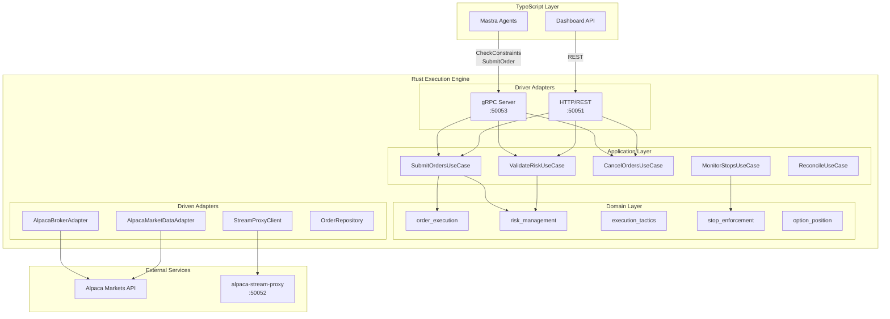
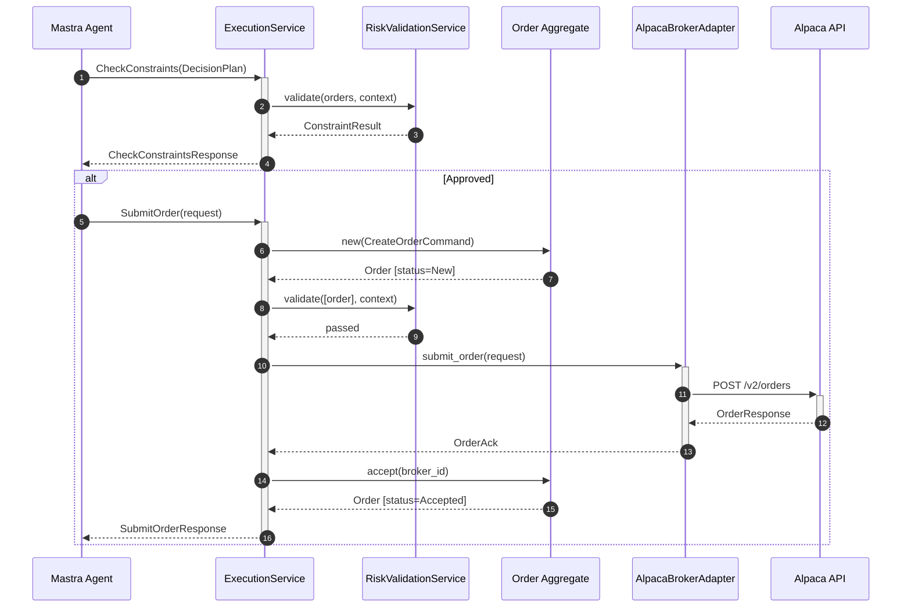
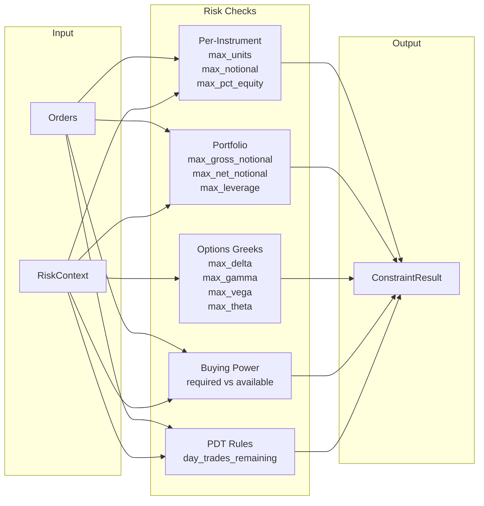
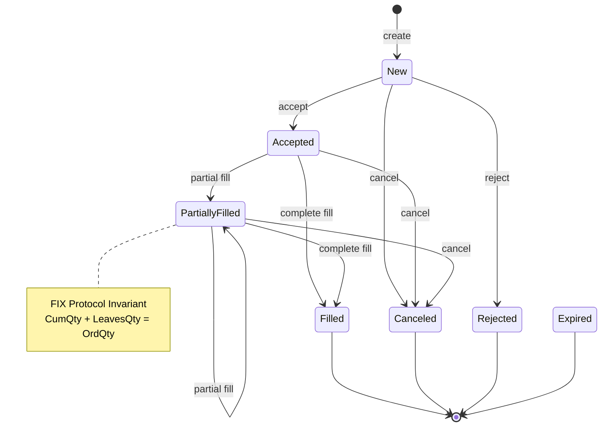
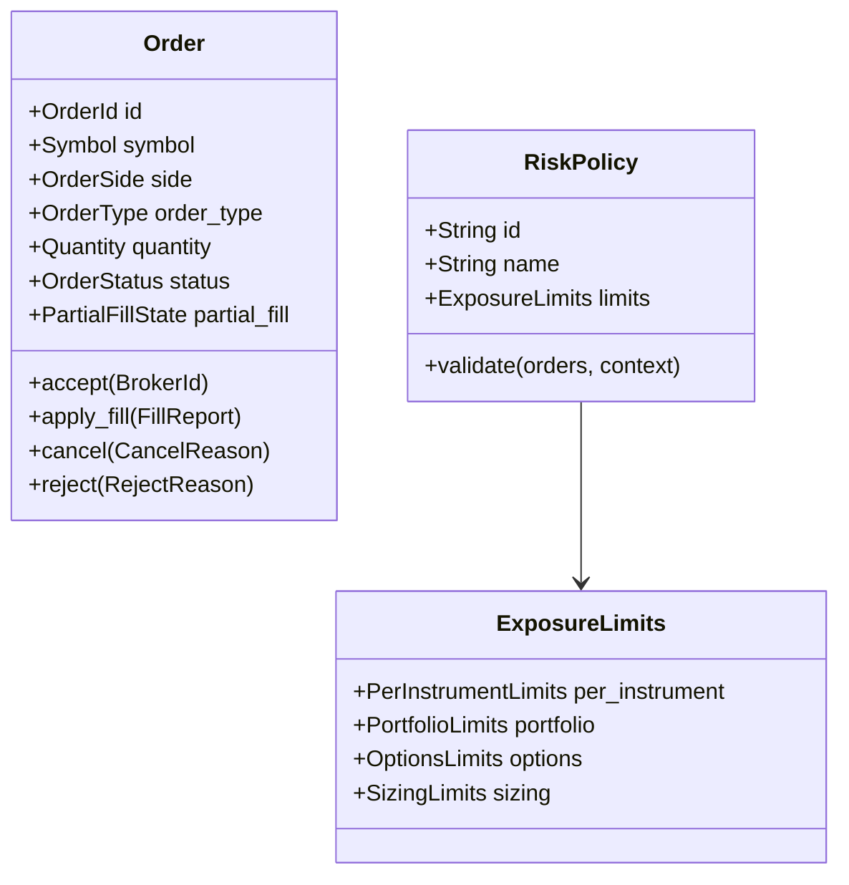

# Execution Engine

Deterministic Rust execution engine for Cream's order routing and risk management. Receives `DecisionPlan` messages from TypeScript agents via gRPC/HTTP, validates against risk constraints, and routes orders to Alpaca Markets.

## Architecture



## Order Flow



## Risk Validation Pipeline



## Order State Machine



## Domain Model

### Bounded Contexts

| Context | Responsibility |
|---------|----------------|
| `order_execution` | Order lifecycle (FIX protocol semantics), partial fills, state transitions |
| `risk_management` | Risk policies, constraint validation, exposure tracking |
| `execution_tactics` | TWAP, VWAP, Iceberg, Adaptive execution strategies |
| `stop_enforcement` | Price monitoring, stop-loss/take-profit triggers |
| `option_position` | Multi-leg options tracking, Greeks aggregation |

### Key Aggregates



## gRPC Service

**Package**: `cream.v1`
**Port**: `50053`

### ExecutionService

| RPC | Request | Response | Description |
|-----|---------|----------|-------------|
| `CheckConstraints` | `CheckConstraintsRequest` | `CheckConstraintsResponse` | Validate DecisionPlan against risk limits |
| `SubmitOrder` | `SubmitOrderRequest` | `SubmitOrderResponse` | Submit single order to broker |
| `GetOrderState` | `GetOrderStateRequest` | `GetOrderStateResponse` | Query order by ID |
| `CancelOrder` | `CancelOrderRequest` | `CancelOrderResponse` | Request order cancellation |
| `StreamExecutions` | `StreamExecutionsRequest` | `stream StreamExecutionsResponse` | Real-time execution updates |
| `GetAccountState` | `GetAccountStateRequest` | `GetAccountStateResponse` | Account equity, buying power |
| `GetPositions` | `GetPositionsRequest` | `GetPositionsResponse` | Current positions |

### MarketDataService

| RPC | Description |
|-----|-------------|
| `GetSnapshot` | Latest quote for symbols |
| `GetOptionChain` | Option chain for underlying |
| `SubscribeMarketData` | Stream real-time quotes |

## HTTP API

**Port**: `50051`

| Method | Endpoint | Description |
|--------|----------|-------------|
| `GET` | `/health` | Health check |
| `POST` | `/api/v1/check-constraints` | Validate orders against risk |
| `POST` | `/api/v1/submit-orders` | Submit batch of orders |
| `POST` | `/api/v1/orders` | Get order state by IDs |
| `POST` | `/api/v1/cancel-orders` | Cancel orders |

## Configuration

### Environment Variables

| Variable | Required | Default | Description |
|----------|----------|---------|-------------|
| `CREAM_ENV` | No | `PAPER` | `PAPER` or `LIVE` |
| `ALPACA_KEY` | Yes | - | Alpaca API key |
| `ALPACA_SECRET` | Yes | - | Alpaca API secret |
| `HTTP_PORT` | No | `50051` | HTTP server port |
| `GRPC_PORT` | No | `50053` | gRPC server port |
| `POSITION_MONITOR_ENABLED` | No | `true` | Enable position monitoring |
| `STREAM_PROXY_ENDPOINT` | No | `http://localhost:50052` | Stream proxy gRPC endpoint |

### config.yaml

```yaml
constraints:
  per_instrument:
    max_notional: 50000      # $50k per position
    max_units: 1000          # Max shares/contracts
    max_equity_pct: 0.10     # 10% of equity

  portfolio:
    max_gross_notional: 500000
    max_net_notional: 200000
    max_leverage: 2.0

  options:
    max_delta_per_underlying: 100.0
    max_portfolio_delta: 500.0
    max_portfolio_gamma: 50.0
    max_portfolio_vega: 1000.0
    max_portfolio_theta: -500.0
```

## Execution Tactics

Available tactics for order slicing and market impact minimization:

| Tactic | Description |
|--------|-------------|
| `PassiveLimit` | Post limit at bid/ask, await fill |
| `AggressiveLimit` | Cross spread for immediate execution |
| `TWAP` | Time-weighted slices over duration |
| `VWAP` | Volume-weighted slices based on historical profile |
| `Iceberg` | Hidden quantity with visible peak |
| `Adaptive` | Dynamic tactic switching based on market conditions |

## Project Structure

```
src/
  domain/                    # Business logic (no dependencies)
    order_execution/         # Order aggregate, FIX semantics
    risk_management/         # Risk policies, validation
    execution_tactics/       # TWAP, VWAP, Iceberg
    stop_enforcement/        # Price monitoring
    option_position/         # Multi-leg options
    shared/                  # Value objects (Money, Quantity, Symbol)

  application/               # Use cases and orchestration
    use_cases/               # SubmitOrders, ValidateRisk, etc.
    ports/                   # BrokerPort, PriceFeedPort interfaces
    dto/                     # Data transfer objects
    services/                # PositionMonitorService

  infrastructure/            # External integrations
    grpc/                    # Tonic gRPC server
    http/                    # Axum REST API
    broker/alpaca/           # Alpaca broker adapter
    marketdata/              # Market data adapter
    stream_proxy/            # Real-time quote client
    persistence/             # Order repository
```

## Development

```bash
# Build
cargo build -p execution-engine

# Test
cargo test -p execution-engine

# Run (requires ALPACA_KEY, ALPACA_SECRET)
CREAM_ENV=PAPER cargo run -p execution-engine

# Generate protobuf stubs (automatic via build.rs)
buf generate
```

## Dependencies

| Crate | Purpose |
|-------|---------|
| `tonic` | gRPC server/client |
| `axum` | HTTP server |
| `tokio` | Async runtime |
| `rust_decimal` | Financial precision arithmetic |
| `reqwest` | HTTP client for Alpaca API |
| `sqlx` | PostgreSQL (shared with TS apps) |
| `tracing` | Structured logging |

## Safety

- `#![forbid(unsafe_code)]` - No unsafe Rust
- Clippy `pedantic` + `nursery` lints enabled
- `unwrap_used` and `expect_used` warnings (test code excepted)
- 90% code coverage target (Critical tier)
