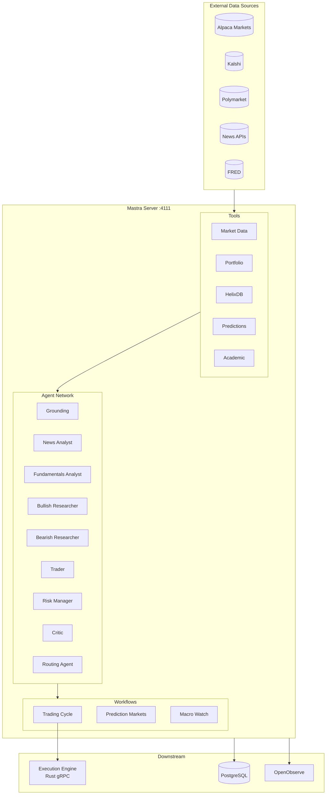
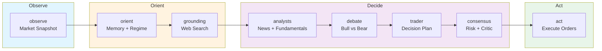
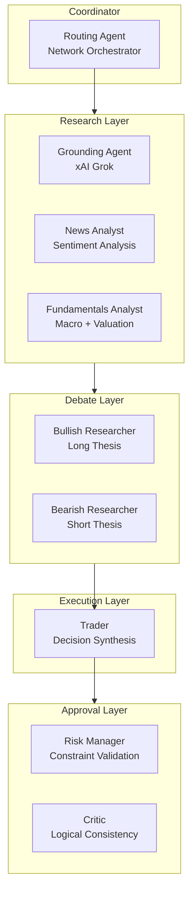
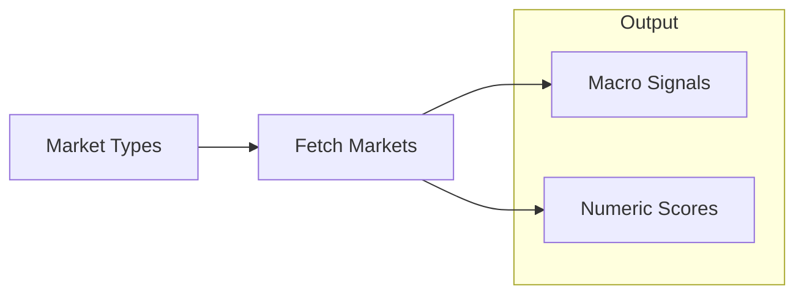
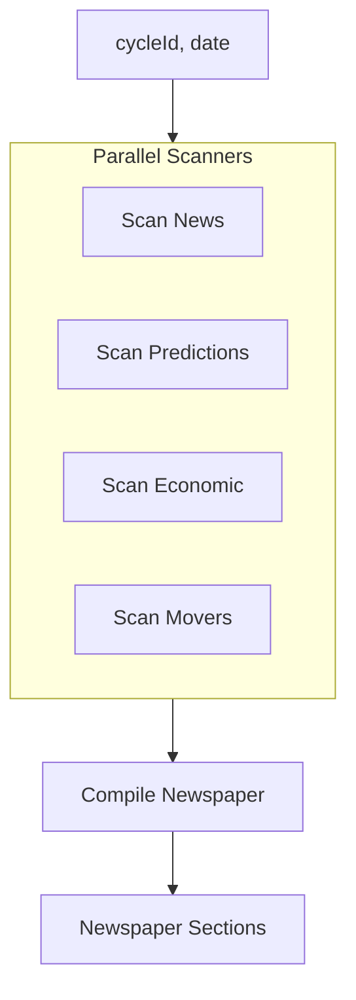
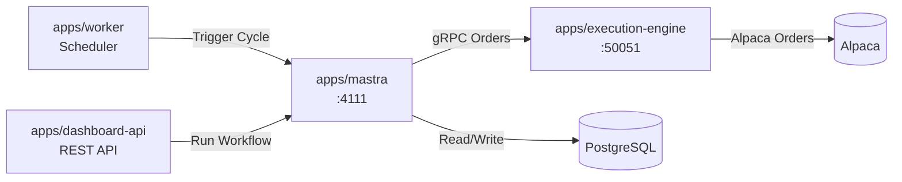

# @cream/mastra

Mastra v1.0 server implementing the OODA (Observe-Orient-Decide-Act) trading loop with 9 LLM agents and 3 workflows. Runs hourly cycles that gather market data, analyze through multi-agent debate, and execute approved trades via the Rust execution engine.

## Architecture



## OODA Trading Cycle

The `tradingCycleWorkflow` implements an 8-step OODA loop executed hourly during market hours.



### Step Details

| Step | Phase | Description | Agents/Tools |
|------|-------|-------------|--------------|
| `observe` | Observe | Fetch quotes, candles, regime classification | Alpaca, @cream/regime |
| `orient` | Orient | Load memory context, prediction signals | HelixDB |
| `grounding` | Orient | Real-time web/X search for context | xAI Grok |
| `analysts` | Decide | Parallel news + fundamentals analysis | newsAnalyst, fundamentalsAnalyst |
| `debate` | Decide | Parallel bull/bear thesis construction | bullishResearcher, bearishResearcher |
| `trader` | Decide | Synthesize into decision plan | trader |
| `consensus` | Decide | Dual approval gate | riskManager, critic |
| `act` | Act | Submit approved orders | Execution Engine gRPC |

## Agent Network



### Agent Configurations

| Agent | Model | Key Tools | Role |
|-------|-------|-----------|------|
| `groundingAgent` | xai/grok-3 | Web search | Real-time context via live search |
| `newsAnalyst` | Claude Sonnet | extractNewsContext, graphragQuery | Event impact assessment |
| `fundamentalsAnalyst` | Claude Sonnet | fredEconomicCalendar, getPredictionSignals | Valuation + macro |
| `bullishResearcher` | Claude Sonnet | helixQuery, searchAcademicPapers | Long thesis construction |
| `bearishResearcher` | Claude Sonnet | helixQuery, searchAcademicPapers | Short thesis construction |
| `trader` | Claude Sonnet | getEnrichedPortfolioState, optionChain, getGreeks | Decision plan synthesis |
| `riskManager` | Claude Sonnet | getEnrichedPortfolioState, getPredictionSignals | Risk constraint validation |
| `critic` | Claude Sonnet | - | Logical consistency check |
| `routingAgent` | Claude Sonnet | All agents | Multi-agent coordinator |

## Workflows

### Trading Cycle (`trading-cycle`)

Primary OODA workflow for hourly trading decisions.

```typescript
// Trigger from dashboard-api or worker
const result = await mastra.runWorkflow("trading-cycle", {
  cycleId: "cycle-2024-01-15-10",
  instruments: ["AAPL", "GOOGL", "MSFT"],
  constraints: { /* optional risk limits */ }
});
```

**Output**: `WorkflowResult` with approved decisions, order IDs, thesis updates.

### Prediction Markets (`prediction-markets`)

Fetches Kalshi/Polymarket data every 15 minutes for macro risk signals.



**Signals produced**: fedCutProbability, recessionProbability12m, macroUncertaintyIndex, policyEventRisk

### Macro Watch (`macro-watch`)

Overnight scanner compiling a "morning newspaper" before market open.



**Sections**: Macro Headlines, Universe News, Prediction Markets, Economic Calendar

## Tools

| Tool | Source | Description |
|------|--------|-------------|
| `getQuotes` | @cream/marketdata | Real-time quotes from Alpaca |
| `optionChain` | @cream/marketdata | Option chain with strikes/expirations |
| `getGreeks` | @cream/marketdata | Delta, gamma, theta, vega |
| `getEnrichedPortfolioState` | @cream/broker | Positions + P&L |
| `helixQuery` | @cream/helix | Graph memory retrieval |
| `graphragQuery` | @cream/helix | RAG over knowledge graph |
| `getPredictionSignals` | @cream/storage | Cached macro signals |
| `getMarketSnapshots` | @cream/storage | Historical prediction data |
| `fredEconomicCalendar` | @cream/external-context | FRED economic releases |
| `extractNewsContext` | @cream/external-context | News API extraction |
| `analyzeContent` | @cream/external-context | Content analysis |
| `searchAcademicPapers` | @cream/helix | Academic paper search |
| `recalcIndicator` | @cream/indicators | RSI, ATR, SMA recalculation |

## Scorers (Evals)

| Scorer | Measures |
|--------|----------|
| `decisionQualityScorer` | Rationale clarity, risk assessment, confidence, position sizing |
| `researchDepthScorer` | Evidence quality, counterarguments, thesis clarity, memory references |

## API Endpoints

| Endpoint | Description |
|----------|-------------|
| `GET /` | Service info and available endpoints |
| `GET /health` | Health check |
| `GET /openapi.json` | OpenAPI spec |
| `GET /swagger-ui` | Swagger documentation |
| `GET /api/agents` | List registered agents |
| `GET /api/workflows` | List registered workflows |
| `POST /api/workflows/:id/run` | Execute workflow |
| `GET /api/tools` | List available tools |

## Configuration

### Environment Variables

| Variable | Required | Description |
|----------|----------|-------------|
| `CREAM_ENV` | Yes | `PAPER` or `LIVE` |
| `PORT` | No | Server port (default: 4111) |
| `ANTHROPIC_API_KEY` | Yes | Claude API key |
| `XAI_API_KEY` | Yes | xAI/Grok API key for grounding |
| `ALPACA_API_KEY` | Yes | Alpaca market data |
| `ALPACA_API_SECRET` | Yes | Alpaca secret |
| `KALSHI_API_KEY_ID` | No | Kalshi API key |
| `KALSHI_PRIVATE_KEY_PATH` | No | Path to Kalshi private key |
| `EXECUTION_ENGINE_URL` | Yes | Rust gRPC endpoint (e.g., http://localhost:50053) |
| `OTEL_ENABLED` | No | Enable OpenTelemetry (default: true) |
| `OTEL_EXPORTER_OTLP_ENDPOINT` | No | OTLP endpoint for traces |

## Development

```bash
# Start server directly (bypasses mastra dev bundler)
bun run dev

# Start with mastra dev (includes studio UI)
bun run dev:mastra

# Run tests
bun test

# Type check
bun run typecheck
```

## Integration Points



### Workflow Invocation

```typescript
import { mastra, tradingCycleWorkflow } from "@cream/mastra";

// Via Mastra instance
const result = await mastra.runWorkflow("trading-cycle", input);

// Direct workflow import
const run = tradingCycleWorkflow.createRun();
const result = await run.start({ inputData: input });
```

### MacroWatch Utilities

```typescript
import { compileMorningNewspaper, formatNewspaperForLLM } from "@cream/mastra";

const entries = await macroWatchRepo.getOvernightEntries(date);
const { content, storageInput } = compileMorningNewspaper(entries, universeSymbols);
const prompt = formatNewspaperForLLM(content.sections);
```

## Observability

Traces exported via OpenTelemetry to OpenObserve:

- Agent runs with input/output
- LLM generations with token counts
- Tool calls with latency
- Workflow step transitions
- Error tracking

Configure via `OTEL_EXPORTER_OTLP_ENDPOINT`.
