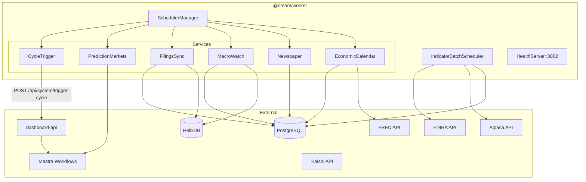
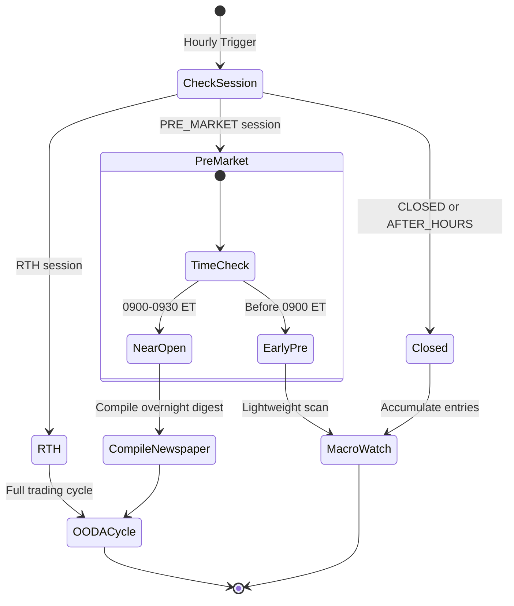
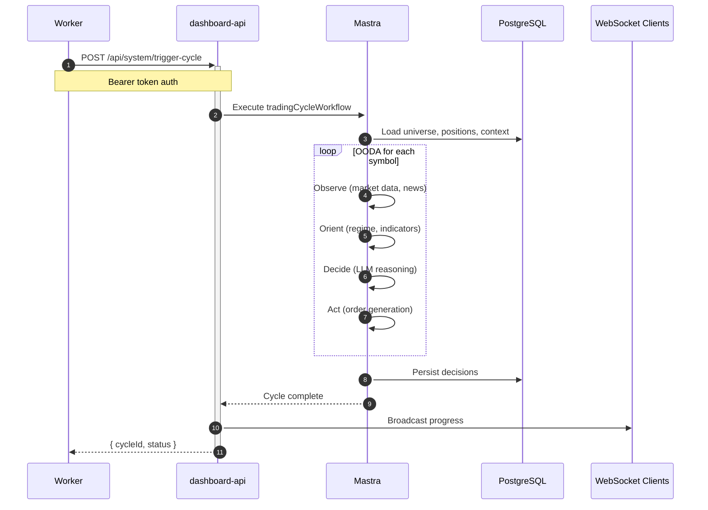

# @cream/worker

Hourly scheduler that orchestrates Cream's trading cycles and data ingestion pipelines. Coordinates with `dashboard-api` for OODA loop execution and manages session-aware job scheduling.

## Architecture



## Session-Aware Scheduling

The worker adapts its behavior based on market session:



## Job Schedules

| Job | Schedule | Description |
|-----|----------|-------------|
| **Trading Cycle** | Hourly (`:00`) | OODA loop via dashboard-api |
| **Prediction Markets** | Every 15 min | Kalshi/Polymarket signals |
| **Filings Sync** | Daily 6 AM ET | SEC EDGAR ingestion |
| **Economic Calendar** | 6 AM / 6 PM ET | FRED event cache refresh |
| **Short Interest** | Daily 6 PM ET | FINRA data post-publish |
| **Sentiment** | Hourly 9 AM-4 PM ET (weekdays) | Alpaca news sentiment |
| **Corporate Actions** | Daily 6 AM ET | Dividends, splits, spinoffs |

## OODA Cycle Flow



## Bounded Contexts

```
src/contexts/
├── scheduling/          # Time-based job orchestration
│   ├── scheduler-manager.ts   # Timer lifecycle management
│   └── time-calculator.ts     # Timezone-aware boundaries
├── trading-cycle/       # Core trading workflows
│   ├── cycle-trigger.ts       # Dashboard-API integration
│   ├── filings-sync.ts        # SEC EDGAR ingestion
│   └── prediction-markets.ts  # Kalshi workflow execution
├── indicators/          # Batch data collection
│   ├── batch-scheduler.ts     # Croner-based scheduling
│   ├── init.ts                # Dependency injection
│   └── adapters/              # FINRA, Alpaca adapters
├── macro-watch/         # Overnight market scanning
│   ├── macro-watch-service.ts # News, movers, events
│   └── newspaper-service.ts   # Morning digest compiler
├── economic-calendar/   # FRED event caching
│   └── economic-calendar-service.ts
└── monitoring/          # Position expiration alerts
```

## Configuration

Runtime configuration loaded from PostgreSQL via `RuntimeConfigService`:

```bash
# Required
CREAM_ENV=PAPER|LIVE           # Trading environment
DATABASE_URL=postgres://...    # PostgreSQL connection
DASHBOARD_API_URL=http://...   # API endpoint for cycle triggers
WORKER_INTERNAL_SECRET=...     # Bearer token for dashboard-api

# Optional
SCHEDULER_DISABLED=true        # Disable schedulers, health endpoint only
RUN_ON_STARTUP=true           # Run cycles immediately on boot
HEALTH_PORT=3002              # Health server port

# Telemetry
OTEL_ENABLED=true
OTEL_EXPORTER_OTLP_ENDPOINT=http://localhost:4318
OTEL_SERVICE_NAME=cream-worker

# External APIs
ALPACA_KEY=...                # Required for indicators
ALPACA_SECRET=...
GOOGLE_GENERATIVE_AI_API_KEY=... # For agent execution
```

## Health API

```bash
# Status check
curl http://localhost:3002/health

# Reload config (hot reload from database)
curl -X POST http://localhost:3002/reload

# Trigger services manually
curl -X POST http://localhost:3002/trigger/macro_watch
curl -X POST http://localhost:3002/trigger/newspaper
curl -X POST http://localhost:3002/trigger/filings_sync
curl -X POST http://localhost:3002/trigger/short_interest
curl -X POST http://localhost:3002/trigger/sentiment
curl -X POST http://localhost:3002/trigger/corporate_actions
curl -X POST http://localhost:3002/trigger/prediction_markets
```

Health response includes:
- Uptime, environment, config ID
- Configured intervals and instruments
- Last/next run timestamps per job
- Running status flags
- Indicator batch job states

## CLI

Manual service triggers for testing:

```bash
# Run macro watch scan
bun apps/worker/src/cli/trigger-service.ts macro-watch

# Sync filings for specific symbols
bun apps/worker/src/cli/trigger-service.ts filings-sync --symbols=AAPL,TSLA

# Dry run to verify config
bun apps/worker/src/cli/trigger-service.ts short-interest --dry-run
```

## Development

```bash
# Start with file watching
bun run dev

# Build for production
bun run build

# Run tests
bun test

# Type check
bun run typecheck
```

## Docker

```bash
# Build image
docker build -t cream-worker -f apps/worker/Dockerfile .

# Run container
docker run \
  -e CREAM_ENV=PAPER \
  -e DATABASE_URL=postgres://... \
  -e DASHBOARD_API_URL=http://dashboard-api:3001 \
  -e WORKER_INTERNAL_SECRET=... \
  cream-worker
```

## Signal Handling

| Signal | Behavior |
|--------|----------|
| `SIGHUP` | Hot reload config from database |
| `SIGINT` | Graceful shutdown |
| `SIGTERM` | Graceful shutdown |

Shutdown sequence: stop health server, cancel all timers, flush telemetry spans.
