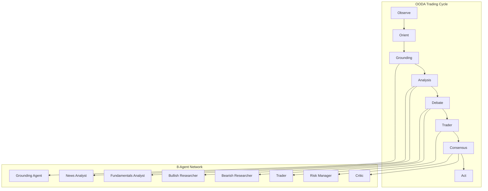
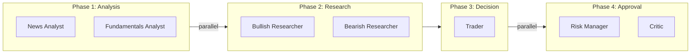
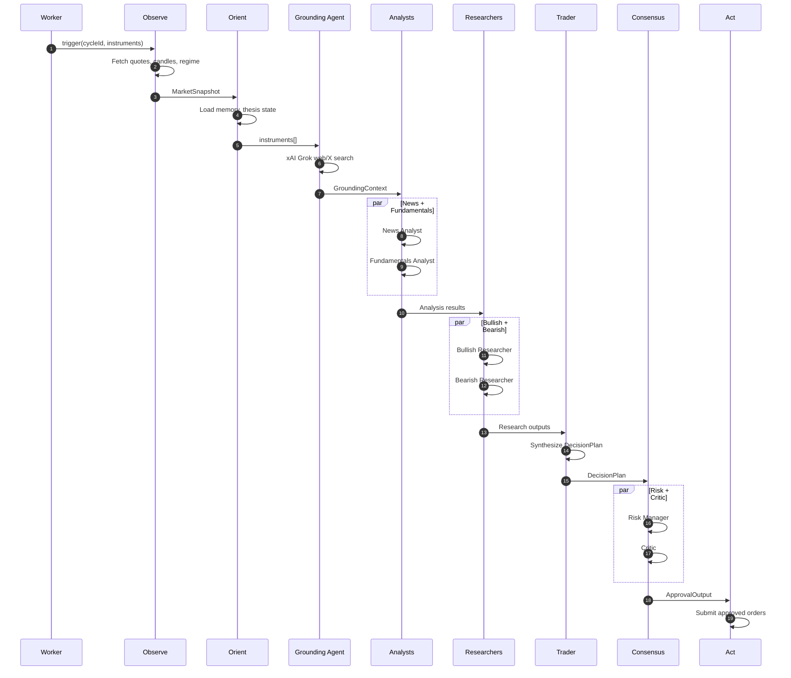
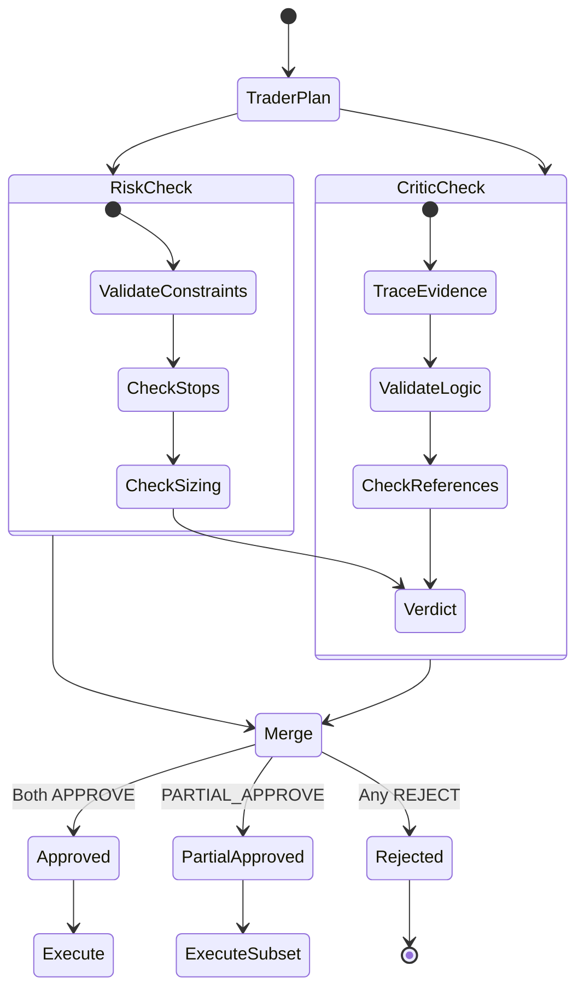

# @cream/agents

Agent prompts, configurations, and tools for Cream's 8-agent trading network. This package provides the LLM orchestration layer that powers the OODA trading cycle.

## Architecture



## Agent Network

### Execution Phases

Agents execute in four phases, with parallelization within phases:



### Agent Responsibilities

| Agent | Role | Tools | Output Type |
|-------|------|-------|-------------|
| **Grounding Agent** | Web/X.com search for real-time context | xAI Grok live search | Structured market context |
| **News Analyst** | Assess news impact and sentiment | None (context-driven) | `SentimentAnalysisOutput` |
| **Fundamentals Analyst** | Valuation and macro context | `fredEconomicCalendar`, `graphragQuery`, `helixQuery`, `getPredictionSignals` | `FundamentalsAnalysisOutput` |
| **Bullish Researcher** | Build strongest case for LONG | `helixQuery`, `analyzeContent`, `searchAcademicPapers` | `BullishResearchOutput` |
| **Bearish Researcher** | Build strongest case for SHORT | `helixQuery`, `analyzeContent`, `searchAcademicPapers` | `BearishResearchOutput` |
| **Trader** | Synthesize into decision plan | `getQuotes`, `getEnrichedPortfolioState`, `optionChain`, `getGreeks`, `helixQuery`, `getPredictionSignals`, `searchAcademicPapers` | `DecisionPlan` |
| **Risk Manager** | Validate against constraints | `getEnrichedPortfolioState`, `getPredictionSignals` | `ApprovalOutput` |
| **Critic** | Validate logical consistency | None (context-driven) | `ApprovalOutput` |

## OODA Integration



## Tools

### Market Data Tools

| Tool | Description | Source |
|------|-------------|--------|
| `getQuotes` | Real-time bid/ask/last quotes | gRPC MarketDataService |
| `getOptionChain` | Option chains by expiration | gRPC MarketDataService |
| `getGreeks` | Delta, gamma, theta, vega, IV | Provider or Black-Scholes fallback |

### Portfolio Tools

| Tool | Description | Source |
|------|-------------|--------|
| `getPortfolioState` | Positions, buying power, PDT status | gRPC ExecutionService / Alpaca |
| `getEnrichedPortfolioState` | Above + strategy, risk params, thesis context | PostgreSQL joins |

### Memory/RAG Tools

| Tool | Description | Source |
|------|-------------|--------|
| `helixQuery` | Query thesis memories, historical trades | HelixDB |
| `graphragQuery` | Semantic search across filings, transcripts, news | HelixDB vectors |
| `searchAcademicPapers` | Search finance research knowledge base | HelixDB |
| `searchExternalPapers` | Search Semantic Scholar | External API |

### Economic Data Tools

| Tool | Description | Source |
|------|-------------|--------|
| `getFredEconomicCalendar` | Upcoming FOMC, CPI, NFP, GDP releases | FRED API |
| `getMacroIndicators` | Latest CPI, unemployment, Fed funds rate | FRED API |
| `getPredictionSignals` | Fed decision probabilities, macro uncertainty | Kalshi |

### Context Extraction Tools

| Tool | Description | Source |
|------|-------------|--------|
| `extractNewsContext` | LLM extraction from news articles | Alpaca News + Gemini |
| `analyzeContent` | Extract entities, sentiment, data points | Gemini structured outputs |

## Prompts

Each agent has a dedicated system prompt in `/src/prompts/`:

```
prompts/
  groundingAgent.ts    # Web/X search strategy
  newsAnalyst.ts       # News impact assessment
  fundamentalsAnalyst.ts # Valuation + macro + prediction markets
  bullishResearcher.ts # LONG thesis construction + IV analysis
  bearishResearcher.ts # SHORT thesis construction + IV analysis
  trader.ts            # Decision synthesis + PDT rules + options
  riskManager.ts       # Constraint validation + position sizing
  critic.ts            # Logic validation + evidence tracing
  selfCheck.ts         # JSON schema validation
```

### Key Prompt Features

**Thesis Memory**: Researchers query historical trades via `helixQuery` to learn from WIN/LOSS patterns.

**IV Rank Analysis**: Researchers recommend options strategies based on volatility:
- IV Rank >50%: Sell premium (credit spreads)
- IV Rank <30%: Buy options (debit spreads)

**PDT Compliance**: Trader enforces FINRA Pattern Day Trader rules for accounts under $25k.

**Prediction Markets**: Fundamentals analyst and trader incorporate Kalshi signals for Fed decisions, macro uncertainty.

## Consensus Flow



Both Risk Manager and Critic must approve for execution. Partial approvals execute the intersection of approved decisions.

## Output Types

### DecisionPlan

```typescript
interface DecisionPlan {
  cycleId: string;
  timestamp: string;
  decisions: Decision[];
  portfolioNotes: string;
}

interface Decision {
  decisionId: string;
  instrumentId: string;
  action: "BUY" | "SELL" | "HOLD" | "CLOSE";
  direction: "LONG" | "SHORT" | "FLAT";
  size: { value: number; unit: SizeUnit };
  stopLoss?: { price: number; type: "FIXED" | "TRAILING" };
  takeProfit?: { price: number };
  strategyFamily: StrategyFamily;
  timeHorizon: "INTRADAY" | "SWING" | "POSITION";
  rationale: Rationale;
  thesisState: ThesisState;
  confidence: number;
  legs?: OptionLeg[];  // For multi-leg options
}
```

### ApprovalOutput

```typescript
interface ApprovalOutput {
  verdict: "APPROVE" | "PARTIAL_APPROVE" | "REJECT";
  approvedDecisionIds: string[];
  rejectedDecisionIds: string[];
  violations: ApprovalViolation[];
  required_changes: ApprovalRequiredChange[];
  notes: string;
}
```

## Configuration

All agents use the same model via `LLM_MODEL_ID` environment variable (default: Gemini). The Grounding Agent uses xAI Grok for live search capabilities.

```typescript
// Agent config structure
interface AgentConfig {
  type: AgentType;
  name: string;
  role: string;
  personality: string[];
  tools: string[];
}
```

## Usage

```typescript
import {
  AGENT_CONFIGS,
  getAgentConfig,
  getAgentPrompt,
  EXECUTION_PHASES,
  // Tools
  getQuotes,
  getEnrichedPortfolioState,
  helixQuery,
  graphragQuery,
} from "@cream/agents";

// Get config for specific agent
const traderConfig = getAgentConfig("trader");

// Get system prompt
const traderPrompt = getAgentPrompt("trader");

// Access execution phases for orchestration
for (const phase of EXECUTION_PHASES) {
  console.log(`Phase ${phase.phase}: ${phase.name}`);
  console.log(`  Agents: ${phase.agents.join(", ")}`);
  console.log(`  Parallel: ${phase.parallel}`);
}
```

## Test Mode

All tools return empty results or throw in test mode (`NODE_ENV=test` with `ctx.source="test"`):

```typescript
// In test mode
await getQuotes(testCtx, ["AAPL"]); // throws Error
await graphragQuery(testCtx, { query: "..." }); // returns empty result
await helixQuery(testCtx, "...", {}); // throws Error
```

## Dependencies

- **@cream/broker**: Alpaca trading client
- **@cream/domain**: ExecutionContext, Zod schemas
- **@cream/helix**: HelixDB client for memory/RAG
- **@cream/marketdata**: Alpaca market data
- **@cream/external-context**: News extraction pipeline
- **@cream/indicators**: Technical indicators
- **@google/genai**: Gemini extraction client
