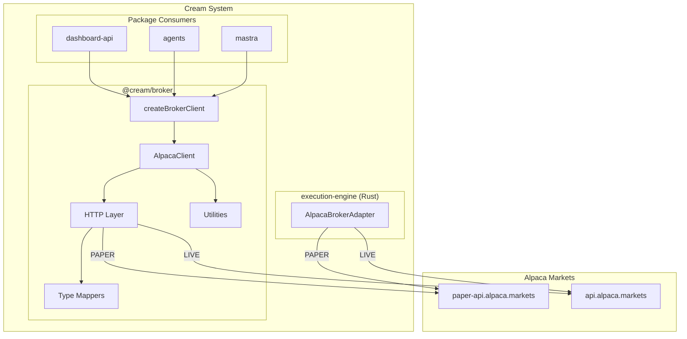
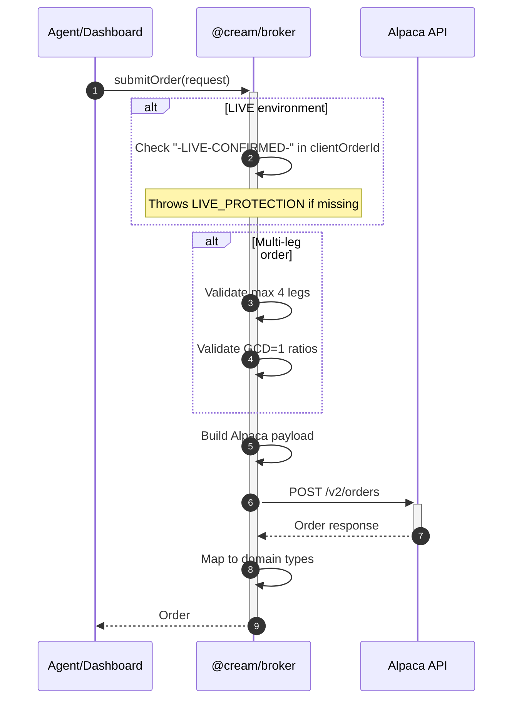
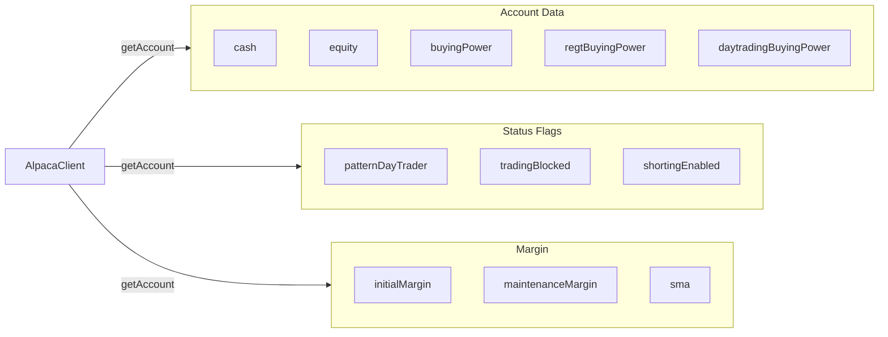
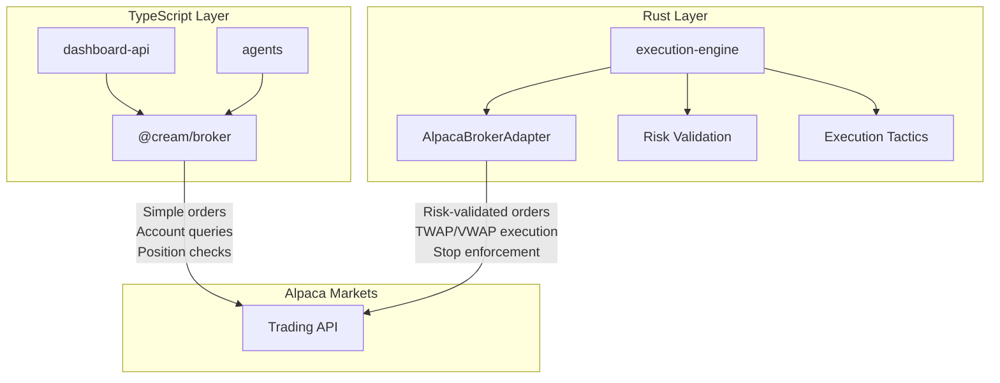

# @cream/broker

Alpaca Markets integration for the Cream trading system. Provides a type-safe TypeScript client for paper and live trading with multi-leg options support.

## Architecture



## Quick Start

```typescript
import { createAlpacaClient } from "@cream/broker";

const client = createAlpacaClient({
  apiKey: Bun.env.ALPACA_KEY!,
  apiSecret: Bun.env.ALPACA_SECRET!,
  environment: "PAPER",
});

// Submit a limit order
const order = await client.submitOrder({
  clientOrderId: client.generateOrderId(),
  symbol: "AAPL",
  qty: 10,
  side: "buy",
  type: "limit",
  timeInForce: "day",
  limitPrice: 150.0,
});

// Check positions
const positions = await client.getPositions();
```

## Context-Aware Factory

Use `createBrokerClient` with an `ExecutionContext` for environment-aware client creation:

```typescript
import { createContext } from "@cream/domain";
import { createBrokerClient } from "@cream/broker";

const ctx = createContext("PAPER", "scheduled");
const client = createBrokerClient(ctx);
// ctx.environment=PAPER -> paper endpoint
// ctx.environment=LIVE -> live endpoint with safety checks
```

## Order Flow



## API Reference

### AlpacaClient Interface

| Method | Description |
|--------|-------------|
| `getAccount()` | Fetch account info (cash, equity, buying power, margin) |
| `getPositions()` | List all open positions |
| `getPosition(symbol)` | Get specific position or null |
| `submitOrder(request)` | Submit new order |
| `cancelOrder(orderId)` | Cancel pending order |
| `getOrder(orderId)` | Get order by ID or null |
| `getOrders(options?)` | List orders with filtering |
| `closePosition(symbol, qty?)` | Close position (partial or full) |
| `closeAllPositions()` | Liquidate all positions |
| `isMarketOpen()` | Check market hours |
| `getEnvironment()` | Returns "PAPER" or "LIVE" |
| `generateOrderId()` | Create unique prefixed order ID |

### Order Types

```typescript
type OrderType = "market" | "limit" | "stop" | "stop_limit" | "trailing_stop";
type TimeInForce = "day" | "gtc" | "opg" | "cls" | "ioc" | "fok";
type OrderSide = "buy" | "sell";
```

### Order Request

```typescript
interface OrderRequest {
  clientOrderId: string;      // Must be unique
  symbol?: string;            // For single-leg orders
  legs?: OrderLeg[];          // For multi-leg options (max 4)
  qty: number;
  side: OrderSide;
  type: OrderType;
  timeInForce: TimeInForce;
  limitPrice?: number;
  stopPrice?: number;
  trailPercent?: number;
  trailPrice?: number;
  extendedHours?: boolean;
}
```

### GetOrdersOptions

```typescript
interface GetOrdersOptions {
  status?: "open" | "closed" | "all";  // default: "open"
  limit?: number;                       // default: 100, max: 500
  direction?: "asc" | "desc";           // default: "desc"
  symbols?: string | string[];
  side?: "buy" | "sell";
  nested?: boolean;                     // Include bracket order legs
}
```

## Multi-Leg Options

Supports up to 4-leg option spreads with ratio validation:

```typescript
// Valid: ratios are coprime (GCD = 1)
await client.submitOrder({
  clientOrderId: client.generateOrderId(),
  legs: [
    { symbol: "AAPL  251219C00200000", ratio: 1 },
    { symbol: "AAPL  251219C00210000", ratio: -2 },
  ],
  qty: 1,
  side: "buy",
  type: "limit",
  timeInForce: "day",
  limitPrice: 2.5,
});

// Invalid: ratios 2:4 can be simplified to 1:2
// Throws: "Leg ratios must be simplified (GCD = 1)"
```

### OCC Symbol Format

```typescript
import { parseOptionSymbol, buildOptionSymbol, isOptionSymbol } from "@cream/broker";

// Parse OCC symbol
parseOptionSymbol("AAPL  251219C00200000");
// { underlying: "AAPL", expiration: "2025-12-19", optionType: "call", strike: 200 }

// Build OCC symbol
buildOptionSymbol("AAPL", "2025-12-19", "call", 200);
// "AAPL  251219C00200000"

// Check if option
isOptionSymbol("AAPL  251219C00200000"); // true
isOptionSymbol("AAPL");                   // false
```

## Account Management



```typescript
const account = await client.getAccount();

console.log({
  portfolioValue: account.portfolioValue,
  buyingPower: account.buyingPower,
  daytradeCount: account.daytradeCount,
  patternDayTrader: account.patternDayTrader,
  maintenanceMargin: account.maintenanceMargin,
});
```

## Portfolio History

Standalone function for fetching equity curves:

```typescript
import { getPortfolioHistory } from "@cream/broker";

const history = await getPortfolioHistory(
  {
    apiKey: Bun.env.ALPACA_KEY!,
    apiSecret: Bun.env.ALPACA_SECRET!,
    environment: "PAPER",
  },
  {
    period: "1M",        // 1D, 1W, 1M, 3M, 6M, 1A, all
    timeframe: "1D",     // 1Min, 5Min, 15Min, 1H, 1D
    extendedHours: false,
  }
);

// history.timestamp: number[]
// history.equity: number[]
// history.profitLoss: number[]
// history.profitLossPct: number[]
// history.baseValue: number
```

## Safety Features

### LIVE Protection

LIVE orders require explicit confirmation by default:

```typescript
// This throws LIVE_PROTECTION error:
await liveClient.submitOrder({
  clientOrderId: "my-order-123",
  // ...
});

// This succeeds (note the marker in clientOrderId):
await liveClient.submitOrder({
  clientOrderId: "my-order-LIVE-CONFIRMED-123",
  // ...
});

// Or disable the check:
const client = createAlpacaClient({
  // ...
  requireLiveConfirmation: false,
});
```

### Order ID Namespacing

Generated order IDs include environment prefix and timestamp:

```typescript
client.generateOrderId();
// "paper-1704326400000-a1b2c3"
// "live-1704326400000-x7y8z9"
```

## Error Handling

```typescript
import { BrokerError } from "@cream/broker";

try {
  await client.submitOrder(request);
} catch (error) {
  if (error instanceof BrokerError) {
    switch (error.code) {
      case "INSUFFICIENT_FUNDS":
      case "INSUFFICIENT_SHARES":
        // Handle buying power / position issues
        break;
      case "INVALID_ORDER":
        // Order validation failed
        break;
      case "LIVE_PROTECTION":
        // Missing confirmation for LIVE order
        break;
      case "RATE_LIMITED":
        // Back off and retry
        break;
      case "MARKET_CLOSED":
        // Queue for market open
        break;
    }
  }
}
```

### Error Codes

| Code | Description |
|------|-------------|
| `INVALID_CREDENTIALS` | API key/secret invalid or missing |
| `INSUFFICIENT_FUNDS` | Not enough buying power |
| `INSUFFICIENT_SHARES` | Not enough shares to sell |
| `INVALID_ORDER` | Order validation failed |
| `ORDER_NOT_FOUND` | Order ID does not exist |
| `MARKET_CLOSED` | Market is closed |
| `RATE_LIMITED` | API rate limit exceeded |
| `NETWORK_ERROR` | Connection failed |
| `VALIDATION_ERROR` | Client-side validation failed |
| `ENVIRONMENT_MISMATCH` | Wrong environment for operation |
| `LIVE_PROTECTION` | LIVE order missing confirmation |

## Relationship to Execution Engine

The TypeScript broker package and Rust execution-engine both integrate with Alpaca but serve different purposes:



| Layer | Use Case |
|-------|----------|
| `@cream/broker` | Dashboard queries, agent tools, simple orders, portfolio history |
| `execution-engine` | Risk-validated execution, algorithmic tactics (TWAP/VWAP/Iceberg), stop enforcement |

## Dependencies

```json
{
  "@cream/config": "workspace:*",
  "@cream/domain": "workspace:*",
  "@cream/logger": "workspace:*"
}
```

## Commands

```bash
bun test              # Run tests
bun run test:paper    # Run paper trading integration tests
bun run typecheck     # Type check
bun run lint          # Lint
bun run format        # Format
```
