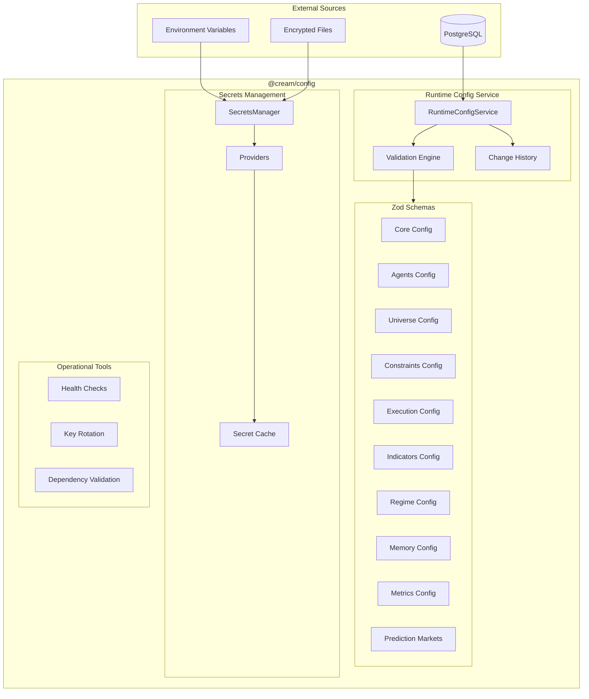
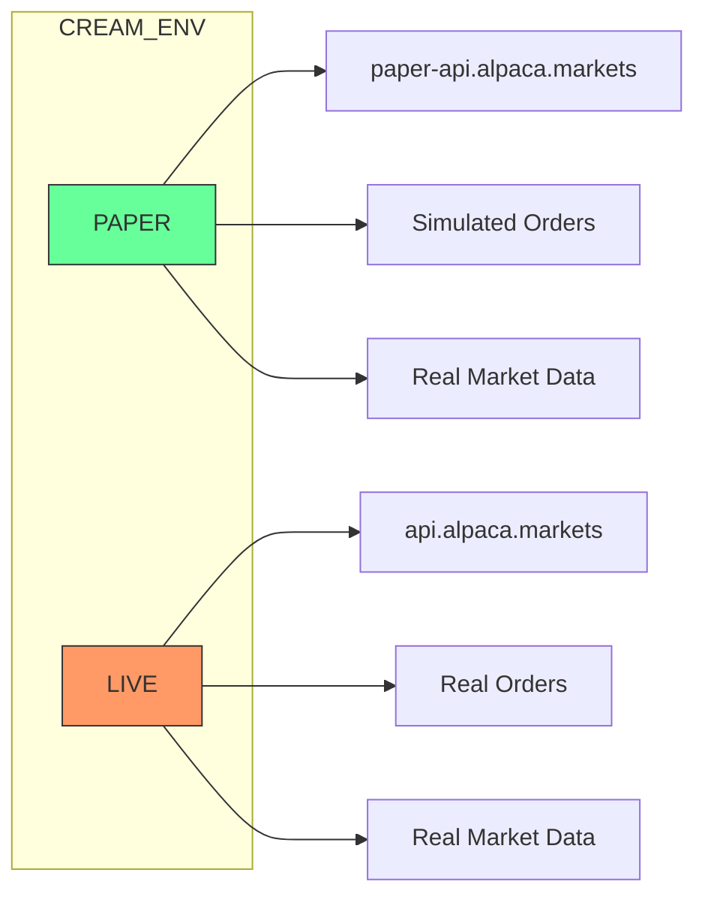
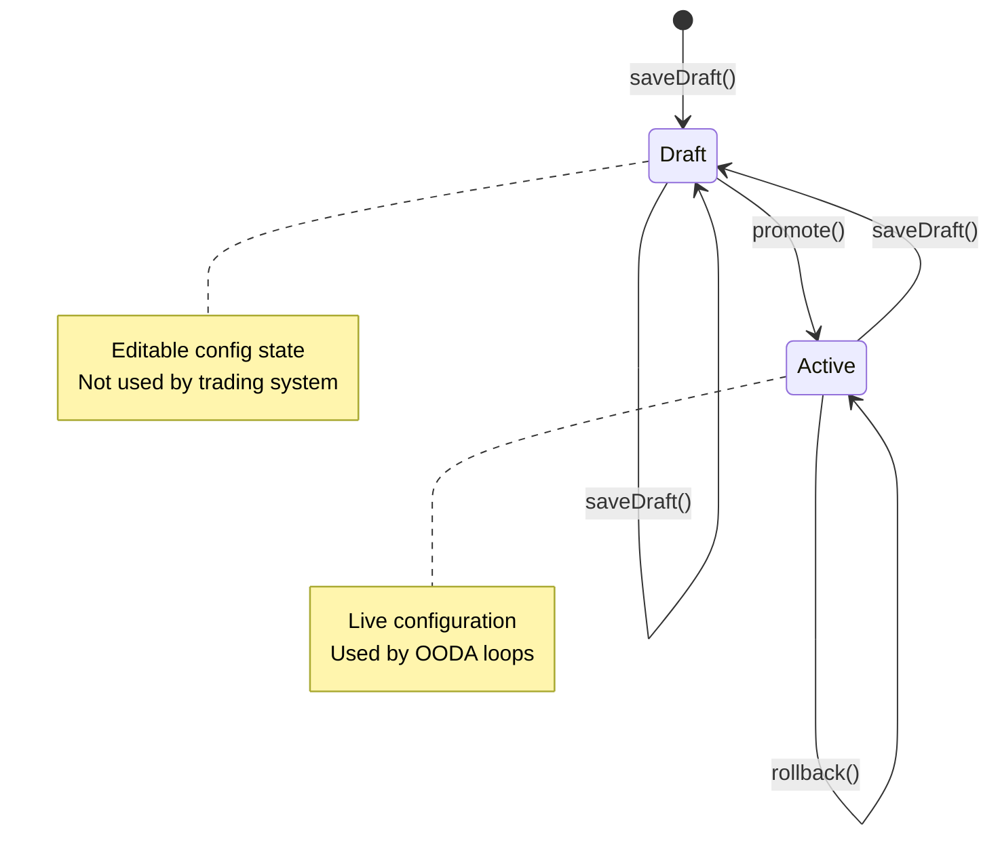
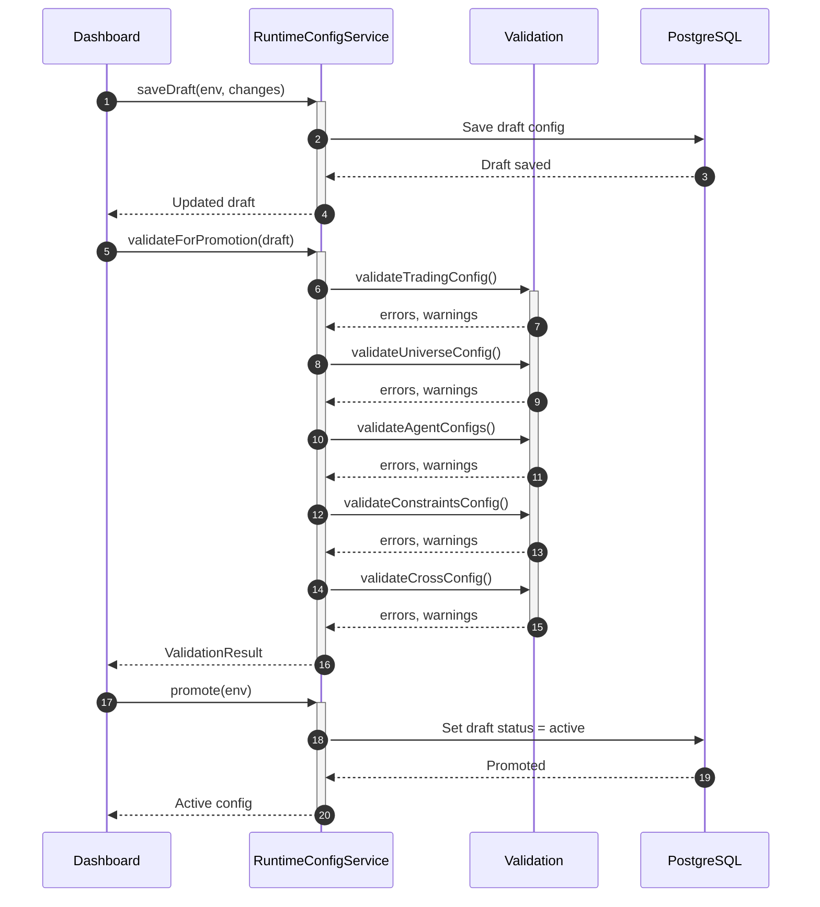
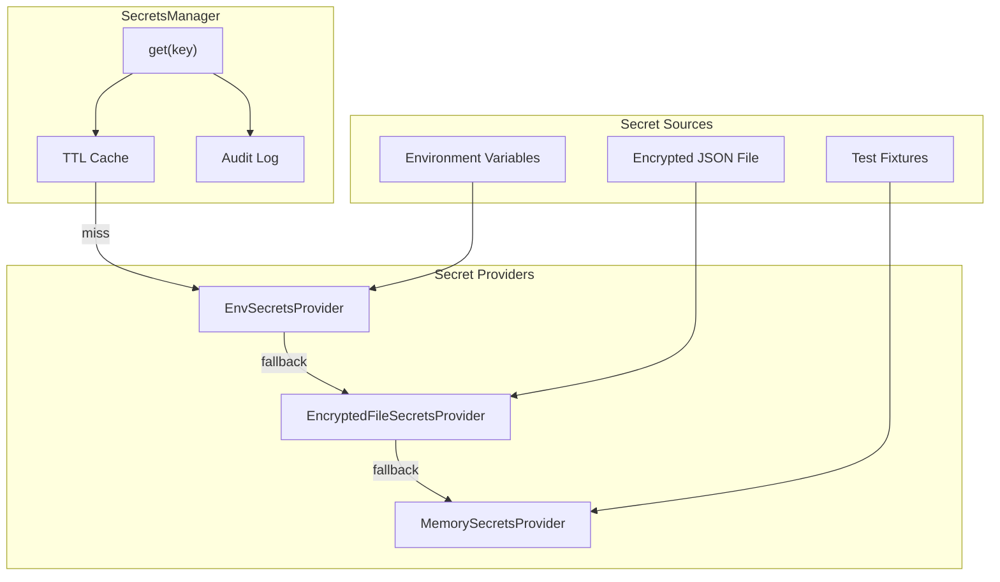
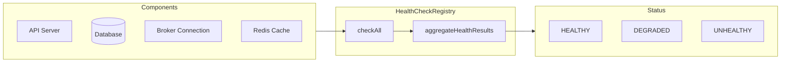
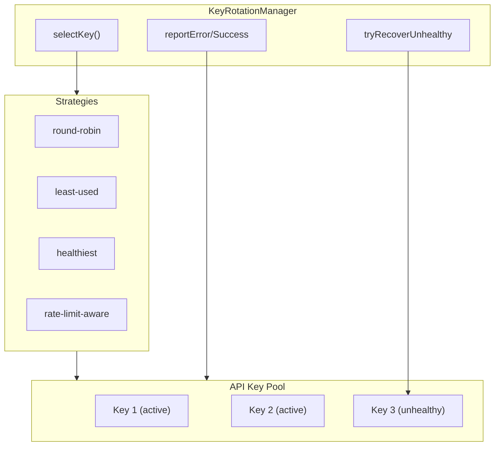

# @cream/config

Central configuration management for the Cream agentic trading system. Provides type-safe schemas, runtime configuration services, secrets management, and operational tooling.

## Architecture Overview



## Core Concepts

### Environment Switch: `CREAM_ENV`

Single environment variable controls all environment-specific behavior:

| Value | Description | Orders | Market Data |
|-------|-------------|--------|-------------|
| `PAPER` | Paper trading | Simulated | Real |
| `LIVE` | Live trading | Real | Real |



## Zod Schemas

All configuration is validated through Zod schemas providing:
- Runtime type safety
- Automatic TypeScript type inference
- Detailed validation error messages
- Default value handling

### Schema Domains

| Schema | File | Purpose |
|--------|------|---------|
| `CoreConfigSchema` | `core.ts` | Environment, LLM model, decision timeframes |
| `AgentsConfigSchema` | `agents.ts` | 7-agent consensus network configuration |
| `UniverseConfigSchema` | `universe.ts` | Trading universe sources and filters |
| `ConstraintsConfigSchema` | `constraints.ts` | Risk limits (per-instrument, portfolio, options) |
| `ExecutionConfigSchema` | `execution.ts` | Order policy, tactics, broker settings |
| `IndicatorsConfigSchema` | `indicators.ts` | Technical indicators (RSI, ATR, SMA, etc.) |
| `RegimeConfigSchema` | `regime.ts` | Market regime classifier (rule-based, HMM, ML) |
| `MemoryConfigSchema` | `memory.ts` | HelixDB, embeddings, retrieval settings |
| `MetricsConfigSchema` | `metrics.ts` | Performance metrics configuration |
| `PredictionMarketsConfigSchema` | `prediction_markets.ts` | Kalshi/Polymarket integration |

### Complete Config Schema

```typescript
import { CreamConfigSchema, validateConfig, validateAtStartup } from "@cream/config";

// Validate raw config
const result = validateConfig(rawConfig);
if (!result.success) {
  console.error(result.errors);
}

// Startup validation with cross-field checks and warnings
const startupResult = validateAtStartup(config);
if (startupResult.warnings.length > 0) {
  console.warn("Warnings:", startupResult.warnings);
}
```

## Runtime Configuration Service

Database-driven configuration management with draft/active lifecycle, validation, and history tracking.



### Configuration Lifecycle



### Usage

```typescript
import { createRuntimeConfigService } from "@cream/config";

const service = createRuntimeConfigService(
  tradingConfigRepo,
  agentConfigsRepo,
  universeConfigsRepo,
  constraintsConfigRepo  // optional
);

// Load active configuration
const config = await service.getActiveConfig("PAPER");

// Edit draft configuration
await service.saveDraft("PAPER", {
  trading: {
    agentTimeoutMs: 15000,
    kellyFraction: 0.25
  },
  constraints: {
    perInstrument: { maxPctEquity: 0.15 }
  }
});

// Validate before promotion
const validation = await service.validateForPromotion(draft);
if (!validation.valid) {
  console.error(validation.errors);
  return;
}
if (validation.warnings.length > 0) {
  console.warn(validation.warnings);
}

// Promote to active
await service.promote("PAPER");

// Promote from PAPER to LIVE
await service.promoteToEnvironment("PAPER", "LIVE");

// View history and rollback
const history = await service.getHistory("PAPER", 20);
await service.rollback("PAPER", history[2].id);
```

### Full Runtime Config Structure

```typescript
interface FullRuntimeConfig {
  trading: RuntimeTradingConfig;      // Consensus, timeouts, conviction thresholds
  agents: Record<AgentType, RuntimeAgentConfig>;  // Per-agent settings
  universe: RuntimeUniverseConfig;    // Symbol selection
  constraints: RuntimeConstraintsConfig;  // Risk limits
}
```

## Secrets Management

Multi-provider secrets system with caching, fallback, and audit logging.



### Providers

| Provider | Use Case | Configuration |
|----------|----------|---------------|
| `EnvSecretsProvider` | Development, production | Optional prefix for env vars |
| `EncryptedFileSecretsProvider` | CI, secure local dev | AES-256-GCM encrypted JSON |
| `MemorySecretsProvider` | Testing | In-memory storage |

### Usage

```typescript
import {
  createEnvSecretsManager,
  createSecretsManager,
  EncryptedFileSecretsProvider
} from "@cream/config";

// Simple: Environment variables
const secrets = createEnvSecretsManager();
const apiKey = await secrets.get("ALPACA_API_KEY");

// With fallback providers
const manager = createSecretsManager("env", {
  config: {
    cacheTtlMs: 300000,  // 5 minutes
    auditEnabled: true,
    fallbackProviders: [
      new EncryptedFileSecretsProvider("./secrets.enc", password)
    ]
  }
});

// Batch retrieval
const keys = await manager.getMany([
  "ALPACA_API_KEY",
  "ALPACA_SECRET_KEY",
  "OPENAI_API_KEY"
]);

// Health check all providers
const health = await manager.healthCheck();
// { env: true, "encrypted-file": true }
```

### Encrypted File Format

```typescript
// Create encrypted secrets file
const encrypted = EncryptedFileSecretsProvider.encrypt(
  {
    ALPACA_API_KEY: "pk_xxx",
    ALPACA_SECRET_KEY: "sk_xxx"
  },
  password
);
// Write to file as base64
```

Encryption: AES-256-GCM with scrypt key derivation (16384 iterations).

## Operational Tools

### Health Check System

Component health monitoring with thresholds and aggregation.



```typescript
import {
  createHealthRegistry,
  createHttpHealthCheck,
  createMemoryHealthCheck,
  createCustomHealthCheck
} from "@cream/config";

const registry = createHealthRegistry({
  defaultIntervalMs: 30000,
  defaultFailureThreshold: 3
});

// Register checks
registry.register({
  ...createHttpHealthCheck("alpaca-api", "https://api.alpaca.markets/v2/account"),
  critical: true
});

registry.register({
  ...createMemoryHealthCheck("memory", { warningThresholdMB: 500 })
});

registry.register({
  ...createCustomHealthCheck("database", async () => {
    const connected = await db.ping();
    return { healthy: connected };
  }),
  critical: true
});

// Check all components
const health = await registry.checkAll();
// { status: "HEALTHY", healthyCount: 3, components: [...] }

// Start automatic checking
registry.startAutoCheck();
```

### API Key Rotation

Manages multiple API keys per service for rate limit distribution and failover.



```typescript
import { KeyRotationManager } from "@cream/config";

const keyManager = new KeyRotationManager("alpaca", {
  strategy: "rate-limit-aware",
  maxConsecutiveErrors: 3,
  autoRotateOnRateLimit: true,
  minRateLimitThreshold: 10
});

// Add keys from env (comma-separated)
keyManager.addKeysFromEnv(process.env.ALPACA_API_KEYS, "ALPACA_API_KEY");

// Get next key
const key = keyManager.getKey();

// Report results
try {
  const response = await fetch(url, { headers: { "APCA-API-KEY-ID": key } });
  keyManager.reportSuccess(key);

  // Report rate limit from headers
  keyManager.reportRateLimit(
    key,
    parseInt(response.headers.get("X-RateLimit-Remaining")),
    new Date(response.headers.get("X-RateLimit-Reset"))
  );
} catch (error) {
  keyManager.reportError(key, error.message);
}

// Get statistics
const stats = keyManager.getStats();
// { totalKeys: 3, activeKeys: 2, errorRate: 0.02, ... }
```

### Dependency Validation

Validates monorepo package dependencies, detects cycles, and provides graph analysis.

```typescript
import { validatePackageDependencies, DependencyValidator } from "@cream/config";

// Quick validation
const result = await validatePackageDependencies("./packages", {
  workspacePrefix: "@cream/",
  circularAsError: true
});

if (!result.valid) {
  console.error("Circular dependencies:", result.circularDependencies);
  console.error("Violations:", result.violations);
}

// Detailed analysis
const validator = new DependencyValidator();
validator.addPackages(packages);

// Check if adding a dependency would create a cycle
if (validator.wouldCreateCycle("@cream/broker", "@cream/domain")) {
  console.error("Would create cycle!");
}

// Get build order
const buildOrder = validator.getTopologicalSort();

// Get graph summary
const summary = result.graphSummary;
// { totalPackages: 20, maxDepth: 4, mostDepended: [...] }
```

## Validation Rules

### Trading Config Validation

| Field | Rule | Error/Warning |
|-------|------|---------------|
| `highConvictionPct > mediumConvictionPct > lowConvictionPct` | Required ordering | Error |
| `agentTimeoutMs <= totalConsensusTimeoutMs` | Timeout constraint | Error |
| `kellyFraction` | Must be 0-1 | Error |
| `kellyFraction > 0.5` | Aggressive sizing | Warning |
| `agentTimeoutMs < 10000` | May cause timeouts | Warning |

### Universe Config Validation

| Field | Rule | Error/Warning |
|-------|------|---------------|
| `source=static` requires `staticSymbols` | Required field | Error |
| `source=index` requires `indexSource` | Required field | Error |
| Symbol in both `includeList` and `excludeList` | Conflict | Error |
| `staticSymbols.length > 100` | Performance impact | Warning |

### Constraints Validation

| Field | Rule | Error/Warning |
|-------|------|---------------|
| `maxPctEquity` | Must be 0-1 | Error |
| `maxDrawdown` | Must be 0-1 | Error |
| `maxGrossExposure > 3` | High leverage | Warning |
| `maxDrawdown > 0.25` | High risk tolerance | Warning |
| `maxPctEquity > 0.2` | Concentrated positions | Warning |

### Cross-Config Validation

| Check | Rule | Warning |
|-------|------|---------|
| Cycle time | `enabledAgents * agentTimeoutMs < tradingCycleIntervalMs * 0.8` | Interval too short |
| Agent count | `enabledAgents >= 3` | Minimum for consensus |

## Default Constraints

When no constraints are configured, these defaults apply:

```typescript
const DEFAULT_CONSTRAINTS = {
  perInstrument: {
    maxShares: 1000,
    maxContracts: 10,
    maxNotional: 50000,
    maxPctEquity: 0.1       // 10% max per position
  },
  portfolio: {
    maxGrossExposure: 2.0,  // 200% gross
    maxNetExposure: 1.0,    // 100% net
    maxConcentration: 0.25, // 25% single position
    maxCorrelation: 0.7,
    maxDrawdown: 0.15,      // 15% max drawdown
    maxRiskPerTrade: 0.02,  // 2% risk per trade
    maxSectorExposure: 0.3, // 30% sector limit
    maxPositions: 10
  },
  options: {
    maxDelta: 100,
    maxGamma: 50,
    maxVega: 1000,
    maxTheta: 500
  }
};
```

## Module Exports

```typescript
// Schemas
export {
  CreamConfigSchema,
  CoreConfigSchema,
  AgentsConfigSchema,
  UniverseConfigSchema,
  ConstraintsConfigSchema,
  ExecutionConfigSchema,
  IndicatorsConfigSchema,
  RegimeConfigSchema,
  MemoryConfigSchema,
  MetricsConfigSchema,
  PredictionMarketsConfigSchema,
  // ... all schema types
} from "@cream/config";

// Runtime Config
export {
  createRuntimeConfigService,
  RuntimeConfigService,
  RuntimeConfigError,
  // ... all runtime types
} from "@cream/config";

// Secrets
export {
  createEnvSecretsManager,
  createSecretsManager,
  SecretsManager,
  EnvSecretsProvider,
  EncryptedFileSecretsProvider,
  MemorySecretsProvider
} from "@cream/config";

// Health
export {
  createHealthRegistry,
  HealthCheckRegistry,
  createHttpHealthCheck,
  createMemoryHealthCheck,
  createCustomHealthCheck
} from "@cream/config";

// Key Rotation
export {
  KeyRotationManager,
  KeyRotationRegistry,
  createKeyRotationRegistry
} from "@cream/config";

// Dependency Validation
export {
  DependencyValidator,
  validatePackageDependencies,
  createDependencyValidator
} from "@cream/config";

// Validation
export {
  validateConfig,
  validateConfigOrThrow,
  validateAtStartup
} from "@cream/config";
```

## Dependencies

| Package | Purpose |
|---------|---------|
| `zod` | Schema validation and type inference |
| `@cream/domain` | Core domain types (GlobalModel, etc.) |
| `@cream/logger` | Structured logging |
