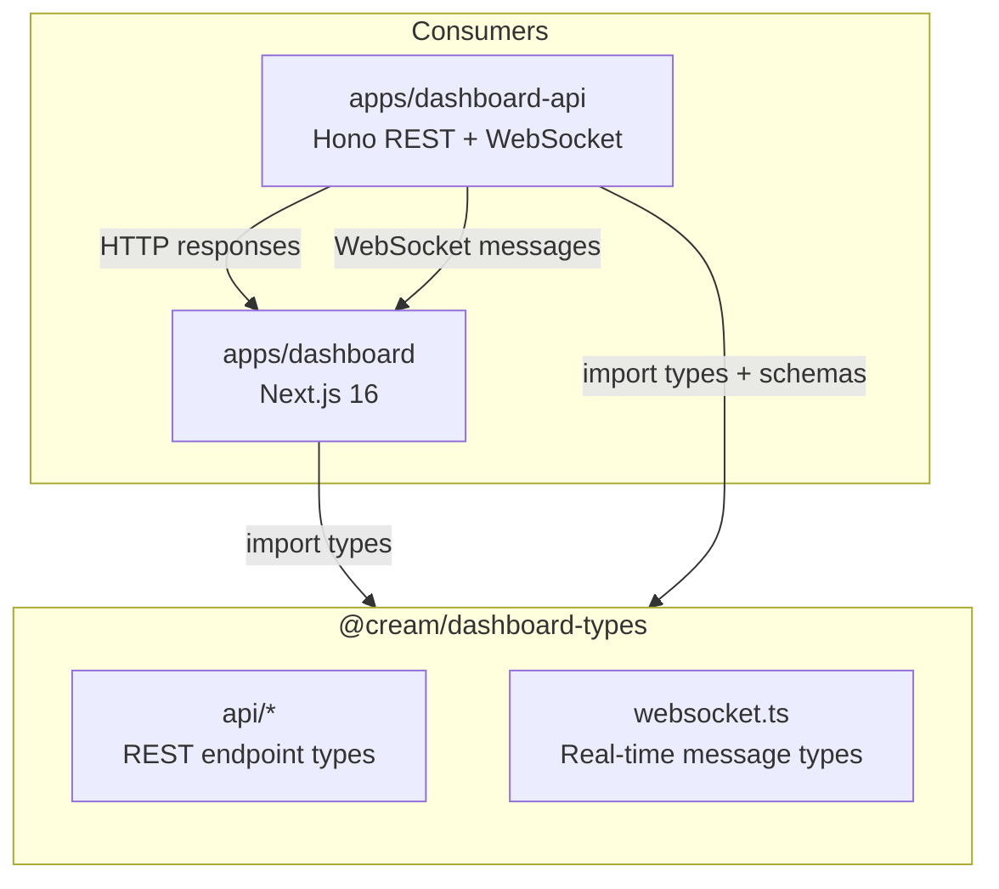
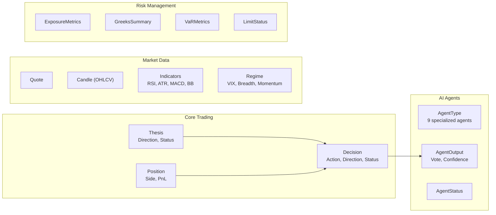
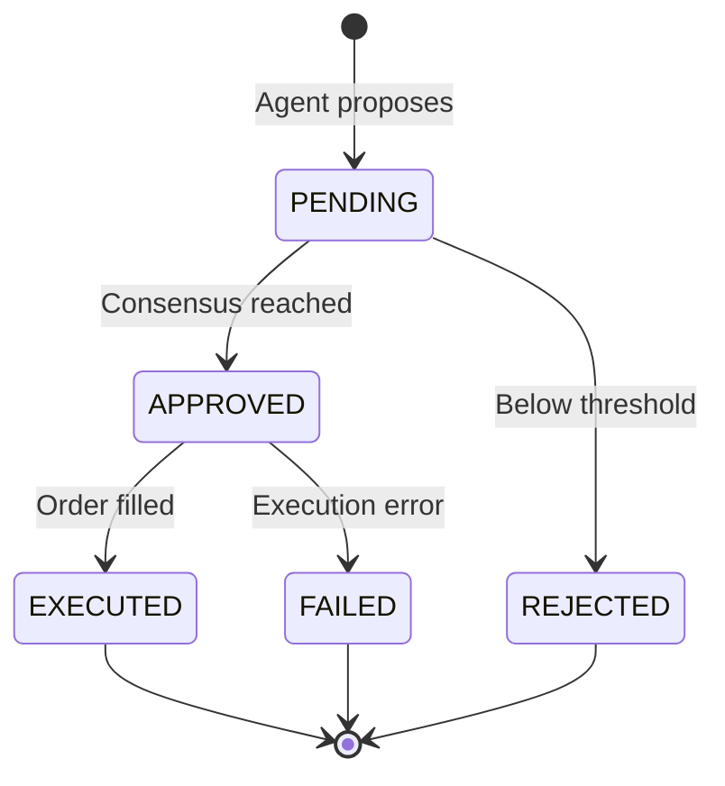
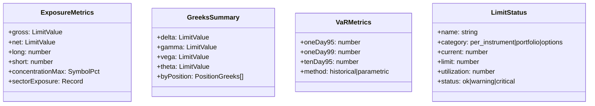
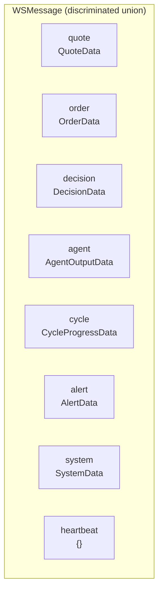

# @cream/dashboard-types

Shared TypeScript types and Zod schemas for the Cream trading dashboard frontend (`apps/dashboard`) and API backend (`apps/dashboard-api`). This package ensures compile-time type safety and runtime validation across the frontend/backend boundary.

## Architecture



## Exports

| Path | Content |
|------|---------|
| `@cream/dashboard-types` | All API types + WebSocket types |
| `@cream/dashboard-types/api` | REST API types only |
| `@cream/dashboard-types/websocket` | WebSocket message types only |

## Type Domains



## REST API Types

### Account (`api/account.ts`)

| Type | Purpose |
|------|---------|
| `Account` | Full Alpaca account state (margin, buying power, PDT status) |
| `AccountSummary` | Dashboard display subset (cash, equity, buying power, margin used) |
| `PortfolioHistory` | Time-series equity data with configurable timeframe/period |

### Decisions (`api/decisions.ts`)



| Type | Fields |
|------|--------|
| `Decision` | id, cycleId, symbol, action, direction, size, sizeUnit, prices, status |
| `DecisionDetail` | Extends Decision with rationale, factors, agentOutputs, citations, execution |
| `AgentOutput` | agentType, vote (APPROVE/REJECT), confidence, reasoning, processingTimeMs |
| `ExecutionDetail` | orderId, broker, status, filledQty, avgFillPrice, slippage, commissions |

**Enums:**
- `DecisionAction`: BUY, SELL, HOLD, CLOSE
- `DecisionDirection`: LONG, SHORT, FLAT
- `SizeUnit`: SHARES, CONTRACTS, DOLLARS, PCT_EQUITY
- `DecisionStatus`: PENDING, APPROVED, REJECTED, EXECUTED, FAILED

### Portfolio (`api/portfolio.ts`)

| Type | Purpose |
|------|---------|
| `PortfolioSummary` | NAV, cash, exposure (gross/net), PnL (today/total) |
| `Position` | Symbol, side, qty, avgEntry, currentPrice, unrealizedPnl, thesisId, daysHeld |
| `PerformanceMetrics` | Period returns, Sharpe, Sortino, max drawdown, win rate, profit factor |

### Risk (`api/risk.ts`)



### Agents (`api/agents.ts`)

Nine specialized agent types participate in the OODA loop:

| Agent | Role |
|-------|------|
| `technical` | Price action, chart patterns, indicators |
| `grounding` | Reality check against market conditions |
| `news` | News sentiment and event impact |
| `fundamentals` | Financial statements, valuations |
| `bullish` | Devil's advocate for long positions |
| `bearish` | Devil's advocate for short positions |
| `trader` | Execution timing and sizing |
| `risk` | Portfolio risk assessment |
| `critic` | Final review before approval |

### Market (`api/market.ts`)

| Type | Content |
|------|---------|
| `Quote` | Bid, ask, last, volume |
| `Candle` | OHLCV with timestamp |
| `Indicators` | RSI14, ATR14, SMAs, EMAs, MACD, Bollinger Bands |
| `Regime` | Market regime classification (label, confidence, VIX/breadth/momentum) |
| `NewsItem` | Headline, summary, source, symbols, sentiment score |

Re-exports `IndicatorSnapshot` types from `@cream/indicators` for comprehensive market context.

### Theses (`api/theses.ts`)

| Type | Purpose |
|------|---------|
| `Thesis` | Investment thesis with direction, timeHorizon, catalysts, target/stop prices |
| `ThesisHistoryEntry` | Audit trail of thesis modifications |

**Enums:**
- `ThesisDirection`: BULLISH, BEARISH, NEUTRAL
- `ThesisStatus`: ACTIVE, INVALIDATED, REALIZED

### Configuration (`api/config.ts`)

| Type | Purpose |
|------|---------|
| `Config` | Full system config (schedule, universe, indicators, constraints) |
| `ConstraintsConfig` | Position limits (per-instrument, portfolio, options Greeks) |
| `Environment` | PAPER or LIVE |

### Economic Calendar (`api/economic-calendar.ts`)

| Type | Purpose |
|------|---------|
| `EconomicCalendarEvent` | Scheduled economic release with impact, category, previous/forecast/actual |
| `FOMCMeeting` | Federal Reserve meeting with statement/press conference/projections flags |
| `UpcomingEventsResponse` | Aggregated view with next high-impact event highlighted |

## WebSocket Types

Real-time message protocol using Zod discriminated unions for type-safe message handling.



### Message Structure

Every WebSocket message follows:

```typescript
{
  type: WSMessageType,  // discriminant
  data: <PayloadType>,  // type-specific payload
  timestamp: string     // ISO 8601
}
```

### Payload Types

| Type | Key Fields |
|------|------------|
| `QuoteData` | symbol, bid, ask, last, volume, change, changePct |
| `OrderData` | orderId, symbol, side, status, qty, filledQty, avgFillPrice |
| `DecisionData` | decisionId, symbol, action, status, confidence |
| `AgentOutputData` | agentType, decisionId, vote, confidence, processingTimeMs |
| `CycleProgressData` | cycleId, phase (observe/orient/decide/act/complete), progress |
| `AlertData` | alertId, severity, message, source |
| `SystemData` | status (running/paused/stopped/error), message |

### Helper Types

```typescript
// Extract payload type for a specific message type
type WSMessageData<T extends WSMessageType> = Extract<WSMessage, { type: T }>["data"];

// Example: WSMessageData<"quote"> resolves to QuoteData
```

## Usage

### Backend (dashboard-api)

```typescript
import { DecisionSchema, type Decision } from "@cream/dashboard-types";

// Runtime validation of incoming data
const validated = DecisionSchema.parse(rawData);

// Type-safe response
const decision: Decision = {
  id: "dec_123",
  cycleId: "cycle_456",
  symbol: "AAPL",
  action: "BUY",
  direction: "LONG",
  size: 100,
  sizeUnit: "SHARES",
  // ...
};
```

### Frontend (dashboard)

```typescript
import type { Decision, WSMessage } from "@cream/dashboard-types";
import { WSMessageSchema } from "@cream/dashboard-types";

// Type-safe API response handling
const decisions: Decision[] = await fetch("/api/decisions").then(r => r.json());

// Runtime validation of WebSocket messages
ws.onmessage = (event) => {
  const result = WSMessageSchema.safeParse(JSON.parse(event.data));
  if (result.success) {
    switch (result.data.type) {
      case "quote":
        // result.data.data is QuoteData
        break;
      case "decision":
        // result.data.data is DecisionData
        break;
    }
  }
};
```

## Dependencies

| Package | Purpose |
|---------|---------|
| `zod` | Runtime schema validation |
| `@cream/indicators` | Re-exported indicator snapshot types |
