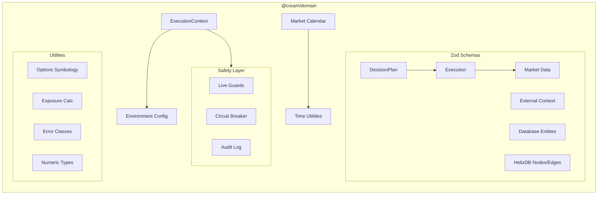
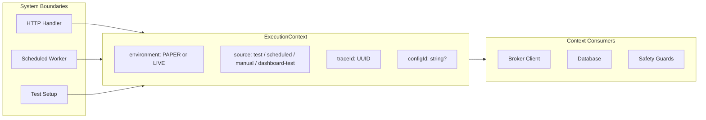
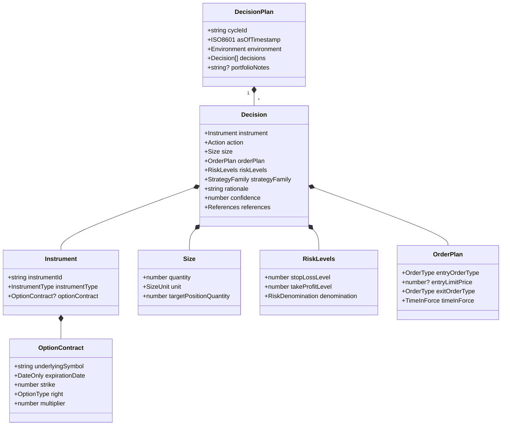
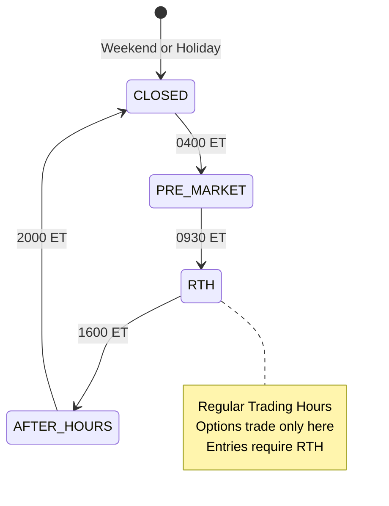
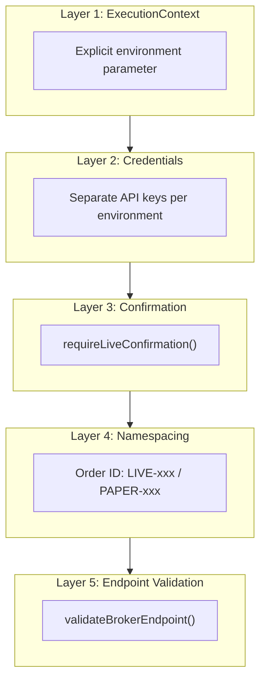
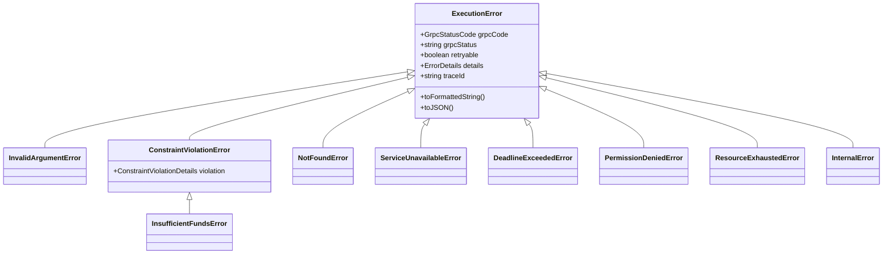
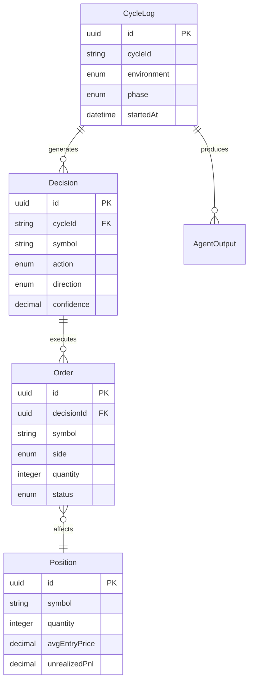
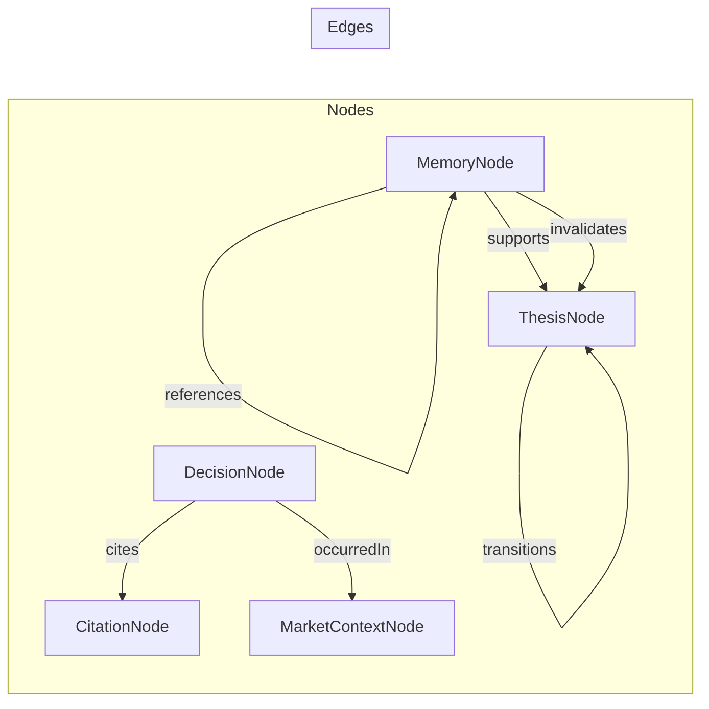
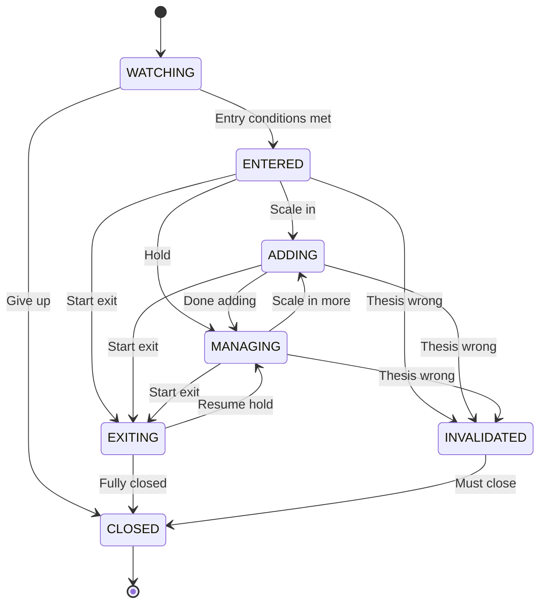

# @cream/domain

Core domain primitives, Zod schemas, and type-safe utilities for the Cream trading system. This package defines the canonical data structures used across all TypeScript services.

## Package Exports

```typescript
import { ... } from "@cream/domain";        // Main exports
import { ... } from "@cream/domain/env";     // Environment config
import { ... } from "@cream/domain/schemas"; // Database/HelixDB schemas
import { ... } from "@cream/domain/time";    // ISO-8601 utilities
import { ... } from "@cream/domain/calendar"; // Market calendar service
import { ... } from "@cream/domain/grpc";    // gRPC client utilities
import { ... } from "@cream/domain/websocket"; // WebSocket message schemas
```

## Architecture Overview



## ExecutionContext

Replaces ambient `CREAM_ENV` with explicit context created at system boundaries. All functions requiring environment awareness receive context as a parameter.

```typescript
import { createContext, isLive, isPaper, isTest } from "@cream/domain";

// Create at system boundaries (HTTP handlers, workers, tests)
const ctx = createContext("PAPER", "scheduled", configId);

// Thread through all operations
if (isLive(ctx)) {
  // Additional safety checks for real money
}
```



| Source | Description |
|--------|-------------|
| `test` | Unit/integration tests via bun test |
| `dashboard-test` | Manual OODA testing from dashboard UI |
| `scheduled` | Hourly OODA loop worker |
| `manual` | CLI invocation |

## DecisionPlan Schema

The core contract between LLM agents and the execution engine. Mirrors Protobuf definitions in `packages/schema`.



### Action Semantics

Actions express intent in terms of exposure, not broker order side:

| Action | From State | To State | Broker Side |
|--------|------------|----------|-------------|
| `BUY` | Flat | Long | BUY |
| `SELL` | Flat | Short | SELL |
| `INCREASE` | Long | Longer | BUY |
| `INCREASE` | Short | Shorter | SELL |
| `REDUCE` | Long | Less Long | SELL |
| `REDUCE` | Short | Less Short | BUY |
| `HOLD` | Any | Same | None |
| `NO_TRADE` | Flat | Flat | None |

```typescript
import { mapActionToBrokerOrder, deriveActionFromPositions } from "@cream/domain";

// Map decision to broker order
const mapping = mapActionToBrokerOrder("BUY", 0, 100);
// { side: "BUY", quantity: 100, description: "Establish long position of 100 units" }

// Derive action from position change
const action = deriveActionFromPositions(100, 150); // "INCREASE"
```

## Market Calendar

Trading session validation and NYSE holiday handling. Delegates to `CalendarService` (Alpaca API or hardcoded fallback).



```typescript
import {
  getTradingSession,
  isRTH,
  validateSessionForAction,
  getNextTradingDay,
  isMonthlyExpiration
} from "@cream/domain";

const session = getTradingSession(new Date()); // "RTH" | "PRE_MARKET" | "AFTER_HOURS" | "CLOSED"

// Validate action feasibility
const result = validateSessionForAction("BUY", "OPTION", new Date());
if (!result.valid) {
  console.log(result.reason);     // "Options can only be traded during RTH"
  console.log(result.suggestion); // "Re-plan with NO_TRADE or wait for RTH"
}
```

### Session Rules

| Action Type | Equities | Options |
|------------|----------|---------|
| Entry (BUY, SELL, INCREASE) | RTH only | RTH only |
| Exit (CLOSE, REDUCE) | RTH (extended hours optional) | RTH only |
| HOLD | Any session | Any session |

## Time Utilities

ISO-8601/RFC 3339 timestamp handling for cross-language compatibility (TypeScript + Rust).

```typescript
import {
  nowIso8601,
  toIso8601,
  fromIso8601,
  toDateOnly,
  addHours,
  daysToExpiration,
  isOptionExpired
} from "@cream/domain";

const now = nowIso8601();                    // "2026-01-26T15:30:45.123Z"
const expiry = toDateOnly(new Date());       // "2026-01-26"
const dte = daysToExpiration("2026-02-21");  // 26.xxx

// Arithmetic
const later = addHours(now, 1);
```

| Type | Format | Use Case |
|------|--------|----------|
| `Iso8601Utc` | `YYYY-MM-DDTHH:mm:ss.sssZ` | All timestamps |
| `DateOnly` | `YYYY-MM-DD` | Option expirations |

## Environment Configuration

Zod-validated environment variables with context-aware helpers.

```typescript
import {
  env,                    // Validated config object
  requireEnv,             // Get CREAM_ENV at startup
  validateEnvironment,    // Check required vars for service
  getAlpacaBaseUrl,       // Context-aware broker URL
  getHelixUrl             // HelixDB connection
} from "@cream/domain";

// At service startup
const creamEnv = requireEnv(); // Throws if CREAM_ENV not set
const ctx = createContext(creamEnv, "scheduled");

// Validate all requirements
validateEnvironmentOrExit(ctx, "dashboard-api", ["DATABASE_URL"]);

// Use context for environment-specific behavior
const brokerUrl = getAlpacaBaseUrl(ctx);
// PAPER: "https://paper-api.alpaca.markets"
// LIVE:  "https://api.alpaca.markets"
```

## Safety Mechanisms

Multi-layer protection against accidental live trading.



```typescript
import {
  requireLiveConfirmation,
  preventAccidentalLiveExecution,
  generateOrderId,
  validateBrokerEndpoint,
  recordCircuitFailure,
  requireCircuitClosed
} from "@cream/domain";

// At LIVE startup
requireLiveConfirmation("I_UNDERSTAND_THIS_IS_REAL_MONEY", ctx);

// Before any order submission
preventAccidentalLiveExecution(ctx);

// Namespaced order IDs
const orderId = generateOrderId(ctx); // "LIVE-018e4f2a-7b3c9d1e"

// Circuit breaker pattern
try {
  await submitOrder();
  resetCircuit("broker", ctx);
} catch (error) {
  recordCircuitFailure("broker", error, ctx);
  requireCircuitClosed("broker", ctx); // Throws after threshold failures
}
```

## Error Handling

Typed error classes mapping to gRPC status codes from the Rust execution engine.



| gRPC Status | Error Class | Retryable |
|-------------|-------------|-----------|
| `INVALID_ARGUMENT` | `InvalidArgumentError` | No |
| `FAILED_PRECONDITION` | `ConstraintViolationError` | No |
| `NOT_FOUND` | `NotFoundError` | No |
| `UNAVAILABLE` | `ServiceUnavailableError` | Yes |
| `DEADLINE_EXCEEDED` | `DeadlineExceededError` | Yes |
| `RESOURCE_EXHAUSTED` | `ResourceExhaustedError` | Yes (backoff) |
| `PERMISSION_DENIED` | `PermissionDeniedError` | No |
| `INTERNAL` | `InternalError` | No |

```typescript
import {
  mapGrpcError,
  isRetryableError,
  withRetry,
  InsufficientFundsError
} from "@cream/domain";

// Map gRPC errors to typed classes
const error = mapGrpcError(grpcError);
if (isRetryableError(error)) {
  await withRetry(() => submitOrder(), { maxRetries: 3 });
}

// Check specific error types
if (error instanceof InsufficientFundsError) {
  console.log(`Need $${error.requiredAmount}, have $${error.availableAmount}`);
}
```

## Options Symbology (OSI)

21-character OCC standard format for option contracts.

```
AAPL  260321C00180000
├────┤├────┤│├───────┤
Symbol Date  │ Strike
      YYMMDD│ $$$$$¢¢¢
             C/P
```

```typescript
import { parseOSI, toOSI, isValidOSI, extractStrike } from "@cream/domain";

// Parse OSI to contract
const result = parseOSI("AAPL  260321C00180000");
if (result.success) {
  console.log(result.contract.underlyingSymbol); // "AAPL"
  console.log(result.contract.strike);           // 180
  console.log(result.contract.right);            // "CALL"
}

// Generate OSI from contract
const osi = toOSI({
  underlyingSymbol: "AAPL",
  expirationDate: "2026-03-21",
  strike: 180,
  right: "CALL",
  multiplier: 100
}); // "AAPL  260321C00180000"
```

## Exposure Calculations

Portfolio risk metrics for gross/net exposure and limit validation.

```typescript
import {
  calculateExposureStats,
  validateExposure,
  calculateDeltaAdjustedExposure,
  DEFAULT_EXPOSURE_LIMITS
} from "@cream/domain";

const stats = calculateExposureStats(positions, accountEquity);
// stats.grossExposurePctEquity = 1.0 (100%)
// stats.netExposurePctEquity = 0.4 (40% net long)

const validation = validateExposure(positions, accountEquity, {
  maxGrossExposure: 2.0,      // 200%
  maxSinglePositionExposure: 0.2 // 20%
});

if (!validation.valid) {
  for (const v of validation.violations) {
    console.log(v.message); // "Position AAPL exposure 25.0% exceeds limit of 20.0%"
  }
}
```

## Database Schemas

Zod schemas for PostgreSQL entities via Drizzle ORM.



Key schemas: `DecisionInsertSchema`, `OrderInsertSchema`, `PositionInsertSchema`, `CycleLogInsertSchema`, `PortfolioSnapshotInsertSchema`

## HelixDB Schemas

Graph database schemas for agent memory and thesis tracking.



### Thesis State Machine



## External Context

Structured data from news, sentiment, and fundamentals providers.

```typescript
import {
  ExternalContextSchema,
  createEmptyExternalContext,
  getSentimentScore,
  hasExternalContext
} from "@cream/domain";

const ctx: ExternalContext = {
  news: {
    items: [...],
    aggregateSentiment: 0.65,
    itemCount: 12,
    periodHours: 24
  },
  sentiment: {
    combinedScore: 0.55,
    direction: "BULLISH",
    confidence: 0.8
  },
  fundamentals: {
    earnings: { daysToEarnings: 14, epsEstimate: 2.15 },
    valuation: { peRatio: 28.5, forwardPe: 24.2 }
  },
  macro: {
    vix: 18.5,
    treasury10y: 4.25
  }
};

const sentiment = getSentimentScore(ctx); // 0.55
```

## Validation Utilities

Error formatting, batch validation, and SQL injection prevention.

```typescript
import {
  safeParse,
  formatValidationError,
  validateBatch,
  createTypeGuard,
  coerceInt,
  safeString
} from "@cream/domain/schemas";

// Safe parsing with structured errors
const result = safeParse(OrderInsertSchema, data);
if (!result.success) {
  return Response.json(result.error, { status: 400 });
}

// Batch validation
const { valid, invalid } = validateBatch(PositionSchema, positions);
console.log(`${valid.length} valid, ${invalid.length} invalid`);

// Type guards
const isOrder = createTypeGuard(OrderInsertSchema);
if (isOrder(data)) {
  // data is typed as OrderInsert
}

// Query parameter coercion
const QuerySchema = z.object({
  page: coerceInt(1),
  limit: coerceInt(20)
});
```

## Position Sizing

Risk-based position sizing calculators.

```typescript
import {
  calculateFixedFractional,
  calculateVolatilityTargeted,
  calculateFractionalKelly,
  calculateLiquidityLimit,
  DEFAULT_RISK_LIMITS
} from "@cream/domain";

// Fixed fractional (risk % of equity per trade)
const size = calculateFixedFractional({
  equity: 100000,
  riskPerTrade: 0.01,  // 1%
  entryPrice: 150,
  stopLoss: 145
}); // { shares: 200, dollarRisk: 1000 }

// Volatility-targeted sizing
const volSize = calculateVolatilityTargeted({
  equity: 100000,
  targetVolatility: 0.15,
  atr: 3.5,
  price: 150
});
```

## Drawdown Tracking

Portfolio drawdown monitoring and alerts.

```typescript
import {
  DrawdownTracker,
  calculateDrawdownStats,
  checkDrawdownAlert,
  DRAWDOWN_THRESHOLDS
} from "@cream/domain";

const tracker = new DrawdownTracker();
tracker.update(100000); // New equity point
tracker.update(95000);  // Drawdown of 5%

const stats = tracker.getStats();
// stats.currentDrawdown = 0.05
// stats.maxDrawdown = 0.05

const alert = checkDrawdownAlert(stats, {
  warning: 0.05,
  danger: 0.10,
  critical: 0.15
});
// alert.level = "warning"
```

## LLM Output Parsing

Utilities for parsing and validating LLM-generated JSON with retry logic.

```typescript
import {
  parseWithRetry,
  cleanLLMOutput,
  generateRetryPrompt,
  schemaToDescription
} from "@cream/domain";

const result = await parseWithRetry(
  DecisionPlanSchema,
  llmOutput,
  {
    maxAttempts: 3,
    logger: console,
    agentType: "trader"
  }
);

if (result.success) {
  const plan = result.data;
} else {
  console.error(result.errors);
}
```

## Dependencies

- `zod` - Runtime schema validation
- `@bufbuild/protobuf` - Protobuf support
- `@connectrpc/connect` - gRPC client
- `@cream/logger` - Structured logging
- `@cream/schema-gen` - Generated Protobuf stubs
