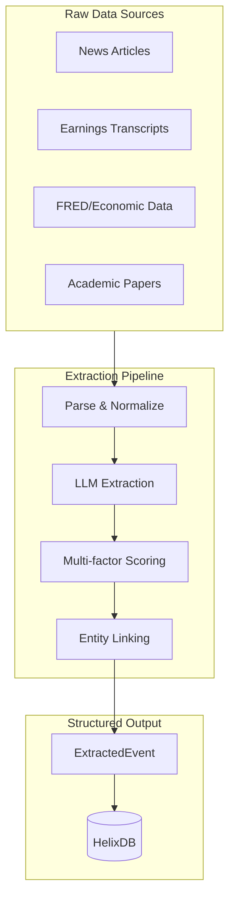
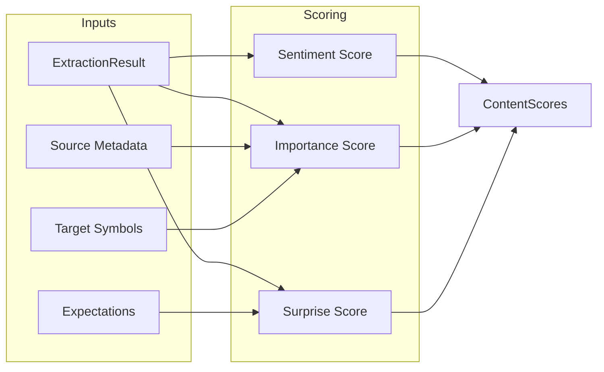
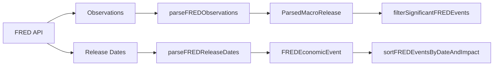
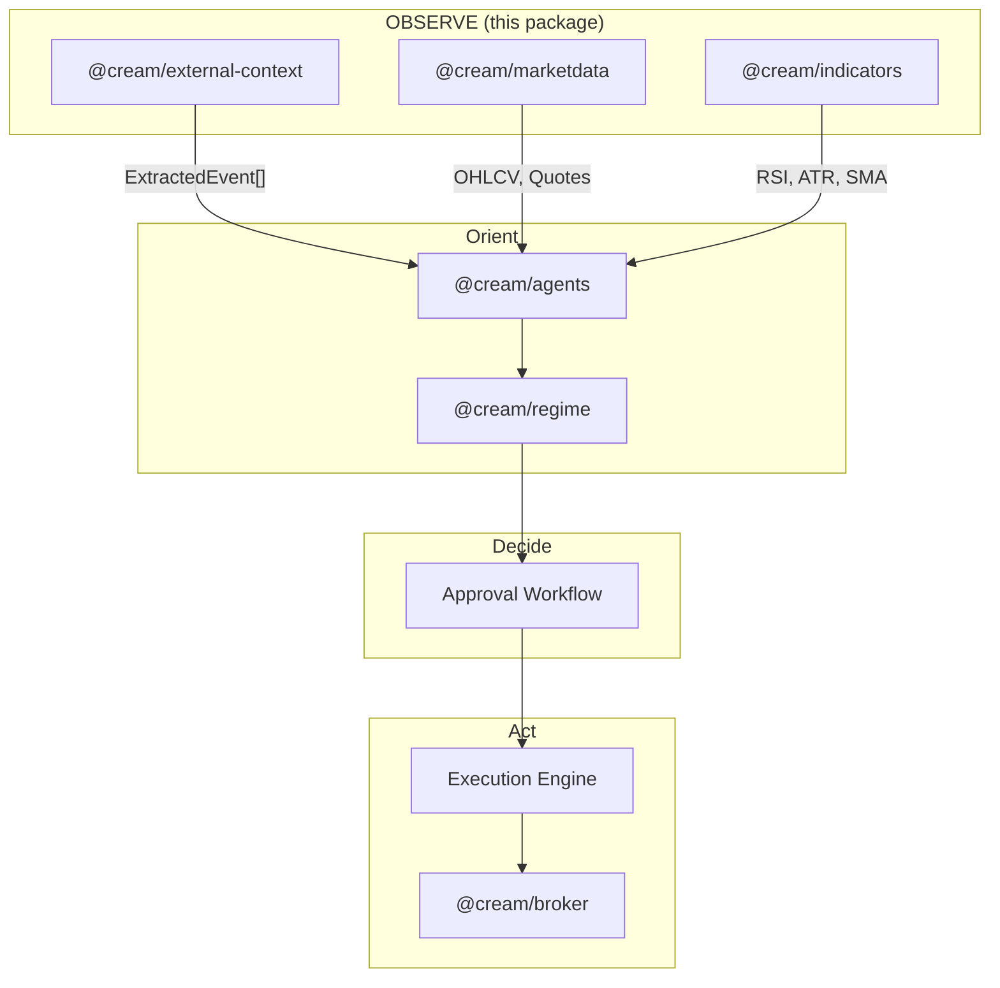

# @cream/external-context

External context extraction pipeline for the Cream trading system. Transforms raw market intelligence (news, transcripts, macro releases) into structured, scored events for the **Observe** phase of the OODA loop.

## Architecture



## Pipeline Stages

### Stage 1: Parse

Normalizes heterogeneous inputs into consistent internal formats.

| Parser | Input | Output | Key Features |
|--------|-------|--------|--------------|
| `newsParser` | `NewsArticle[]` | `ParsedNews[]` | HTML entity cleanup, content length validation, symbol extraction |
| `transcriptParser` | `TranscriptInput[]` | `ParsedTranscript[]` | Speaker segmentation, role detection, Q&A section splitting |
| `macroParser` | `EconomicCalendarEvent[]` / FRED data | `ParsedMacroRelease[]` | FRED series metadata lookup, release time classification |

### Stage 2: Extract (LLM)

Uses dependency-injected `IExtractionClient` for structured extraction via LLM.

```typescript
interface ExtractionResult {
  sentiment: "bullish" | "bearish" | "neutral";
  confidence: number;           // 0-1
  entities: ExtractedEntity[];  // Companies, people, products
  dataPoints: DataPoint[];      // Numeric metrics with units
  eventType: EventType;         // earnings, guidance, merger_acquisition, etc.
  importance: number;           // 1-5 scale
  summary: string;
  keyInsights: string[];
}
```

### Stage 3: Score



**Sentiment Score** (-1.0 to 1.0)
- Converts categorical sentiment to numeric with confidence weighting
- Aggregation methods: mean, median, weighted

**Importance Score** (0.0 to 1.0)
- Source credibility (transcripts: 0.95, press releases: 0.9, Reuters: 0.85, unknown: 0.5)
- Recency decay (configurable half-life, default 24h)
- Entity relevance to target portfolio
- LLM importance rating

**Surprise Score** (-1.0 to 1.0)
- Compares extracted data points against provided expectations
- Falls back to sentiment+importance heuristics when no expectations match

### Stage 4: Link

Maps extracted company names to ticker symbols using local alias dictionary.

```typescript
const COMPANY_ALIASES = {
  "apple": "AAPL",
  "alphabet": "GOOGL",
  "meta platforms": "META",
  // 100+ major companies covered
};
```

Match methods:
- **exact**: Ticker provided in extraction
- **alias**: Direct alias match (confidence: 0.95)
- **fuzzy**: Partial alias match (confidence: 0.8)

## Usage

```typescript
import { createExtractionClient } from "@cream/agents";
import { createExtractionPipeline } from "@cream/external-context";

const pipeline = createExtractionPipeline({
  extractionClient: createExtractionClient(),
  targetSymbols: ["AAPL", "MSFT", "GOOGL"],
  expectations: [
    { metric: "revenue", expectedValue: 120_000_000_000 },
    { metric: "eps", expectedValue: 2.50 },
  ],
});

// Process news batch
const result = await pipeline.processNews(articles);
console.log(result.events);    // ExtractedEvent[]
console.log(result.stats);     // { inputCount, successCount, errorCount, processingTimeMs }

// Process single content item
const event = await pipeline.processContent(
  "Apple reported Q1 revenue of $120B, beating estimates.",
  "news",
  new Date(),
  "reuters.com",
  ["AAPL"]
);
```

### Dry Run Mode

Skip LLM calls for testing/development:

```typescript
const pipeline = createExtractionPipeline({
  extractionClient: mockClient,
  dryRun: true,  // Returns neutral extraction with no LLM call
});
```

## Data Flow to HelixDB

```typescript
import { createHelixClient } from "@cream/helix";
import { ingestExtractedEvents, searchSimilarEvents } from "@cream/external-context";

const client = createHelixClient();

// Ingest with embeddings and graph edges
await ingestExtractedEvents(client, events, {
  generateEmbeddings: true,
  createMacroEdges: true,
  createCompanyEdges: true,
});

// Semantic search for similar events
const similar = await searchSimilarEvents(
  client,
  "Fed rate hike inflation concerns",
  10
);
```

## FRED Integration



```typescript
import { parseFREDObservations, parseFREDReleaseDates } from "@cream/external-context";

// Parse historical observations
const releases = parseFREDObservations("CPIAUCSL", observations);

// Parse upcoming release calendar
const events = parseFREDReleaseDates(releaseDates, latestValues);
const significant = filterSignificantFREDEvents(events);  // high + medium impact only
```

Release times:
- Standard releases: 08:30 ET
- FOMC announcements: 14:00 ET

## Academic Research API

Query Semantic Scholar for research papers to ground trading hypotheses:

```typescript
import { createSemanticScholarClient } from "@cream/external-context";

const client = createSemanticScholarClient();

// Search finance-related papers
const papers = await client.searchFinancePapers("momentum factor", {
  limit: 10,
  recentYears: 5,
});

// Get paper by DOI or ArXiv ID
const paper = await client.getPaperByDOI("10.1111/j.1540-6261.2012.01740.x");
```

Rate limits:
- With API key: 1 req/sec
- Without API key: ~600ms between requests (shared pool)

## Event Types

```typescript
type EventType =
  | "earnings"           // Quarterly/annual results
  | "guidance"           // Forward-looking statements
  | "merger_acquisition" // M&A announcements
  | "product_launch"     // New products/services
  | "regulatory"         // SEC filings, compliance
  | "macro_release"      // Economic data releases
  | "analyst_rating"     // Upgrades/downgrades
  | "insider_trade"      // Form 4 filings
  | "dividend"           // Dividend declarations
  | "stock_split"        // Stock splits
  | "layoffs"            // Workforce reductions
  | "executive_change"   // C-suite changes
  | "legal"              // Lawsuits, settlements
  | "other";
```

## Scoring Utilities

```typescript
import {
  classifySentimentScore,
  classifyImportance,
  classifySurprise,
  computeSentimentMomentum,
  applyEventTypeBoost,
} from "@cream/external-context";

// Classify numeric scores
classifySentimentScore(0.7);  // "strong_bullish"
classifyImportance(0.5);      // "medium"
classifySurprise(-0.6);       // "big_miss"

// Sentiment momentum (recent vs older)
const momentum = computeSentimentMomentum(recentScores, olderScores);

// Boost importance for high-impact event types
const boosted = applyEventTypeBoost(0.5, "merger_acquisition");  // 0.7
```

## Integration with OODA Loop



The `@cream/external-context` package provides the qualitative market intelligence that complements quantitative price/indicator data during the Observe phase.

## Dependencies

| Package | Purpose |
|---------|---------|
| `@cream/config` | Runtime configuration |
| `@cream/domain` | Shared Zod schemas |
| `@cream/helix` | Graph database client |
| `@cream/logger` | Structured logging |
| `@cream/universe` | FRED series metadata, release classification |
