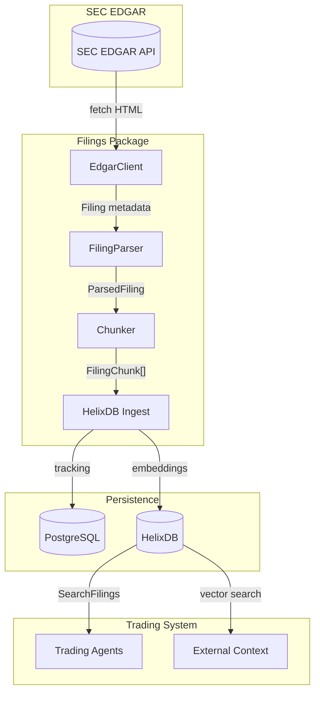
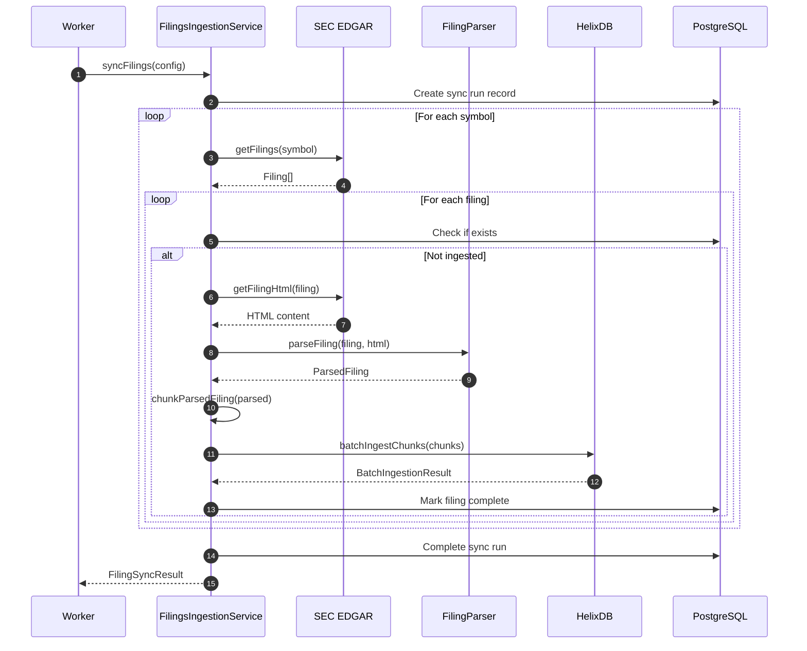
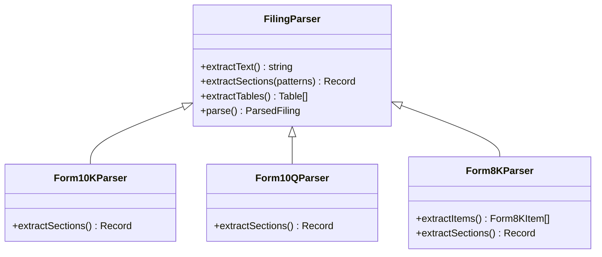
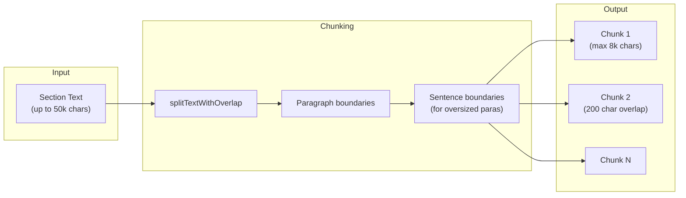
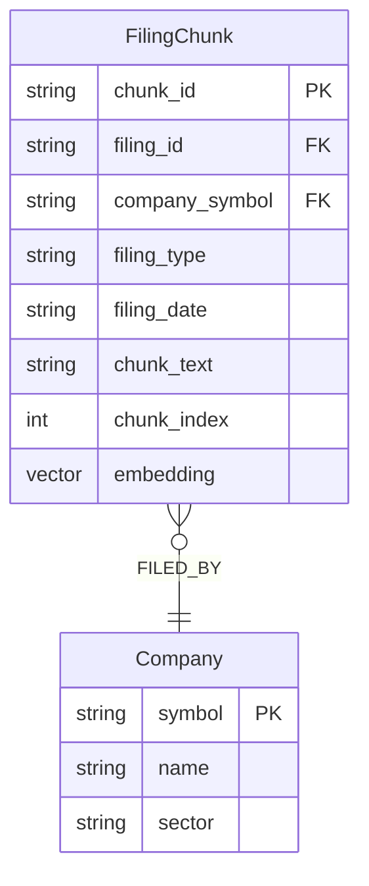
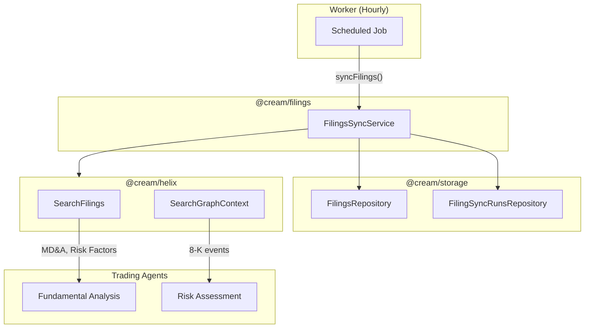

# @cream/filings

SEC EDGAR filings ingestion pipeline for Cream's fundamental analysis. Fetches, parses, and chunks 10-K, 10-Q, and 8-K filings into HelixDB for RAG-based retrieval during trading decisions.

## Architecture



## Filing Types

| Type | Purpose | Frequency | Key Sections |
|------|---------|-----------|--------------|
| **10-K** | Annual report | Yearly | Business, Risk Factors, MD&A, Financial Statements |
| **10-Q** | Quarterly report | Q1, Q2, Q3 | Financial Statements, MD&A, Risk Factor updates |
| **8-K** | Current report | Event-driven | Material events (earnings, M&A, leadership changes) |

## Ingestion Pipeline



## Form Parsing

### Section Extraction

Each filing type has specialized parsers that extract relevant sections:



### 10-K Sections

| Section Key | Pattern | Content |
|-------------|---------|---------|
| `business` | Item 1 | Company description, products, markets |
| `risk_factors` | Item 1A | Material risks to the business |
| `properties` | Item 2 | Physical assets |
| `legal_proceedings` | Item 3 | Ongoing litigation |
| `mda` | Item 7 | Management's Discussion and Analysis |
| `financial_statements` | Item 8 | Audited financials |
| `quantitative_disclosures` | Item 7A | Market risk disclosures |
| `controls_procedures` | Item 9A | Internal controls |

### 10-Q Sections

| Section Key | Pattern | Content |
|-------------|---------|---------|
| `financial_statements` | Part I, Item 1 | Unaudited quarterly financials |
| `mda` | Item 2 | Quarterly MD&A |
| `quantitative_disclosures` | Item 3 | Quantitative/qualitative market risk |
| `controls_procedures` | Item 4 | Control changes |
| `legal_proceedings` | Part II, Item 1 | Legal updates |
| `risk_factors` | Item 1A | Risk factor updates |

### 8-K Items

8-K filings report specific material events. The parser extracts items by number:

| Section | Items | Events |
|---------|-------|--------|
| 1 | 1.01-1.04 | Material agreements, bankruptcy |
| 2 | 2.01-2.06 | Acquisitions, earnings (2.02), impairments |
| 3 | 3.01-3.03 | Delisting, unregistered sales |
| 4 | 4.01-4.02 | Accountant changes, restatements |
| 5 | 5.01-5.08 | Control changes, officer departures (5.02), bylaws |
| 7 | 7.01 | Regulation FD disclosures |
| 8 | 8.01 | Other material events |
| 9 | 9.01 | Exhibits |

## Chunking Strategy

Filings are split into overlapping chunks for RAG retrieval:



**Configuration:**
- Max chunk size: 8,000 characters
- Overlap: 200 characters (context preservation)
- Min section length: 100 characters (skip tiny sections)

**Chunk Format:**
```
## Business Description (Part 1 of 3)

[Section content with overlap from previous chunk...]
```

## HelixDB Integration

Filing chunks are stored as `FilingChunk` nodes with vector embeddings:



**Queries:**
- `InsertFilingChunk` - Ingest with auto-embedding via `Embed(chunk_text)`
- `SearchFilings(query, limit)` - Vector search across all filings
- `SearchFilingsByCompany(query, symbol, limit)` - Filtered by company
- `SearchGraphContext(query, limit)` - Cross-document search with company relationships

## Usage

### Sync Filings for Universe

```typescript
import { createFilingsIngestionService } from "@cream/filings";
import { createDatabase } from "@cream/storage";

const db = createDatabase();
const service = createFilingsIngestionService(db);

const result = await service.syncFilings({
  symbols: ["AAPL", "MSFT", "GOOGL"],
  filingTypes: ["10-K", "10-Q"],
  limitPerSymbol: 5,
  triggerSource: "scheduled",
  environment: "PAPER",
});

console.log(`Ingested ${result.filingsIngested} filings, ${result.chunksCreated} chunks`);
```

### Process Single Filing

```typescript
const service = createFilingsIngestionService(db);
const processed = await service.processFiling("AAPL", "0000320193-24-000081");

if (processed) {
  console.log(`Parsed ${Object.keys(processed.filing.sections).length} sections`);
  console.log(`Created ${processed.chunks.length} chunks`);
}
```

### Direct Parser Usage

```typescript
import { EdgarClient, parseFiling, chunkParsedFiling } from "@cream/filings";

const client = new EdgarClient();
const filings = await client.getFilings({
  tickerOrCik: "NVDA",
  filingTypes: ["8-K"],
  limit: 10,
});

for (const filing of filings) {
  const html = await client.getFilingHtml(filing);
  const parsed = parseFiling(filing, html);
  const chunks = chunkParsedFiling(parsed);

  // Use chunks for custom ingestion
}
```

## Integration with Cream



**Data Flow:**
1. **Worker** triggers filing sync on schedule or manual request
2. **FilingsIngestionService** fetches new filings from SEC EDGAR
3. **Parsers** extract sections based on filing type
4. **Chunker** splits content for optimal embedding
5. **HelixDB** stores chunks with vector embeddings
6. **Trading agents** query relevant filings during OODA loops

## Environment Variables

| Variable | Required | Description |
|----------|----------|-------------|
| `OPERATOR_EMAIL` | Yes | Contact email for SEC API User-Agent |
| `HELIX_HOST` | Yes | HelixDB server host |
| `HELIX_PORT` | Yes | HelixDB server port |
| `DATABASE_URL` | Yes | PostgreSQL connection string |
| `LOG_LEVEL` | No | `debug` or `info` (default) |

## Dependencies

| Package | Purpose |
|---------|---------|
| `sec-edgar-toolkit` | SEC EDGAR API client |
| `cheerio` | HTML parsing |
| `@cream/helix` | HelixDB client |
| `@cream/storage` | PostgreSQL repositories |
| `@cream/logger` | Structured logging |
| `zod` | Schema validation |
