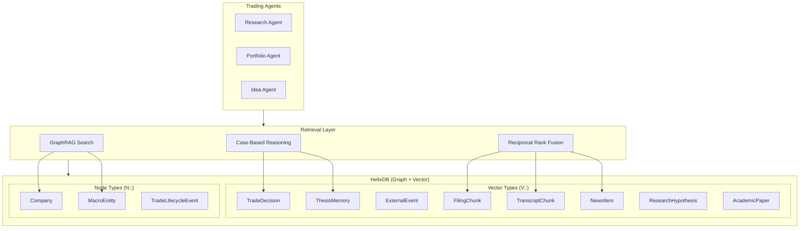
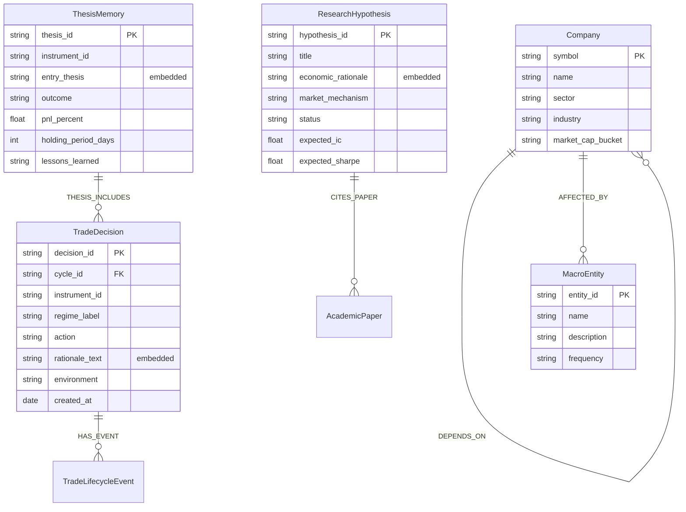
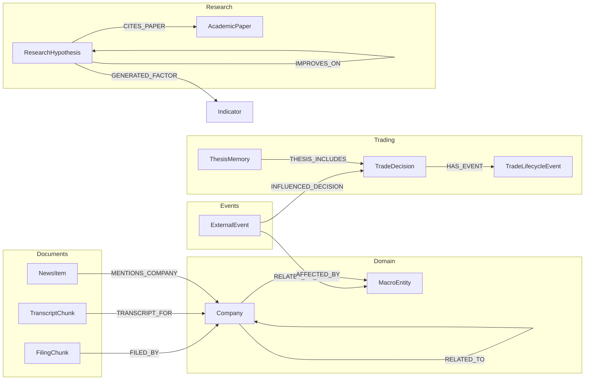
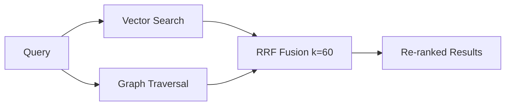
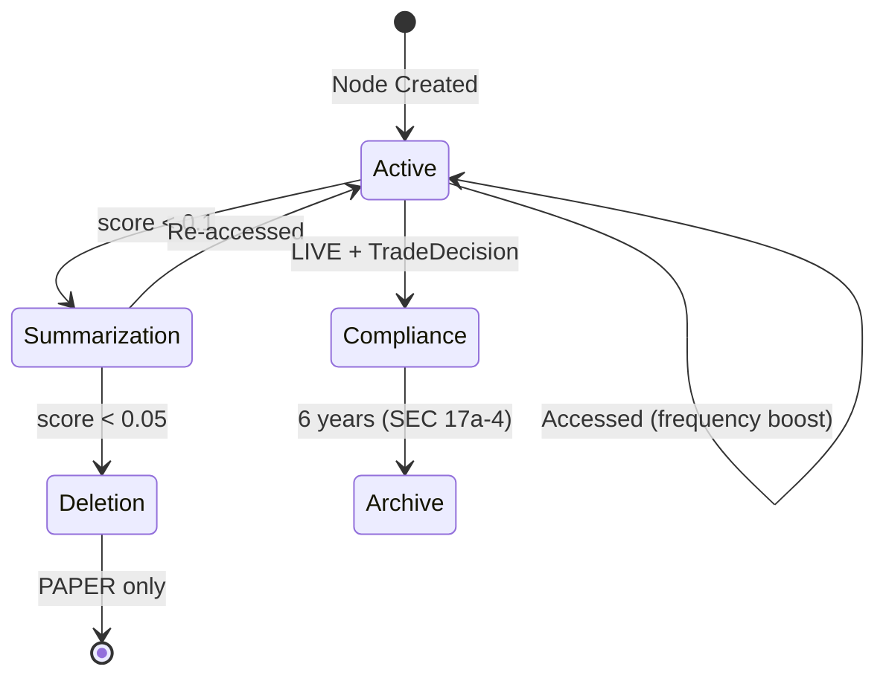

# @cream/helix-schema

HelixDB schema definitions and retrieval utilities for the Cream trading system's graph + vector memory layer.

## Architecture

HelixDB serves as the semantic memory backbone for Cream's agentic trading system, combining graph relationships with vector embeddings for hybrid retrieval (GraphRAG). This package defines the complete schema and provides TypeScript utilities for Case-Based Reasoning, Reciprocal Rank Fusion, and active forgetting.



## Schema Overview

### Type Prefixes

| Prefix | Description | Storage |
|--------|-------------|---------|
| `V::` | Vector types with embeddings | HNSW index for similarity search |
| `N::` | Node types without embeddings | Graph traversal only |
| `E::` | Edge types (relationships) | Graph edges with properties |

### Node Types



### Edge Relationships



## Retrieval Patterns

### Case-Based Reasoning (CBR)

Retrieves similar historical trading decisions based on market context:

```typescript
import { retrieveSimilarCases, createEmbeddingClient } from "@cream/helix-schema";

const result = await retrieveSimilarCases(client, embeddingClient, {
  instrumentId: "AAPL",
  regimeLabel: "BULL_TREND",
  indicators: { rsi: 65, volatility: 0.25 },
});

// Returns cases with statistics
console.log(result.statistics.winRate);
console.log(result.statistics.avgReturn);
```

### Reciprocal Rank Fusion (RRF)

Combines vector similarity and graph traversal results using RRF (k=60):



```typescript
import { fuseWithRRF, DEFAULT_RRF_K } from "@cream/helix-schema";

const fused = fuseWithRRF(vectorResults, graphResults, {
  k: DEFAULT_RRF_K,  // 60 (empirically optimal)
  topK: 10,
});

// Nodes appearing in both sets get boosted scores
fused.forEach(r => console.log(r.rrfScore, r.sources));
```

### GraphRAG Unified Search

Cross-type search with graph expansion:

```typescript
// SearchGraphContext query returns:
// - FilingChunks, TranscriptChunks, NewsItems, ExternalEvents
// - Plus their connected Companies via graph traversal
const context = await client.query("SearchGraphContext", {
  query: "Apple supply chain risks",
  limit: 10
});
```

## Active Forgetting (Ebbinghaus Curve)

Memory retention follows the Ebbinghaus forgetting curve with compliance overrides:



Retention score formula:
```
score = base * recency * (1 + frequency) * (1 + importance)

where:
  recency = e^(-age_days / 365)
  frequency = log(1 + access_count) / 10
  importance = |realized_pnl| / 10000  (for trades)
```

```typescript
import { calculateRetentionScore, getForgettingDecision } from "@cream/helix-schema";

const breakdown = calculateRetentionScore(nodeInfo);
// breakdown.recencyFactor, frequencyFactor, importanceFactor

const decision = getForgettingDecision(nodeInfo);
// decision: RETAIN | SUMMARIZE | DELETE
```

## Temporal Edges (Bi-Temporal Model)

Edges support point-in-time queries:

```typescript
import { createTemporalEdge, isEdgeActiveAt } from "@cream/helix-schema";

// Create edge with valid_from, valid_to, recorded_at
const edge = createTemporalEdge(Date.parse("2024-01-01"));

// Query: "What were AAPL's suppliers in Q3 2024?"
if (isEdgeActiveAt(edge, Date.parse("2024-09-15"))) {
  // Edge was active at that time
}
```

## Compliance (SEC Rule 17a-4)

LIVE trading records are immutable with 6-year retention:

```typescript
import { AuditLogger, checkImmutability, requireMutable } from "@cream/helix-schema";

const logger = new AuditLogger(storage, { environment: "LIVE" });

// All writes are logged with hash chains
await logger.logOperation({
  entityType: "TradeDecision",
  entityId: "dec-123",
  operation: "CREATE",
  before: null,
  after: decisionData,
});

// Immutability enforcement
requireMutable(node); // Throws ImmutabilityViolationError for LIVE records
```

## HNSW Index Configuration

Vector indices are tuned per environment:

| Profile | ef_construction | ef_search | m | Use Case |
|---------|-----------------|-----------|---|----------|
| `low_latency` | 64 | 128 | 8 | Real-time trading (LIVE) |
| `balanced` | 128 | 768 | 16 | Default (PAPER) |
| `high_recall` | 256 | 1024 | 24 | Research/backtesting |

```typescript
import { getConfigForEnvironment, getTuningProfile } from "@cream/helix-schema";

const config = getConfigForEnvironment("PAPER"); // balanced profile
const profile = getTuningProfile("high_recall");
```

## Embedding Model

All vector types use Gemini embeddings (3072 dimensions):

| Node Type | Embedded Field | Model |
|-----------|----------------|-------|
| TradeDecision | `rationale_text` | gemini-embedding-001 |
| ThesisMemory | `entry_thesis` | gemini-embedding-001 |
| FilingChunk | `chunk_text` | gemini-embedding-001 |
| TranscriptChunk | `chunk_text` | gemini-embedding-001 |
| NewsItem | `headline` | gemini-embedding-001 |
| ExternalEvent | `text_summary` | gemini-embedding-001 |
| ResearchHypothesis | `economic_rationale` | gemini-embedding-001 |
| AcademicPaper | `paper_abstract` | gemini-embedding-001 |

## Queries (queries.hx)

### Insertion Queries

- `InsertTradeDecision` - Store trading decision with rationale embedding
- `InsertThesisMemory` - Store closed thesis with lessons learned
- `InsertFilingChunk` / `InsertTranscriptChunk` - Store document chunks
- `InsertResearchHypothesis` - Store alpha factor hypothesis
- `InsertCompany` / `InsertMacroEntity` - Store domain nodes

### Search Queries

- `SearchSimilarDecisions` - Vector search for CBR
- `SearchFilingsByCompany` / `SearchTranscriptsByCompany` - Filtered document search
- `SearchGraphContext` - Unified cross-type GraphRAG search
- `SearchSimilarHypotheses` - Find related research hypotheses

### Graph Traversal

- `GetTradeWithEvents` - Decision + lifecycle events
- `GetCompanyFilings` / `GetCompanyTranscripts` - Documents by company
- `GetCompanyDependencies` / `GetDependentCompanies` - Supply chain graph
- `GetHypothesisInspirations` / `GetCitingHypotheses` - Research lineage

## Configuration

`config.hx.json`:
```json
{
  "embedding_model": "gemini:gemini-embedding-001",
  "bm25": true,
  "mcp": true,
  "vector_config": {
    "ef_construction": 128,
    "ef_search": 768,
    "m": 16,
    "db_max_size": 20
  }
}
```

`helix.toml`:
```toml
[project]
name = "cream-helix"
queries = "./"
container_runtime = "docker"

[local.dev]
port = 6969
build_mode = "debug"
```

## Package Exports

```typescript
// Node/Edge type definitions
export type { TradeDecision, Company, ThesisMemory, ResearchHypothesis } from "@cream/helix-schema";

// CBR retrieval
export { retrieveSimilarCases, buildMemoryContext } from "@cream/helix-schema";

// RRF fusion
export { fuseWithRRF, calculateRRFScore, DEFAULT_RRF_K } from "@cream/helix-schema";

// Retention/Forgetting
export { calculateRetentionScore, getForgettingDecision } from "@cream/helix-schema";

// Compliance
export { AuditLogger, checkImmutability } from "@cream/helix-schema";

// Embedding utilities
export { EmbeddingClient, createEmbeddingClient } from "@cream/helix-schema";

// Temporal edges
export { createTemporalEdge, isEdgeActiveAt } from "@cream/helix-schema";
```

## Dependencies

- `@cream/domain` - Trading domain types (RetrievedCase, CaseStatistics)
- `@cream/config` - Configuration service
- `@google/genai` - Gemini embedding generation
