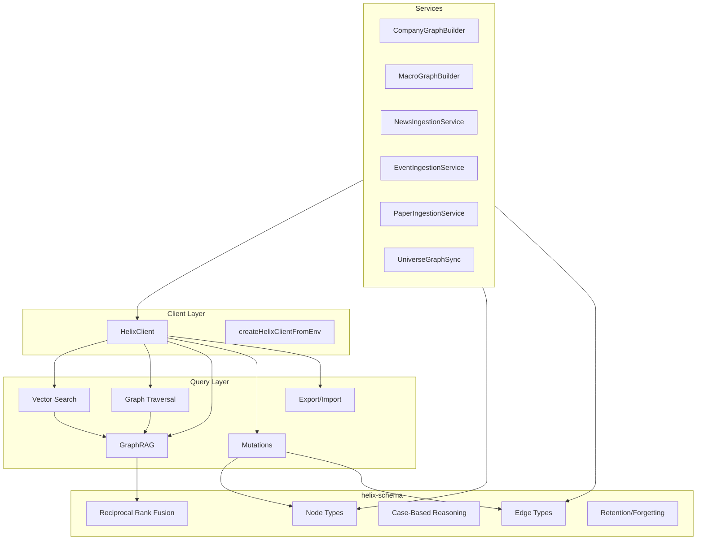
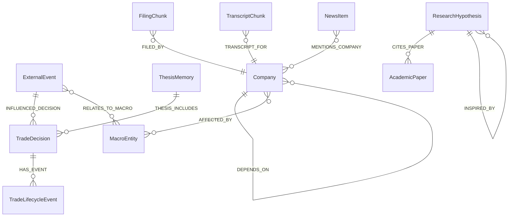
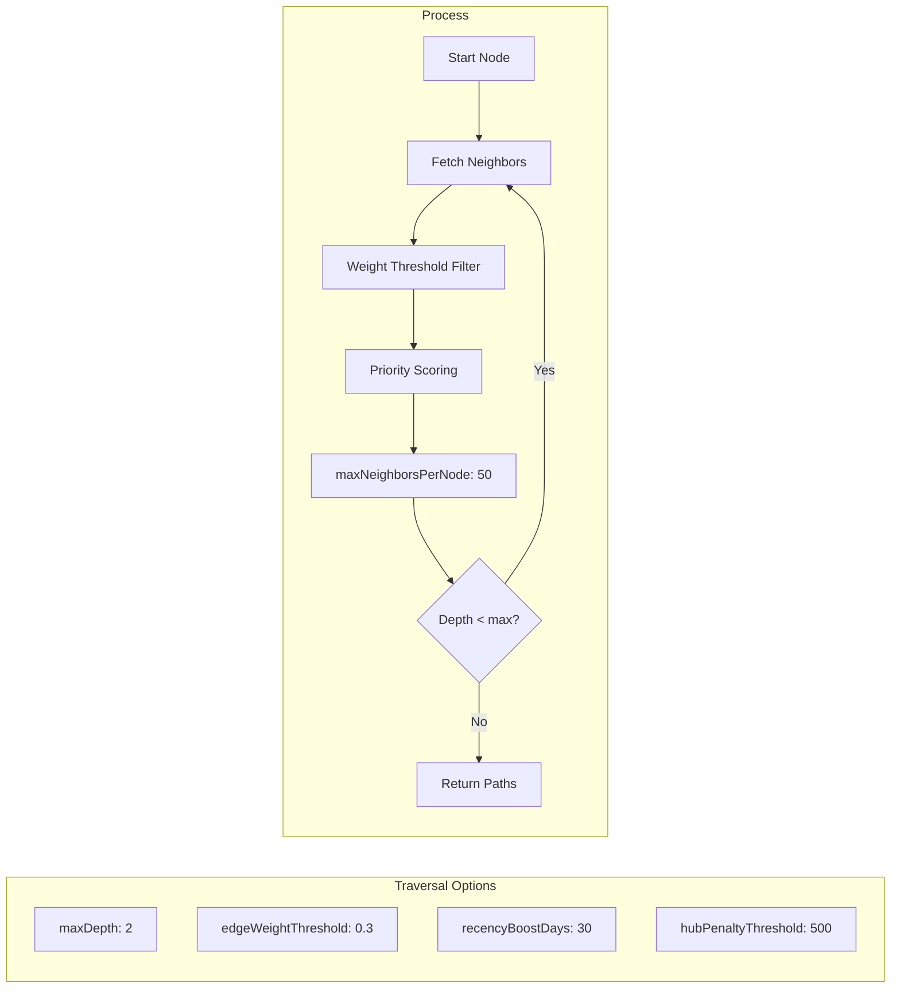
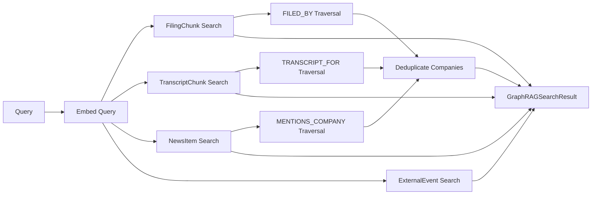

# @cream/helix

HelixDB client for the Cream trading system. Combines graph traversal with vector similarity search for GraphRAG-powered trade memory retrieval.

## Architecture



## Node Types

| Node | Purpose | Embedded Field |
|------|---------|----------------|
| `TradeDecision` | Trading decisions with rationale | `rationale_text` |
| `TradeLifecycleEvent` | Fill, partial fill, close events | - |
| `ExternalEvent` | Discrete market events | `text_summary` |
| `FilingChunk` | SEC filing chunks (10-K, 10-Q, 8-K) | `chunk_text` |
| `TranscriptChunk` | Earnings call transcript chunks | `chunk_text` |
| `NewsItem` | News articles and press releases | `headline`, `body_text` |
| `Company` | Company metadata | - |
| `MacroEntity` | Macroeconomic concepts (Fed, CPI) | - |
| `ThesisMemory` | Post-hoc trade analysis | `entry_thesis` |
| `ResearchHypothesis` | Alpha factor hypotheses | `economic_rationale` |
| `AcademicPaper` | Referenced academic papers | `paper_abstract` |

## Edge Types



## Usage

### Client Setup

```typescript
import { createHelixClient, createHelixClientFromEnv } from "@cream/helix";

// From environment (HELIX_HOST, HELIX_PORT, HELIX_TIMEOUT, HELIX_MAX_RETRIES)
const client = createHelixClientFromEnv();

// Or with explicit config
const client = createHelixClient({
  host: "localhost",
  port: 6969,
  timeout: 5000,
  maxRetries: 3,
  retryDelay: 100, // exponential backoff base
});

// Health check
const health = await client.healthCheck();
if (!health.healthy) {
  throw new Error(`HelixDB unhealthy: ${health.error}`);
}
```

### Vector Search

```typescript
import { vectorSearch, searchSimilarDecisions } from "@cream/helix";

// Generic vector search
const results = await vectorSearch(client, embedding, {
  topK: 10,
  minSimilarity: 0.7,
  nodeType: "TradeDecision",
  filters: { regime_label: "BULL_TREND" },
});

// Type-specific helpers
const decisions = await searchSimilarDecisions(client, rationaleEmbedding, {
  topK: 5,
  minSimilarity: 0.6,
});
```

### Graph Traversal



```typescript
import { traverse, weightedTraverse, getNeighbors } from "@cream/helix";

// Basic traversal
const result = await traverse(client, "decision-123", {
  maxDepth: 2,
  edgeTypes: ["INFLUENCED_DECISION"],
  direction: "incoming",
  limit: 100,
});

// Weighted traversal with priority scoring
const weighted = await weightedTraverse(client, "decision-123", {
  maxDepth: 2,
  edgeWeightThreshold: 0.5,
  recencyBoostDays: 14,
  recencyBoostMultiplier: 1.5,
  hubPenaltyThreshold: 500,
  hubPenaltyMultiplier: 0.5,
});

// High-priority edges first
for (const { edge, priority, recencyBoost } of weighted.prioritizedEdges) {
  console.log(`${edge.type}: priority=${priority.toFixed(2)}`);
}
```

### Temporal Queries (Point-in-Time)

```typescript
import { traverseAtTime } from "@cream/helix";

// What were AAPL's suppliers in Q3 2024?
const q3_2024 = Date.parse("2024-09-30");
const result = await traverseAtTime(client, "AAPL", {
  asOfTimestamp: q3_2024,
  edgeTypes: ["DEPENDS_ON"],
  direction: "outgoing",
});

// What did we know at decision time?
const decisionTime = Date.parse("2024-06-15T10:30:00Z");
const result = await traverseAtTime(client, decisionId, {
  asOfTimestamp: decisionTime,
  knownAsOfTimestamp: decisionTime, // bi-temporal query
  edgeTypes: ["INFLUENCED_DECISION"],
});

console.log(`Excluded: ${result.temporalStats.notYetValid} not yet valid`);
console.log(`Excluded: ${result.temporalStats.expired} expired`);
```

### GraphRAG Unified Search



```typescript
import { searchGraphContext, searchGraphContextByCompany } from "@cream/helix";

// Search across all document types
const results = await searchGraphContext(client, {
  query: "semiconductor supply chain constraints",
  limit: 20,
});

// Access by type
results.filingChunks.forEach(f => console.log(`${f.companySymbol}: ${f.chunkText.slice(0, 100)}`));
results.newsItems.forEach(n => console.log(`${n.headline}: sentiment=${n.sentimentScore}`));

// Discovered companies via graph traversal
results.companies.forEach(c => console.log(`${c.symbol} (${c.source}): ${c.name}`));

// Company-specific search with relationship discovery
const aapl = await searchGraphContextByCompany(client, "AAPL", "iPhone demand", 10);
// Includes related/dependent companies from DEPENDS_ON edges
```

### Trade Memory Retrieval

```typescript
import {
  retrieveTradeMemories,
  generateSituationBrief,
  formatTradeMemorySummary,
} from "@cream/helix";

// Generate situation brief for embedding
const brief = generateSituationBrief({
  instrumentId: "AAPL",
  regimeLabel: "BULL_TREND",
  indicators: { rsi: 65.2, atr: 2.1 },
  positionContext: "Long 100 shares, +5% unrealized",
});

// Retrieve similar trade memories
const result = await retrieveTradeMemories(client, embedding, {
  instrumentId: "AAPL",
  regimeLabel: "BULL_TREND",
}, {
  topK: 10,
  minSimilarity: 0.5,
  rrfK: 60,
  includeInfluencingEvents: true,
  enableCorrective: true, // broaden search if quality is low
});

// Statistics from retrieved trades
console.log(`Win rate: ${(result.statistics.winRate * 100).toFixed(1)}%`);
console.log(`Avg return: ${(result.statistics.avgReturn * 100).toFixed(2)}%`);
console.log(`Quality: ${result.quality.score.toFixed(2)}`);

// Format for agent context
const summary = formatTradeMemorySummary(result);
```

### Mutations

```typescript
import {
  upsertTradeDecision,
  upsertExternalEvent,
  createLifecycleEvent,
  createInfluencedDecisionEdge,
  batchUpsertTradeDecisions,
} from "@cream/helix";

// Upsert a trade decision with embedding
const result = await upsertTradeDecision(client, {
  decision_id: "dec-123",
  cycle_id: "cycle-456",
  instrument_id: "AAPL",
  regime_label: "BULL_TREND",
  action: "BUY",
  decision_json: JSON.stringify(decision),
  rationale_text: "Strong momentum with support at 180",
  snapshot_reference: "s3://...",
  created_at: new Date().toISOString(),
  environment: "PAPER",
}, embedding, "text-embedding-3-small");

// Create relationship edge
await createInfluencedDecisionEdge(client, {
  source_id: "event-789",
  target_id: "dec-123",
  influence_score: 0.85,
  influence_type: "NEWS",
});

// Batch operations for performance
const batchResult = await batchUpsertTradeDecisions(client, decisions.map(d => ({
  node: d,
  embedding: embeddings[d.decision_id],
  embeddingModelVersion: "text-embedding-3-small",
})));
```

### Export/Import (Data Portability)

```typescript
import {
  exportData,
  importData,
  exportIncremental,
  mergeExports,
  createGraphDatabase,
} from "@cream/helix";

// Full export
const backup = await exportData(client, {
  nodeTypes: ["TradeDecision", "ExternalEvent"],
  includeEmbeddings: true,
});
await Bun.write("backup.json", JSON.stringify(backup));

// Incremental export
const incremental = await exportIncremental(client, lastExportTimestamp);
console.log(`Added: ${incremental.changes.nodesAdded} nodes`);

// Merge incrementals into base
const merged = mergeExports(baseExport, incremental);

// Import
const data = JSON.parse(await Bun.file("backup.json").text());
const result = await importData(client, data, { overwrite: false });
console.log(`Imported: ${result.nodesImported} nodes, ${result.edgesImported} edges`);

// Abstraction layer for database portability
const db = createGraphDatabase(client);
await db.exportAll();
```

## Services

### CompanyGraphBuilder

Populates company relationship graph with sector peers, industry peers, correlation-based relationships, and supply chain dependencies.

```typescript
import { createCompanyGraphBuilder } from "@cream/helix";

const builder = createCompanyGraphBuilder(client);

// Build from universe
const result = await builder.build(companies, correlationPairs, supplyChainRels, {
  maxPeersPerCompany: 20,
  includeIndustryPeers: true,
  correlationOptions: { minCorrelation: 0.7, maxPairsPerSymbol: 10 },
});

// Query relationships
const related = await builder.getRelatedCompanies("AAPL", ["SECTOR_PEER", "COMPETITOR"]);
const dependencies = await builder.getCompanyDependencies("AAPL");
const dependents = await builder.getDependentCompanies("TSMC");
```

### MacroGraphBuilder

Creates macro entity nodes and AFFECTED_BY edges linking companies to macroeconomic factors.

```typescript
import { createMacroGraphBuilder, PREDEFINED_MACRO_ENTITIES } from "@cream/helix";

const builder = createMacroGraphBuilder(client);
const result = await builder.build(companies, {
  useSectorDefaults: true,
  correlationData: priceVsMacroCorrelations,
});
```

### NewsIngestionService

Ingests news items with company mention extraction and sentiment.

```typescript
import { createNewsIngestionService } from "@cream/helix";

const service = createNewsIngestionService(client, embeddingClient);
const result = await service.ingest(newsItems, {
  extractCompanyMentions: true,
  batchSize: 50,
});
```

### EventIngestionService

Ingests external events and links them to macro entities.

```typescript
import { createEventIngestionService } from "@cream/helix";

const service = createEventIngestionService(client, embeddingClient);
const result = await service.ingest(events);
```

### UniverseGraphSync

Syncs trading universe to graph, creating Company nodes.

```typescript
import { syncUniverseToGraph } from "@cream/helix";

const result = await syncUniverseToGraph(client, instruments, {
  updateExisting: true,
});
```

## Edge Weight Thresholds

| Edge Type | Threshold | Weight Attribute |
|-----------|-----------|------------------|
| `INFLUENCED_DECISION` | 0.6 | `confidence_score` or `influence_score` |
| `DEPENDS_ON` | 0.3 | `strength` |
| `AFFECTED_BY` | 0.3 | `sensitivity` |
| `MENTIONED_IN` | 0.5 | `mention_type` (PRIMARY=1.0, SECONDARY=0.7, PEER_COMPARISON=0.5) |

## Performance Targets

| Operation | Target Latency |
|-----------|----------------|
| Vector search | ~2ms |
| Graph traversal (depth 2) | <1ms |
| GraphRAG unified search | <5ms |
| Trade memory retrieval | <3ms |

## Environment Variables

| Variable | Default | Description |
|----------|---------|-------------|
| `HELIX_HOST` | `localhost` | HelixDB server host |
| `HELIX_PORT` | `6969` | HelixDB server port |
| `HELIX_TIMEOUT` | `5000` | Connection timeout (ms) |
| `HELIX_MAX_RETRIES` | `3` | Max retry attempts |

## Dependencies

- `@cream/helix-schema` - Node/edge type definitions, CBR, RRF, retention
- `@cream/domain` - Core domain types
- `@cream/config` - Configuration and secrets
- `helix-ts` - HelixDB TypeScript client
