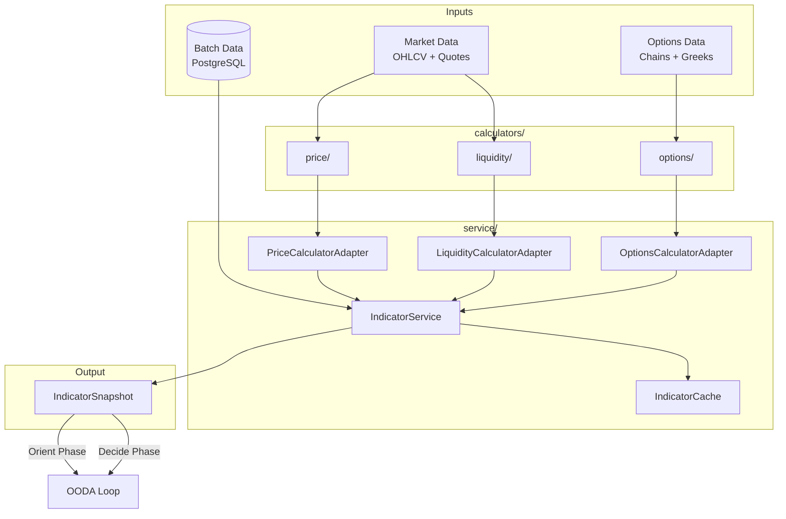
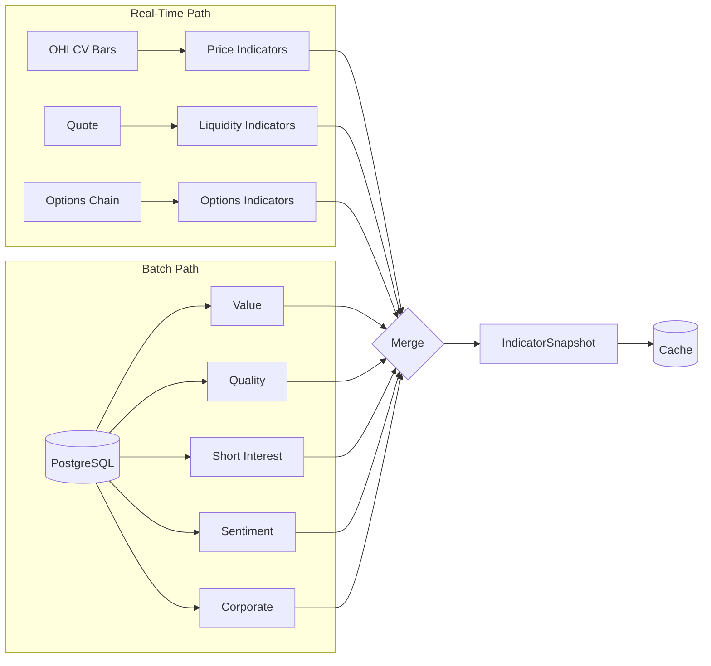
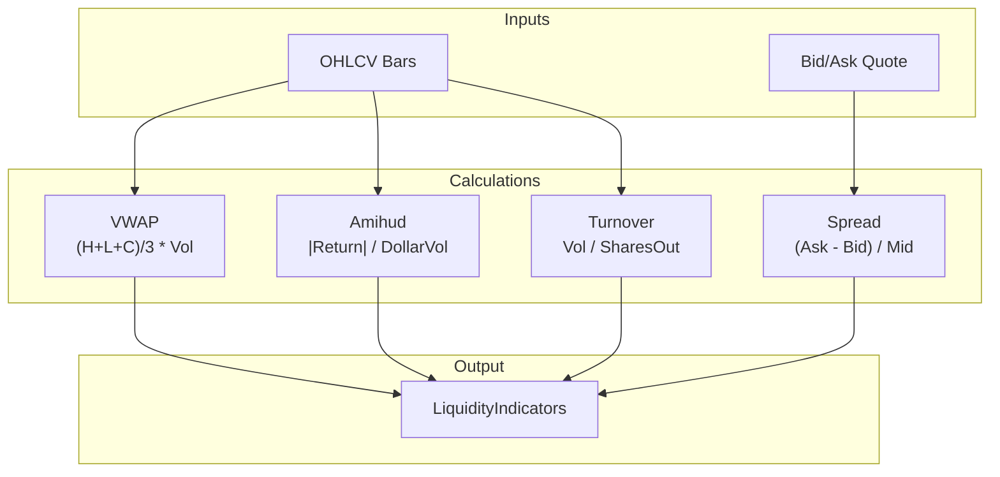
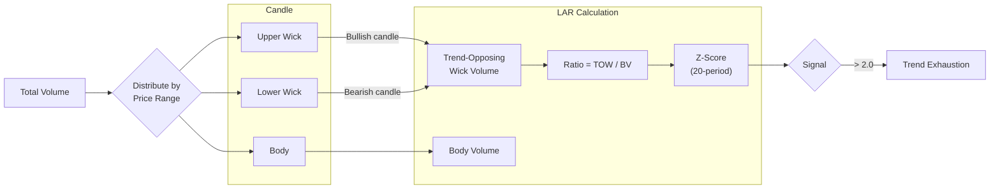
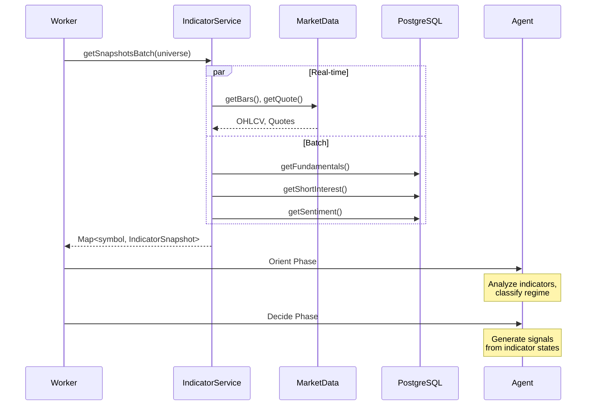

# @cream/indicators

Technical indicator calculation engine for Cream's OODA trading loop. Computes 60+ indicators across 8 categories, combining real-time market data calculations with batch-processed fundamental and sentiment data.

## Architecture



## Indicator Categories

| Category | Update Frequency | Source | Key Indicators |
|----------|-----------------|--------|----------------|
| **Price** | Real-time | Alpaca bars | RSI, ATR, SMA, EMA, MACD, Bollinger, Stochastic |
| **Liquidity** | Real-time | Alpaca quotes | Bid-ask spread, VWAP, Amihud illiquidity, Turnover |
| **Options** | Real-time | Options chains | IV skew, Put/Call ratio, VRP, Term structure, Greeks |
| **Value** | Nightly batch | EDGAR/APIs | P/E, P/B, EV/EBITDA, Earnings yield |
| **Quality** | Nightly batch | EDGAR | ROE, ROA, Beneish M-Score, Accruals |
| **Short Interest** | Bi-weekly | FINRA | Days to cover, Short % float |
| **Sentiment** | Nightly + RT | News/Social | Sentiment score, News volume, Event risk |
| **Corporate** | Daily | Alpaca | Dividend yield, Ex-div days, Splits |

## Calculation Flow



## Price Indicators

### Trend Indicators

| Indicator | Period | Formula | Signal |
|-----------|--------|---------|--------|
| SMA | 20, 50, 200 | `sum(close) / n` | Price vs MA position |
| EMA | 9, 12, 21, 26 | `close * k + EMA_prev * (1-k)` | Faster trend response |
| MACD | 12, 26, 9 | `EMA_12 - EMA_26` | Crossover signals |

### Momentum Indicators

| Indicator | Period | Range | Interpretation |
|-----------|--------|-------|----------------|
| RSI | 14 | 0-100 | >70 overbought, <30 oversold |
| Stochastic | 14, 3 | 0-100 | >80 overbought, <20 oversold |
| Momentum | 21, 63, 126, 252 | % | Rate of change over 1/3/6/12 months |

### Volatility Indicators

| Indicator | Period | Method | Use Case |
|-----------|--------|--------|----------|
| ATR | 14 | Wilder smoothing | Position sizing, stops |
| Realized Vol | 20 | Close-to-close | Historical volatility |
| Parkinson Vol | 20 | High-low range | More efficient estimator |
| Bollinger Bands | 20, 2SD | SMA + stddev | Volatility squeeze detection |

## Liquidity Indicators



### Amihud Illiquidity

Measures price impact per dollar traded. Higher values = less liquid.

```
ILLIQ = (1/N) * sum(|Return_t| / DollarVolume_t)
```

**Classification:**
- `< 1e-10`: Highly liquid (large cap)
- `1e-10 to 1e-8`: Liquid (mid cap)
- `1e-8 to 1e-6`: Moderate (small cap)
- `> 1e-6`: Illiquid (micro cap)

## Options Indicators

### IV Skew (25-delta)

Measures asymmetry in implied volatility across strikes.

```
Skew = IV_put_25d - IV_call_25d
```

- **Positive skew** (typical): Market pricing downside protection
- **Negative skew** (rare): Market pricing upside potential

### Volatility Risk Premium (VRP)

```
VRP = Implied Volatility - Realized Volatility
```

| VRP Level | Classification | Trading Signal |
|-----------|---------------|----------------|
| > 10% | Very Rich | Strong sell premium |
| 3-10% | Rich | Sell premium |
| -2% to 3% | Fair | Neutral |
| -5% to -2% | Cheap | Avoid selling |
| < -5% | Very Cheap | Buy premium |

### Term Structure

Slope of IV across expirations:
- **Contango** (front < back): Normal, low vol environment
- **Backwardation** (front > back): Fear, event risk

## Custom Indicators

### Liquidity Absorption Ratio (LAR)

Novel indicator measuring trend exhaustion via volume distribution in candle wicks.



**Economic rationale:** High LAR indicates aggressive orders being absorbed by passive liquidity at extremes, predicting regime transition from trending to ranging.

## IndicatorSnapshot Schema

```typescript
interface IndicatorSnapshot {
  symbol: string;
  timestamp: number;

  // Real-time (calculated on-demand)
  price: PriceIndicators;      // 26 fields
  liquidity: LiquidityIndicators;  // 6 fields
  options: OptionsIndicators;  // 15 fields

  // Batch (from PostgreSQL)
  value: ValueIndicators;      // 7 fields
  quality: QualityIndicators;  // 8 fields
  short_interest: ShortInterestIndicators;  // 5 fields
  sentiment: SentimentIndicators;  // 6 fields
  corporate: CorporateIndicators;  // 4 fields

  // Context
  market: MarketContext;
  metadata: SnapshotMetadata;
}
```

## Usage

### Single Symbol Snapshot

```typescript
import { IndicatorService, createPriceCalculator } from "@cream/indicators";

const service = new IndicatorService({
  marketData: alpacaProvider,
  priceCalculator: createPriceCalculator(),
  fundamentalRepo: fundamentalRepository,
});

const snapshot = await service.getSnapshot("AAPL");
console.log(snapshot.price.rsi_14);  // 65.5
console.log(snapshot.options.vrp);   // 0.05
```

### Batch Processing

```typescript
const result = await service.getSnapshotsBatch(
  ["AAPL", "MSFT", "GOOGL", ...universe],
  {
    concurrency: 10,
    onProgress: (p) => console.log(`${p.completed}/${p.total}`),
  }
);

console.log(`Cached: ${result.metadata.cached}`);
console.log(`Fetched: ${result.metadata.successful - result.metadata.cached}`);
```

### Direct Calculator Access

```typescript
import { calculateRSI, calculateATR, calculateBollingerBands } from "@cream/indicators";

const bars: OHLCVBar[] = await getBars("AAPL", 200);

const rsi = calculateRSI(bars, 14);        // { rsi: 65.5, avgGain, avgLoss }
const atr = calculateATR(bars, 14);        // 2.45
const bb = calculateBollingerBands(bars);  // { upper, middle, lower, bandwidth, percentB }
```

## Integration with OODA Loop



## Directory Structure

```
src/
  calculators/
    price/          # RSI, ATR, SMA, EMA, MACD, Bollinger, Stochastic, Volatility
    liquidity/      # Bid-ask spread, VWAP, Amihud, Turnover
    options/        # IV skew, Put/Call ratio, VRP, Term structure, Greeks
  service/
    indicator-service.ts    # Main orchestrator
    indicator-cache.ts      # TTL-based caching
    price-calculator.ts     # Adapter wrapping all price calculators
    liquidity-calculator.ts # Adapter wrapping liquidity calculators
    options-calculator.ts   # Adapter wrapping options calculators
    batch-data-adapter.ts   # PostgreSQL repository adapters
  batch/
    short-interest-batch.ts    # FINRA data sync
    sentiment-batch.ts         # News/social aggregation
    corporate-actions-batch.ts # Dividend/split processing
  custom/
    liquidity_absorption_ratio.ts  # Novel trend exhaustion indicator
  types/
    index.ts        # All Zod schemas and TypeScript types
    schemas.ts      # Pure type exports (no runtime)
```

## Data Quality

The `SnapshotMetadata.data_quality` field indicates completeness:

| Quality | Criteria |
|---------|----------|
| `COMPLETE` | 5+ indicator categories have data |
| `PARTIAL` | 2-4 categories have data |
| `STALE` | <2 categories have data |

## Normalization

Multi-timeframe feature normalization for ML pipelines:

```typescript
import { applyTransforms, calculateMultiTimeframeIndicators } from "@cream/indicators";

const indicators = calculateMultiTimeframeIndicators(bars, { basePeriod: 14 });
const features = applyTransforms(bars, "1h", { method: "zscore", lookbackPeriod: 20 });
// { zscore_close_20_1h: 1.2, zscore_return_20_1h: -0.5, ... }
```

**Methods:**
- `zscore`: (x - mean) / stddev - Centers around 0
- `minmax`: (x - min) / (max - min) - Scales to [0, 1]
- `robust`: (x - median) / IQR - Resistant to outliers

## Caching

TTL-based caching with category-specific expiration:

```typescript
const cache = createIndicatorCache({
  maxSize: 500,
  ttl: {
    snapshot: 60_000,      // 1 minute
    priceIndicators: 30_000,
    batchIndicators: 3600_000,  // 1 hour (stale OK)
  }
});
```

## Dependencies

```
@cream/logger    # Structured logging
@cream/storage   # PostgreSQL repositories
zod              # Schema validation
```
