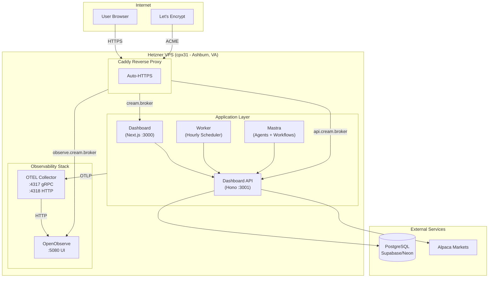
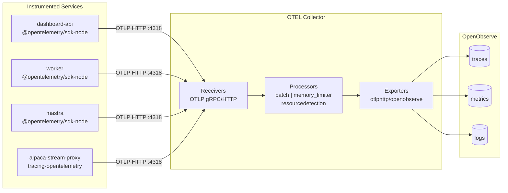

# @cream/infra

OpenTofu infrastructure as code and OpenTelemetry observability configuration for the Cream trading system.

## Architecture



## Observability Flow



## OpenTofu Resources

| Resource | Type | Purpose |
|----------|------|---------|
| `hcloud_server.cream` | VPS | Ubuntu 24.04, cpx31 (4 vCPU, 8 GB RAM) |
| `hcloud_firewall.cream` | Firewall | SSH (22), HTTP (80), HTTPS (443), ICMP |
| `hcloud_ssh_key.deploy` | SSH Key | Ed25519 key for deployment access |
| `vercel_dns_record.root` | DNS A | cream.broker -> server IP |
| `vercel_dns_record.api` | DNS A | api.cream.broker -> server IP |
| `vercel_dns_record.www` | DNS CNAME | www.cream.broker -> cream.broker |
| `vercel_dns_record.caa` | DNS CAA | Restrict issuance to Let's Encrypt |

### Providers

| Provider | Version | Purpose |
|----------|---------|---------|
| hetznercloud/hcloud | ~> 1.49 | VPS, firewall, SSH keys |
| vercel/vercel | ~> 2.0 | DNS record management |

## File Structure

```
packages/infra/
├── backend.tf          # Local state backend configuration
├── dns.tf              # Vercel DNS A/CNAME/CAA records
├── firewall.tf         # Hetzner firewall rules (SSH, HTTP, HTTPS)
├── outputs.tf          # server_ip, ssh_command, dashboard_url, api_url
├── providers.tf        # Hetzner + Vercel provider configuration
├── server.tf           # VPS provisioning with cloud-init
├── ssh.tf              # SSH key resource
├── variables.tf        # Input variables with defaults
├── versions.tf         # OpenTofu and provider version constraints
└── observability/
    └── otel-collector-config.yaml  # OTEL Collector pipeline configuration
```

## OpenTelemetry Configuration

### Collector Endpoints

| Protocol | Port | URL |
|----------|------|-----|
| gRPC | 4317 | `grpc://otel-collector:4317` |
| HTTP | 4318 | `http://otel-collector:4318/v1/traces` |
| Health | 13133 | `http://otel-collector:13133` |

### Pipeline Configuration

```yaml
# Receivers: Accept OTLP from all services
receivers:
  otlp:
    protocols:
      grpc: { endpoint: 0.0.0.0:4317 }
      http: { endpoint: 0.0.0.0:4318 }

# Processors: Batch, detect resources, limit memory
processors:
  batch: { send_batch_size: 10000, timeout: 10s }
  resourcedetection: { detectors: [env, system] }
  memory_limiter: { limit_percentage: 75 }

# Exporters: Send to OpenObserve streams
exporters:
  otlphttp/openobserve_traces:   # -> traces stream
  otlphttp/openobserve_metrics:  # -> metrics stream
  otlphttp/openobserve_logs:     # -> logs stream
```

### Service Instrumentation

Each TypeScript service initializes tracing before application code:

```typescript
// apps/*/src/tracing.ts
import { NodeSDK } from "@opentelemetry/sdk-node";
import { OTLPTraceExporter } from "@opentelemetry/exporter-trace-otlp-proto";
import { getNodeAutoInstrumentations } from "@opentelemetry/auto-instrumentations-node";

const sdk = new NodeSDK({
  serviceName: "cream-<service>",
  spanProcessors: [new BatchSpanProcessor(exporter)],
  instrumentations: [getNodeAutoInstrumentations()],
  textMapPropagator: new W3CTraceContextPropagator(),
});
sdk.start();
```

Environment variables:

| Variable | Default | Description |
|----------|---------|-------------|
| `OTEL_ENABLED` | `true` | Set to `false` to disable tracing |
| `OTEL_EXPORTER_OTLP_ENDPOINT` | `http://localhost:4318` | Collector endpoint |
| `OTEL_SERVICE_NAME` | per-service | Service identifier in traces |

## Usage

### Prerequisites

```bash
brew install opentofu hcloud
```

### Initial Setup

```bash
# Generate SSH key
ssh-keygen -t ed25519 -f ~/.ssh/cream-deploy -C "cream-deploy"

# Create terraform.tfvars (gitignored)
cat > terraform.tfvars << 'EOF'
hcloud_token        = "your-hetzner-token"
vercel_api_token    = "your-vercel-token"
ssh_public_key_path = "~/.ssh/cream-deploy.pub"
EOF

# Initialize and apply
tofu init
tofu plan
tofu apply
```

### Outputs

```bash
tofu output server_ip      # VPS IPv4 address
tofu output ssh_command    # ssh cream@<ip>
tofu output dashboard_url  # https://cream.broker
tofu output api_url        # https://api.cream.broker
```

## Server Provisioning

Cloud-init installs on first boot:

- Docker CE with Compose plugin
- fail2ban for SSH brute-force protection
- unattended-upgrades for automatic security patches
- `cream` deploy user with passwordless sudo

## Security

| Layer | Protection |
|-------|------------|
| Network | Firewall allows only ports 22, 80, 443 |
| SSH | Key-only authentication (no passwords) |
| TLS | Automatic HTTPS via Caddy + Let's Encrypt |
| CAA | DNS CAA record restricts cert issuance |
| Intrusion | fail2ban monitors SSH |
| Patches | Automatic security updates |

## Cost

| Resource | Monthly |
|----------|---------|
| Hetzner cpx31 | ~$15 |
| PostgreSQL (Supabase/Neon) | ~$25 |
| Vercel Pro | ~$20 |
| **Total** | **~$60** |

## Required Secrets

For GitHub Actions deployment:

| Secret | Purpose |
|--------|---------|
| `HCLOUD_TOKEN` | Hetzner Cloud API |
| `VERCEL_API_TOKEN` | Vercel DNS management |
| `HETZNER_SSH_PRIVATE_KEY` | Server SSH access |
| `DATABASE_URL` | PostgreSQL connection |
| `ALPACA_KEY` / `ALPACA_SECRET` | Broker API |
| `ZO_AUTH_TOKEN` | OpenObserve collector auth |
