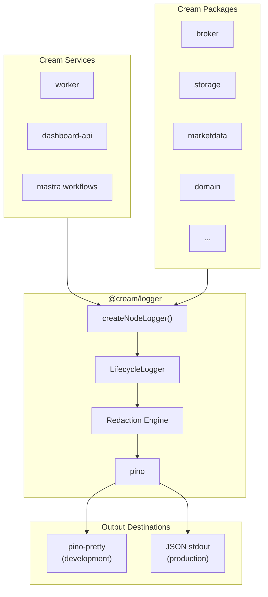
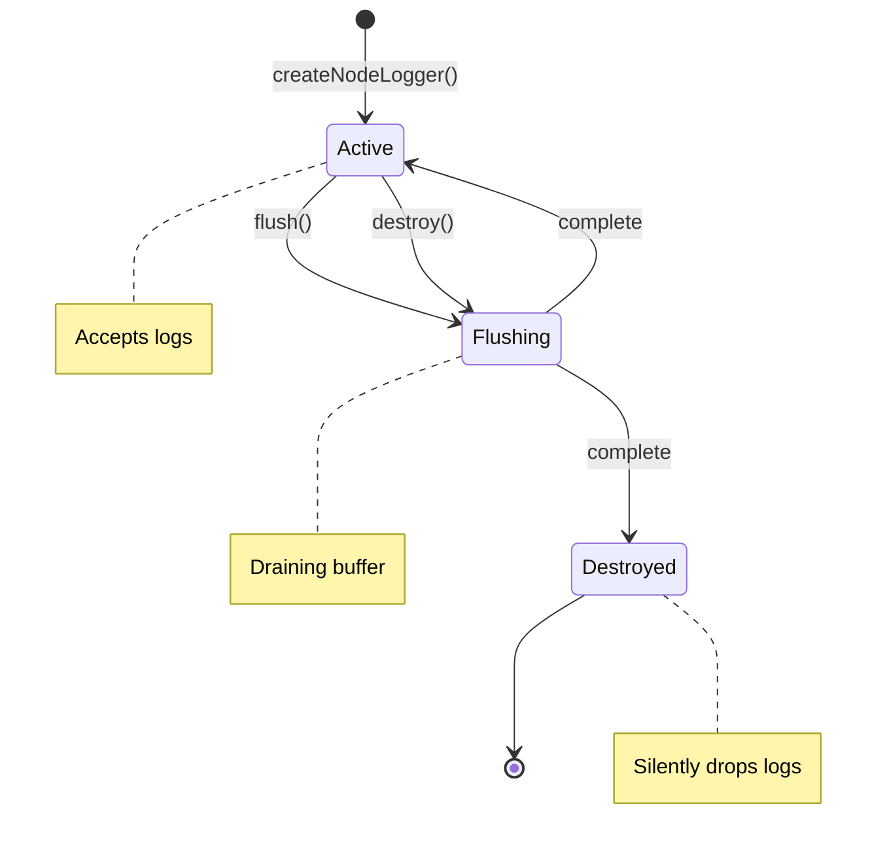
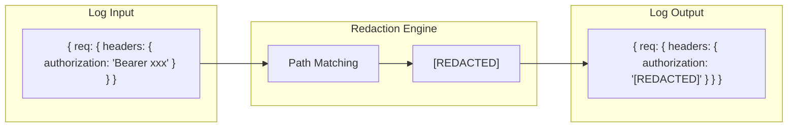

# @cream/logger

Structured logging wrapper built on [pino](https://getpino.io) for the Cream trading system. Provides automatic sensitive data redaction, lifecycle management, and consistent log formatting across all services.

## Architecture



## Installation

```bash
bun add @cream/logger
```

## Usage

### Basic Logger

```typescript
import { createNodeLogger } from "@cream/logger";

const log = createNodeLogger({
  service: "my-service",
  level: "info",
  environment: Bun.env.CREAM_ENV ?? "PAPER",
});

log.info({ orderId: "123" }, "Order submitted");
log.warn({ symbol: "AAPL" }, "Position limit approaching");
log.error({ error }, "Failed to execute trade");
```

### Standard Package Pattern

Every Cream package exports a singleton logger from `src/logger.ts`:

```typescript
// packages/broker/src/logger.ts
import { createNodeLogger, type LifecycleLogger } from "@cream/logger";

export const log: LifecycleLogger = createNodeLogger({
  service: "broker",
  level: Bun.env.LOG_LEVEL === "debug" ? "debug" : "info",
  environment: Bun.env.CREAM_ENV ?? "PAPER",
  pretty: Bun.env.NODE_ENV === "development",
});
```

### Workflow Step Pattern

Trading cycle steps use inline loggers with hierarchical service names:

```typescript
import { createNodeLogger } from "@cream/logger";

const log = createNodeLogger({ service: "trading-cycle:analysts" });
const log = createNodeLogger({ service: "trading-cycle:consensus" });
const log = createNodeLogger({ service: "trading-cycle:act" });
```

### Consensus Logger Adapter

For `@cream/agents` compatibility, wrap pino in the ConsensusLogger interface:

```typescript
import { createConsensusLogger, createNodeLogger } from "@cream/logger";

const pinoLogger = createNodeLogger({ service: "agents" });
const consensusLogger = createConsensusLogger(pinoLogger);

consensusLogger.info("Processing analysis", { symbol: "AAPL" });
```

## Configuration

```typescript
interface NodeLoggerOptions {
  service: string;           // Required: identifies the source service
  level?: LogLevel;          // Default: "info"
  environment?: string;      // CREAM_ENV (PAPER/LIVE)
  version?: string;          // Service version
  pretty?: boolean;          // Default: true if NODE_ENV=development
  redactPaths?: string[];    // Additional paths to redact
  base?: Record<string, unknown>; // Extra fields on every log
  pinoOptions?: PinoOptions; // Direct pino configuration
}

type LogLevel = "trace" | "debug" | "info" | "warn" | "error" | "fatal";
```

## Lifecycle Management



The `LifecycleLogger` extends pino with graceful shutdown:

```typescript
export interface LifecycleLogger extends Logger {
  flush(): Promise<void>;   // Drain pending logs
  destroy(): Promise<void>; // Flush then disable
}

// Graceful shutdown
process.on("SIGTERM", async () => {
  await log.destroy();
  process.exit(0);
});
```

## Automatic Redaction

Sensitive data is automatically censored using pino's built-in redaction:



### Default Redaction Paths

| Category | Paths |
|----------|-------|
| **Auth Headers** | `req.headers.authorization`, `req.headers.cookie`, `req.headers['x-api-key']` |
| **Request Body** | `req.body.password`, `req.body.token`, `req.body.*Token`, `req.body.secret` |
| **Auth Objects** | `auth.*`, `identity.token`, `secrets.*` |
| **PII** | `*.email`, `*.phone`, `*.ssn`, `*.creditCard` |
| **API Keys** | `*.apiKey`, `*.ALPACA_KEY`, `*.ALPACA_SECRET`, `*.ANTHROPIC_API_KEY` |

### Custom Redaction

```typescript
const log = createNodeLogger({
  service: "my-service",
  redactPaths: [
    "customField.secret",
    "nested.*.password",
  ],
});
```

## Output Formats

### Development (pretty)

```
14:32:15 INFO Order submitted {"orderId":"123","symbol":"AAPL"}
14:32:16 WARN Position limit approaching {"symbol":"AAPL","usage":0.85}
14:32:17 ERROR Failed to execute trade {"error":"Connection timeout"}
```

Pretty mode ignores `pid`, `hostname`, `service`, `environment`, `version` since Turborepo prefixes logs with package names.

### Production (JSON)

```json
{"severity":"INFO","timestamp":"2024-01-15T14:32:15.123Z","service":"broker","environment":"LIVE","msg":"Order submitted","orderId":"123","symbol":"AAPL"}
```

## Context Propagation

### Trace Context

Add distributed tracing fields via child logger:

```typescript
import { withTraceContext } from "@cream/logger";

const tracedLog = withTraceContext(log, {
  correlationId: "cycle-123",
  traceId: "abc-def",
  spanId: "span-1",
  requestId: "req-456",
});
```

### Tenant Context

Add multi-tenant identification:

```typescript
import { withTenantContext } from "@cream/logger";

const tenantLog = withTenantContext(log, {
  tenantId: "tenant-1",
  campaignId: "campaign-abc",
  adminUserId: "admin-123",
});
```

## Log Levels

| Level | Use Case |
|-------|----------|
| `trace` | Granular debugging (disabled in production) |
| `debug` | Development diagnostics |
| `info` | Normal operations, state changes |
| `warn` | Degraded state, recoverable issues |
| `error` | Failures requiring attention |
| `fatal` | Unrecoverable errors, shutdown |

Control via environment:

```bash
LOG_LEVEL=debug bun run start
```

## Testing

Mock the logger in tests:

```typescript
import { mock } from "bun:test";

mock.module("@cream/logger", () => ({
  createNodeLogger: () => ({
    info: () => {},
    warn: () => {},
    error: () => {},
    debug: () => {},
    trace: () => {},
    fatal: () => {},
    child: () => this,
    flush: async () => {},
    destroy: async () => {},
  }),
}));
```

## Exports

```typescript
// Logger factory
export { createNodeLogger } from "./node.js";
export { createConsensusLogger } from "./node.js";

// Context helpers
export { withTraceContext, withTenantContext } from "./node.js";

// Types
export type { LifecycleLogger } from "./node.js";
export type { Logger, LogLevel, NodeLoggerOptions } from "./types.js";
export type { TraceContext, TenantContext } from "./types.js";

// Redaction
export { DEFAULT_REDACT_PATHS, mergeRedactPaths } from "./redaction.js";

// Re-export pino for advanced usage
export { pino } from "pino";
```
