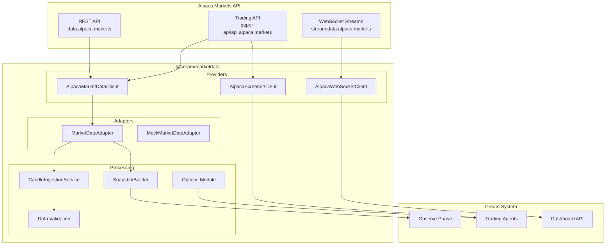
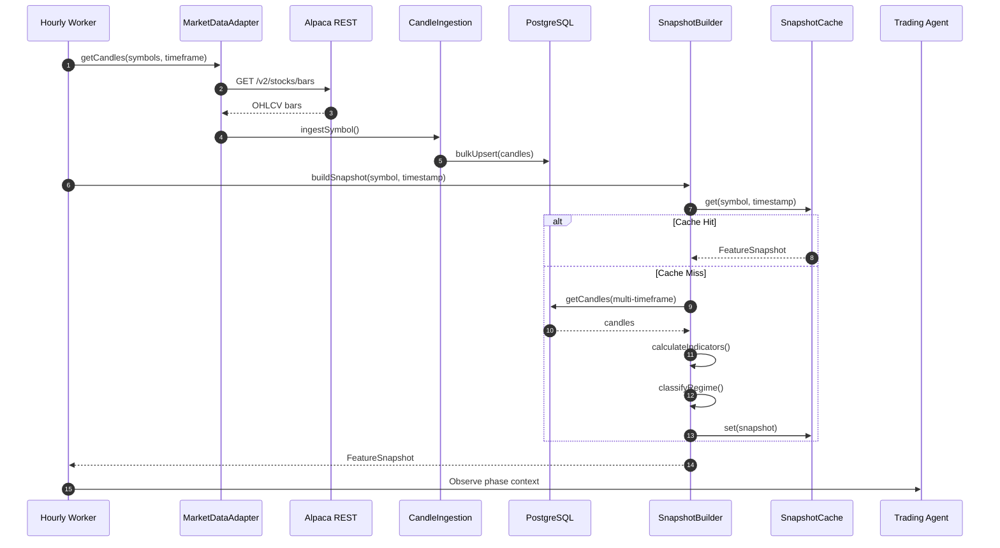
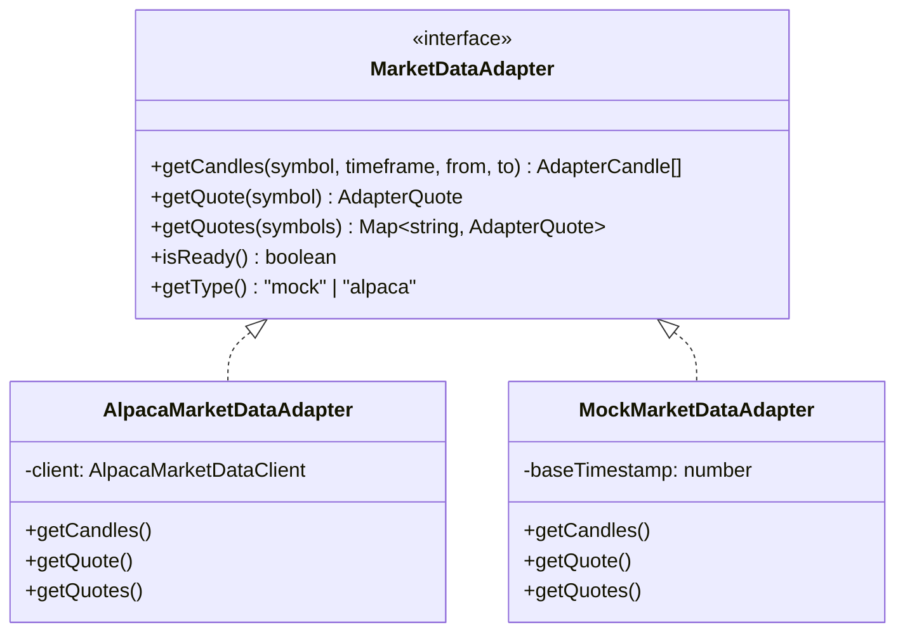
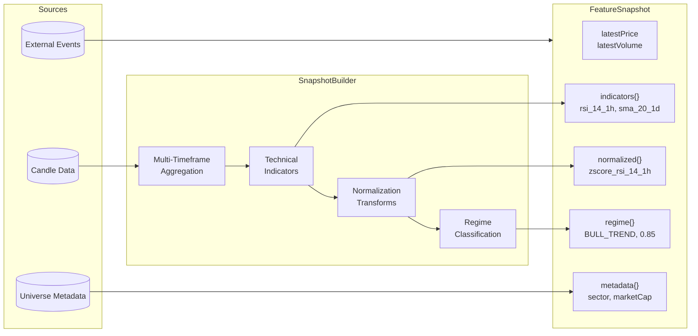

# @cream/marketdata

Unified market data provider for the Cream trading system. Consolidates all Alpaca Markets integration (REST + WebSocket) and provides feature snapshots for the OODA Observe phase.

## Architecture



## Data Flow



## Providers

### AlpacaMarketDataClient

Primary REST client for historical and current market data.

```typescript
import { createAlpacaClientFromEnv } from "@cream/marketdata";

const client = createAlpacaClientFromEnv();

// Historical bars
const bars = await client.getBars("AAPL", "1Hour", "2026-01-01", "2026-01-10");

// Latest quotes (batch)
const quotes = await client.getQuotes(["AAPL", "MSFT", "GOOGL"]);

// Snapshots (quote + trade + bars)
const snapshots = await client.getSnapshots(["AAPL"]);

// Options contracts
const contracts = await client.getOptionContracts("AAPL", {
  expirationDateGte: "2026-02-01",
  expirationDateLte: "2026-03-01",
  type: "call",
});

// Options snapshots with Greeks
const optionSnapshots = await client.getOptionSnapshots([
  "AAPL260117C00150000",
]);

// Corporate actions
const splits = await client.getStockSplits("AAPL");
const dividends = await client.getDividends("AAPL");

// News
const news = await client.getNews(["AAPL"], 10);
```

### AlpacaWebSocketClient

Real-time streaming for stocks, options, and news.

```typescript
import { createAlpacaStocksClientFromEnv } from "@cream/marketdata";

const ws = createAlpacaStocksClientFromEnv("sip");

ws.on((event) => {
  switch (event.type) {
    case "quote":
      console.log(`${event.message.S}: $${event.message.bp}/$${event.message.ap}`);
      break;
    case "trade":
      console.log(`${event.message.S}: ${event.message.s} @ $${event.message.p}`);
      break;
    case "bar":
      console.log(`${event.message.S}: OHLCV bar`);
      break;
  }
});

await ws.connect();
ws.subscribe("quotes", ["AAPL", "MSFT"]);
ws.subscribe("trades", ["AAPL"]);
ws.subscribe("bars", ["*"]); // All symbols
```

**WebSocket Endpoints:**

| Market | Feed | Endpoint | Encoding |
|--------|------|----------|----------|
| Stocks | SIP | `wss://stream.data.alpaca.markets/v2/sip` | JSON |
| Stocks | IEX | `wss://stream.data.alpaca.markets/v2/iex` | JSON |
| Options | OPRA | `wss://stream.data.alpaca.markets/v1beta1/opra` | msgpack |
| News | - | `wss://stream.data.alpaca.markets/v1beta1/news` | JSON |

### AlpacaScreenerClient

Pre-market scanning for market movers.

```typescript
import { createAlpacaScreenerFromEnv } from "@cream/marketdata";

const screener = createAlpacaScreenerFromEnv();

// Most active by volume or trades
const actives = await screener.getMostActives("volume", 20);

// Top gainers and losers
const movers = await screener.getMarketMovers(10);

// Pre-market movers filtered to universe
const preMarket = await screener.getPreMarketMovers(universeSymbols, 5);
```

## Adapters

The `MarketDataAdapter` interface provides a unified API for different environments:



```typescript
import { createMarketDataAdapter, MockMarketDataAdapter } from "@cream/marketdata";

// Production: uses ALPACA_KEY + ALPACA_SECRET
const adapter = createMarketDataAdapter();

// Testing: deterministic fixture data
const mockAdapter = new MockMarketDataAdapter();
```

## Feature Snapshots

Aggregates multi-timeframe candles, indicators, regime classification, and external events for agent consumption.



```typescript
import { buildSnapshot, buildSnapshots } from "@cream/marketdata";

const snapshot = await buildSnapshot("AAPL", Date.now(), {
  candles: myCandleSource,
  events: myEventSource,
  universe: myUniverseSource,
});

console.log(snapshot.regime.regime);     // "BULL_TREND"
console.log(snapshot.regime.confidence); // 0.85
console.log(snapshot.indicators["rsi_14_1h"]); // 65.5
console.log(snapshot.metadata.sector);   // "Technology"

// Batch processing
const snapshots = await buildSnapshots(["AAPL", "MSFT", "GOOGL"], Date.now(), sources);
```

### Snapshot Cache

LRU cache with TTL to avoid redundant computation within trading cycles.

```typescript
import { SnapshotCache, getGlobalCache } from "@cream/marketdata";

// Global singleton
const cache = getGlobalCache();

// Custom instance
const customCache = new SnapshotCache({
  ttlMs: 3600000,  // 1 hour
  maxEntries: 1000,
});

// Cache operations
const cached = cache.get("AAPL", timestamp);
cache.set(snapshot);
cache.invalidate("AAPL", timestamp);
cache.invalidateSymbol("AAPL");
cache.prune(); // Remove expired

// Statistics
const stats = cache.getStats();
// { size: 150, hits: 450, misses: 50, hitRate: 0.9, ... }
```

## Candle Ingestion

Orchestrates fetching and storing OHLCV data with gap detection.

```typescript
import { CandleIngestionService } from "@cream/marketdata";

const service = new CandleIngestionService(alpacaClient, storage);

// Single symbol
const result = await service.ingestSymbol("AAPL", {
  from: "2026-01-01",
  to: "2026-01-10",
  timeframe: "1h",
  detectGaps: true,
});

// Universe batch (respects rate limits)
const results = await service.ingestUniverse(symbols, options, 5); // concurrency=5

// Incremental update (since last candle)
const updated = await service.incrementalUpdate("AAPL", "1h");

// Backfill historical
const backfill = await service.backfill("AAPL", "1h", "2025-01-01");
```

## Data Validation

### Staleness Detection

```typescript
import { checkStaleness, DEFAULT_STALENESS_THRESHOLDS } from "@cream/marketdata";

const result = checkStaleness("2026-01-26T14:00:00Z", "1h");
// { isStale: false, staleMinutes: 45, threshold: 120 }

// Default thresholds (2x timeframe)
// 1m: 2min, 5m: 10min, 1h: 120min, 1d: 2880min
```

### Anomaly Detection

```typescript
import { detectAllAnomalies, DEFAULT_ANOMALY_CONFIG } from "@cream/marketdata";

const result = detectAllAnomalies(candles, {
  volumeSigmaThreshold: 5,   // 5 standard deviations
  priceSpikePct: 0.10,       // 10% single-candle move
  flashCrashPct: 0.05,       // 5% flash crash
  lookbackPeriod: 20,
});

// result.anomalies: Array<{ type, timestamp, symbol, value, severity }>
// Types: volume_spike, price_spike, flash_crash, flash_rally, gap_up, gap_down
```

### Trading Calendar

```typescript
import {
  isTradingDay,
  isMarketOpen,
  isHoliday,
  getNextTradingDay,
  US_MARKET_HOURS,
} from "@cream/marketdata";

const tradingDay = isTradingDay(new Date()); // Excludes weekends + holidays
const marketOpen = isMarketOpen(new Date()); // Within 9:30-16:00 ET
const nextDay = getNextTradingDay(new Date());
```

## Options Module

### Greeks Calculation (Black-Scholes)

```typescript
import { calculateGreeks, calculateOptionsExposure } from "@cream/marketdata";

const greeks = calculateGreeks({
  symbol: "AAPL",
  contracts: 10,
  strike: 150,
  underlyingPrice: 155,
  timeToExpiration: 0.08, // 30 days = 30/365
  impliedVolatility: 0.25,
  optionType: "CALL",
});
// { delta: 0.65, gamma: 0.04, theta: -0.05, vega: 0.12, rho: 0.08, theoreticalPrice: 8.50 }

// Portfolio-level exposure
const exposure = calculateOptionsExposure(positions);
// { deltaNotional, totalGamma, totalVega, totalTheta, bySymbol }
```

### Option Chain Scanner

```typescript
import { OptionChainScanner, DEFAULT_FILTERS } from "@cream/marketdata";

const scanner = new OptionChainScanner(alpacaClient);

// Scan with custom filter
const candidates = await scanner.scan("AAPL", {
  minDte: 30,
  maxDte: 60,
  minDelta: 0.15,
  maxDelta: 0.30,
  minVolume: 100,
  minOpenInterest: 500,
  maxSpreadPct: 0.10,
  minIvPercentile: 50,
});

// Use preset strategy filters
const creditSpreadCandidates = await scanner.getTopCandidates("AAPL", "creditSpread", 5);
const coveredCallCandidates = await scanner.getTopCandidates("AAPL", "coveredCall", 5);
```

**Strategy Presets:**

| Strategy | DTE | Delta | Volume | OI | Spread | IV Rank |
|----------|-----|-------|--------|-----|--------|---------|
| creditSpread | 30-60 | 0.15-0.30 | 100+ | 500+ | <10% | >50 |
| debitSpread | 21-45 | 0.30-0.50 | 50+ | 200+ | <8% | <50 |
| coveredCall | 14-45 | 0.25-0.40 | 100+ | 300+ | <8% | - |
| cashSecuredPut | 21-45 | 0.20-0.35 | 100+ | 500+ | <10% | >40 |
| longOption | 30-90 | 0.40-0.60 | 200+ | 1000+ | <5% | <40 |

### IV Solver

```typescript
import { solveIV, solveIVFromQuote } from "@cream/marketdata";

// From option price
const iv = solveIV({
  optionPrice: 5.25,
  spotPrice: 150,
  strike: 155,
  timeToExpiry: 0.08,
  optionType: "CALL",
});
// { impliedVolatility: 0.28, iterations: 12, converged: true }

// From bid/ask
const ivFromQuote = solveIVFromQuote(bidPrice, askPrice, spotPrice, strike, tte, "CALL");
```

## Corporate Actions

### Split Adjustments

```typescript
import { adjustCandlesForSplits, calculateSplitRatio } from "@cream/marketdata";

const ratio = calculateSplitRatio({ newRate: 4, oldRate: 1 }); // 4:1 split = 0.25

const adjusted = adjustCandlesForSplits(candles, splits);
// Adjusts OHLC prices and volumes for historical continuity
```

### Dividend Adjustments

```typescript
import {
  calculateDividendAdjustedReturn,
  getDividendsGoingExWithin,
} from "@cream/marketdata";

// Total return including dividends
const returns = calculateDividendAdjustedReturn(prevClose, currClose, dividends);
// { priceReturn: 0.02, dividendReturn: 0.005, totalReturn: 0.025 }

// Upcoming ex-dividend dates
const upcoming = getDividendsGoingExWithin(dividends, 7); // Next 7 days
```

## Environment Configuration

| Variable | Required | Description |
|----------|----------|-------------|
| `ALPACA_KEY` | Yes | Alpaca API key |
| `ALPACA_SECRET` | Yes | Alpaca API secret |
| `CREAM_ENV` | Yes | `PAPER` or `LIVE` (controls trading API endpoint) |

Both `PAPER` and `LIVE` modes use real market data from Alpaca. The environment only affects which trading API endpoint is used for options contract lookups.

## Testing

```typescript
import { MockMarketDataAdapter, createMockCandleSource } from "@cream/marketdata";

// Mock adapter generates deterministic data based on symbol hash
const mock = new MockMarketDataAdapter();
const candles = await mock.getCandles("AAPL", "1h", "2026-01-01", "2026-01-10");

// Custom mock sources for snapshot testing
const candleSource = createMockCandleSource(candlesBySymbol);
const eventSource = createMockEventSource(eventsBySymbol);
const universeSource = createMockUniverseSource(metadataBySymbol);
```

## Dependencies

- `@cream/config` - Runtime configuration
- `@cream/domain` - Zod schemas, environment utilities
- `@cream/indicators` - Technical indicator calculations
- `@cream/regime` - Market regime classification
- `@cream/universe` - Trading universe resolution
- `@cream/logger` - Structured logging
- `@msgpack/msgpack` - Options WebSocket encoding
- `zod` - Schema validation
