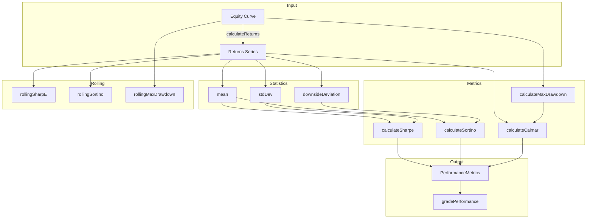
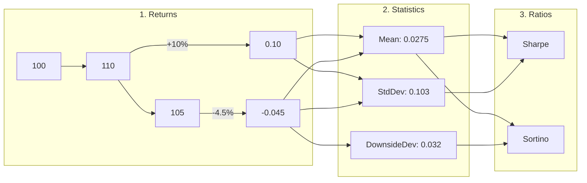
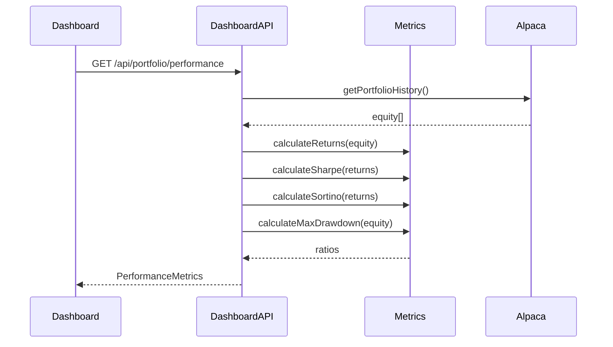

# @cream/metrics

Risk-adjusted performance metrics for Cream's trading strategy evaluation. Zero external dependencies.

## Metrics Overview

| Metric | Formula | Measures | Target |
|--------|---------|----------|--------|
| **Sharpe** | (Return - Rf) / StdDev | Risk-adjusted return (all volatility) | >1.0 acceptable, >2.0 professional |
| **Sortino** | (Return - Target) / DownsideDev | Risk-adjusted return (downside only) | >1.0 acceptable, >2.0 good |
| **Calmar** | Annualized Return / Max Drawdown | Return per unit of max loss | >1.0 acceptable, >2.0 elite |

## Architecture



## Calculation Flow



## Usage

### Basic Metrics

```typescript
import {
  calculateSharpe,
  calculateSortino,
  calculateCalmar,
  calculateReturns,
  calculateMaxDrawdown,
} from "@cream/metrics";

const equity = [100000, 102000, 101500, 104000, 103000];
const returns = calculateReturns(equity);

// Individual metrics
const sharpe = calculateSharpe(returns);      // null if insufficient data
const sortino = calculateSortino(returns);    // null if no downside
const calmar = calculateCalmar(returns, equity); // null if no drawdown

const maxDrawdown = calculateMaxDrawdown(equity); // 0.0096 (0.96%)
```

### Window-Based Analysis

```typescript
import {
  calculateMetricsForWindow,
  calculateAllMetrics,
  DEFAULT_WINDOWS,
} from "@cream/metrics";

const equity = getEquityCurve(); // hourly snapshots

// Single window
const dailyMetrics = calculateMetricsForWindow(equity, { period: 20, label: "1d" });

// All default windows (1d, 1w, 1m)
const allMetrics = calculateAllMetrics(equity);
// [
//   { window: "1d", sharpe: 1.2, sortino: 1.5, calmar: 0.8, ... },
//   { window: "1w", sharpe: 1.8, sortino: 2.1, calmar: 1.2, ... },
//   { window: "1m", sharpe: 2.1, sortino: 2.8, calmar: 1.5, ... },
// ]
```

### Rolling Metrics

```typescript
import {
  rollingSharpE,
  rollingSortino,
  rollingMaxDrawdown,
} from "@cream/metrics";

const returns = calculateReturns(equity);
const windowSize = 20; // 20 periods

const rollingSharpe = rollingSharpE(returns, windowSize);
// [null, null, ..., null, 1.2, 1.3, 1.1, ...] (first 19 are null)

const rollingDD = rollingMaxDrawdown(equity, windowSize);
// [0, 0, ..., 0, 0.02, 0.025, ...] (first 19 are 0)
```

### Performance Grading

```typescript
import {
  isAcceptablePerformance,
  gradePerformance,
} from "@cream/metrics";

const metrics = calculateMetricsForWindow(equity, { period: 100, label: "1w" });

if (isAcceptablePerformance(metrics)) {
  // All metrics >= 1.0
}

const grade = gradePerformance(metrics);
// "exceptional" (>=3.0), "elite" (>=2.0), "acceptable" (>=1.0), or "poor"
```

## Configuration

```typescript
interface MetricsConfig {
  riskFreeRate: number;    // Annual, decimal (0.05 = 5%)
  targetReturn: number;    // Sortino target, decimal
  periodsPerYear: number;  // Annualization factor
}

// Default: Hourly data with 5% risk-free rate
const DEFAULT_METRICS_CONFIG = {
  riskFreeRate: 0.05,
  targetReturn: 0,
  periodsPerYear: 252 * 24,  // 6,048 hourly periods/year
};

// Daily data config
const dailyConfig = {
  riskFreeRate: 0.05,
  targetReturn: 0,
  periodsPerYear: 252,
};

const sharpe = calculateSharpe(returns, dailyConfig);
```

## Default Windows

| Label | Period (hours) | Approximate |
|-------|----------------|-------------|
| `1d`  | 20             | 1 trading day |
| `1w`  | 100            | 1 week |
| `1m`  | 500            | 1 month |

## API Reference

### Return Calculations

| Function | Input | Output |
|----------|-------|--------|
| `calculateReturns(equity)` | Price/equity series | Period returns array |
| `calculateRawReturn(equity)` | Equity series | Total return (decimal) |
| `cumulativeReturn(returns)` | Returns array | Cumulative return (decimal) |

### Drawdown

| Function | Input | Output |
|----------|-------|--------|
| `calculateMaxDrawdown(equity)` | Equity series | Max drawdown (positive decimal) |
| `calculateCurrentDrawdown(equity)` | Equity series | Current drawdown from peak |

### Risk Ratios

| Function | Returns | Notes |
|----------|---------|-------|
| `calculateSharpe(returns, config?)` | `number \| null` | null if zero volatility |
| `calculateSortino(returns, config?)` | `number \| null` | null if no downside |
| `calculateCalmar(returns, equity, config?)` | `number \| null` | null if no drawdown |

### Rolling Metrics

| Function | Output |
|----------|--------|
| `rollingSharpE(returns, windowSize, config?)` | `(number \| null)[]` |
| `rollingSortino(returns, windowSize, config?)` | `(number \| null)[]` |
| `rollingMaxDrawdown(equity, windowSize)` | `number[]` |

### Aggregation

| Function | Output |
|----------|--------|
| `calculateMetricsForWindow(equity, window, config?)` | `PerformanceMetrics` |
| `calculateAllMetrics(equity, windows?, config?)` | `PerformanceMetrics[]` |

### Utilities

| Function | Output |
|----------|--------|
| `isAcceptablePerformance(metrics)` | `boolean` (all ratios >= 1.0) |
| `gradePerformance(metrics)` | `"exceptional" \| "elite" \| "acceptable" \| "poor"` |
| `mean(values)` | Arithmetic mean |
| `stdDev(values, mean?)` | Sample standard deviation |
| `downsideDeviation(returns, target?)` | Downside volatility |

## Types

```typescript
interface PerformanceMetrics {
  rawReturn: number;        // Cumulative return (decimal)
  sharpe: number | null;    // Annualized Sharpe ratio
  sortino: number | null;   // Annualized Sortino ratio
  calmar: number | null;    // Calmar ratio
  window: string;           // Window label (e.g., "1d", "1w")
  timestamp: string;        // ISO timestamp of calculation
}

interface MetricsWindow {
  period: number;  // Number of periods (hours)
  label: string;   // Human-readable label
}
```

## Integration with Cream

Used by `dashboard-api` to calculate portfolio performance:



## Metric Selection Guide

| Scenario | Primary Metric | Why |
|----------|----------------|-----|
| General performance | Sharpe | Industry standard, comparable |
| Downside-focused | Sortino | Ignores upside "volatility" |
| Drawdown-sensitive | Calmar | Measures recovery efficiency |
| Strategy comparison | All three | Comprehensive risk view |

## Edge Cases

- **Insufficient data**: Returns `null` when < 2 data points
- **Zero volatility**: Sharpe returns `null` (constant returns)
- **No downside**: Sortino returns `null` (all positive returns)
- **No drawdown**: Calmar returns `null` (monotonically increasing)
- **Division by zero**: Handled gracefully, returns 0 or null
