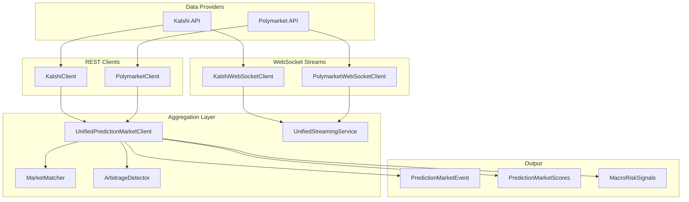
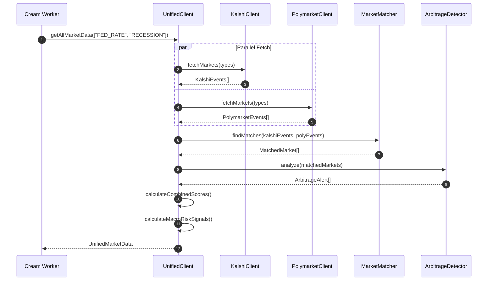
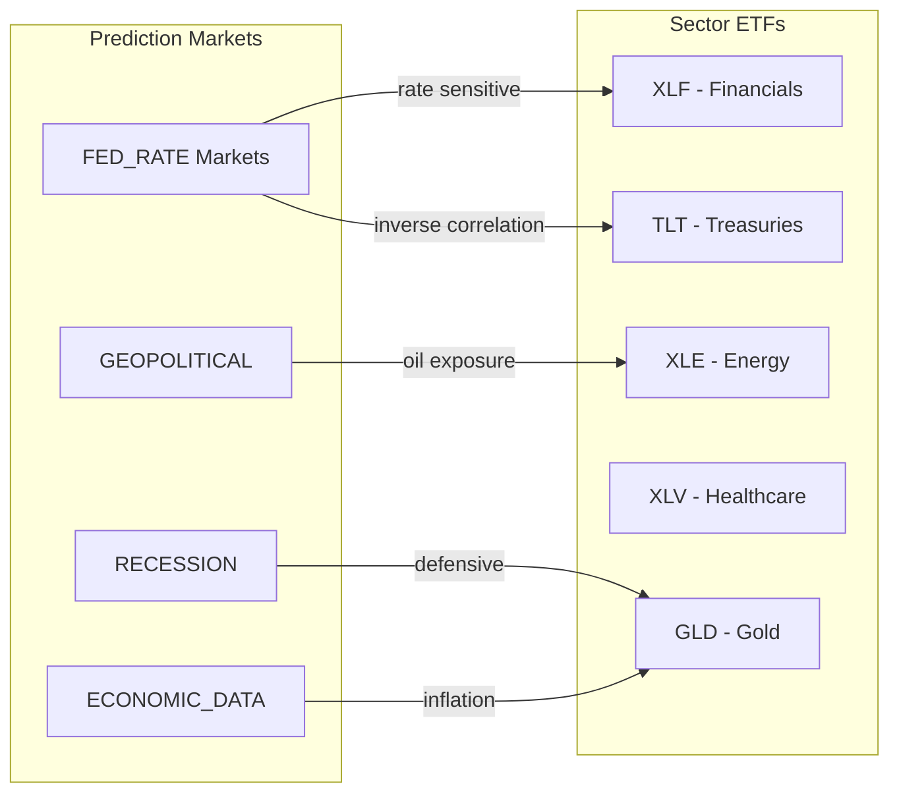
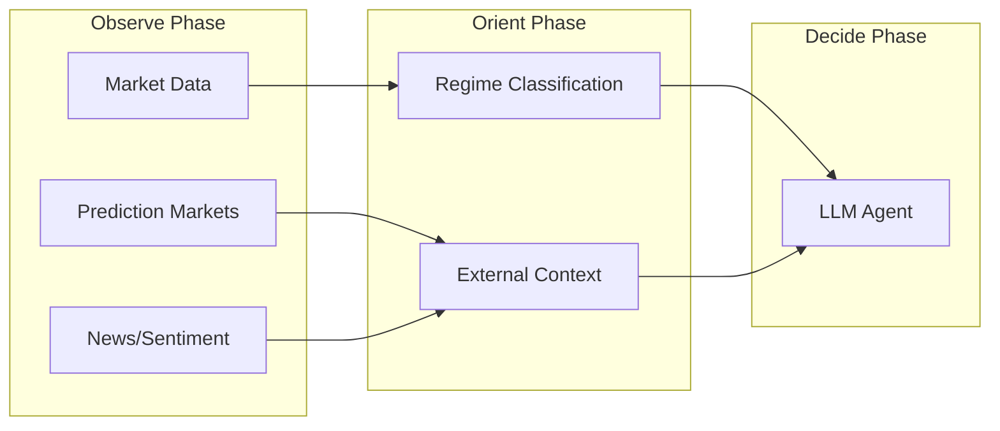

# @cream/prediction-markets

Prediction market data integration for Cream. Aggregates probability signals from Kalshi and Polymarket to provide macro-level context for trading decisions.

## Architecture Overview



## Data Flow



## Market Types

| Type | Kalshi Series | Description |
|------|---------------|-------------|
| `FED_RATE` | KXFED, KXFOMC | Federal Reserve rate decisions |
| `ECONOMIC_DATA` | KXCPI, KXGDP, KXJOBS, KXPCE | Economic indicator releases |
| `RECESSION` | KXREC | Recession probability |
| `ELECTION` | KXPRES | Presidential elections |
| `GEOPOLITICAL` | - | Geopolitical events |
| `REGULATORY` | - | Regulatory decisions |

## Usage

### Unified Client (Recommended)

```typescript
import { createUnifiedClient, type UnifiedMarketData } from "@cream/prediction-markets";

const client = createUnifiedClient({
  kalshi: {
    enabled: true,
    api_key_id: process.env.KALSHI_API_KEY_ID,
    private_key_path: process.env.KALSHI_PRIVATE_KEY_PATH,
    rate_limit_tier: "basic",
  },
  polymarket: {
    enabled: true,
  },
});

// Fetch all market data with cross-platform analysis
const data: UnifiedMarketData = await client.getAllMarketData([
  "FED_RATE",
  "ECONOMIC_DATA",
  "RECESSION",
]);

// Access aggregated signals
const { fedCutProbability, recessionProbability12m } = data.signals;
```

### Direct Provider Access

```typescript
import { createKalshiClientFromEnv, createPolymarketClientFromEnv } from "@cream/prediction-markets";

// Kalshi (requires API credentials)
const kalshi = createKalshiClientFromEnv();
const fedEvents = await kalshi.fetchMarkets(["FED_RATE"]);
const scores = kalshi.calculateScores(fedEvents);

// Polymarket (no auth required for read-only)
const polymarket = createPolymarketClientFromEnv();
const events = await polymarket.fetchMarkets(["RECESSION"]);
```

### Real-time Streaming

```typescript
import { createUnifiedStreamingService } from "@cream/prediction-markets";

const streaming = createUnifiedStreamingService({
  kalshiEnabled: true,
  kalshiApiKeyId: process.env.KALSHI_API_KEY_ID,
  kalshiPrivateKeyPath: process.env.KALSHI_PRIVATE_KEY_PATH,
  polymarketEnabled: true,
  autoReconnect: true,
});

streaming.onUpdate((update) => {
  console.log(`${update.platform} ${update.ticker}: ${update.lastPrice}`);
});

await streaming.start();
streaming.subscribeKalshiTickers(["KXFED-26JAN29-T4.25"]);
streaming.subscribePolymarketAssets(["asset_id_here"]);
```

## Sector Mappings

Prediction market events are mapped to tradeable instruments based on market type and keywords.



| Market Pattern | Primary Sector | Key Instruments |
|----------------|----------------|-----------------|
| Fed rate, FOMC | FINANCIALS | XLF, KRE, TLT, IYR |
| CPI, inflation | FINANCIALS | TIP, GLD, TLT |
| Recession, GDP | FINANCIALS | SPY, QQQ, VIX, TLT |
| Oil, OPEC | ENERGY | XLE, XOP, USO |
| Tariff, trade | CONSUMER | XLY, EEM, FXI |
| FDA approval | HEALTHCARE | XLV, IBB, XBI |

## Scores & Signals

### PredictionMarketScores

Raw probability scores extracted from markets:

| Field | Type | Description |
|-------|------|-------------|
| `fedCutProbability` | `number?` | Probability of Fed rate cut |
| `fedHikeProbability` | `number?` | Probability of Fed rate hike |
| `recessionProbability12m` | `number?` | 12-month recession probability |
| `macroUncertaintyIndex` | `number?` | Uncertainty index (0-1) |
| `cpiSurpriseDirection` | `number?` | Expected CPI surprise direction |
| `shutdownProbability` | `number?` | Government shutdown probability |

### MacroRiskSignals

Computed signals for trading decisions:

| Field | Description |
|-------|-------------|
| `fedCutProbability` | Averaged across platforms |
| `fedHikeProbability` | Averaged across platforms |
| `recessionProbability12m` | Averaged across platforms |
| `macroUncertaintyIndex` | Overall market uncertainty |
| `policyEventRisk` | Risk score for policy events |
| `marketConfidence` | Inverse of uncertainty |
| `marketCount` | Markets used in computation |
| `platforms` | Contributing platforms |

## Cross-Platform Analysis

### Market Matching

The `MarketMatcher` finds equivalent markets across platforms using:

- **Question similarity** (50% weight): Jaccard similarity on normalized text
- **Outcome similarity** (30% weight): Binary market detection, outcome name matching
- **Temporal similarity** (20% weight): Expiration date proximity

```typescript
const matcher = new MarketMatcher({ minSimilarity: 0.7 });
const matches = matcher.findMatches(kalshiEvents, polymarketEvents);
```

### Arbitrage Detection

The `ArbitrageDetector` identifies price divergences:

| Alert Type | Condition | Implication |
|------------|-----------|-------------|
| `opportunity` | 5-20% divergence, high similarity | Potential arbitrage |
| `data_quality_issue` | >20% divergence | Data validation needed |
| `resolution_risk` | Divergence + low similarity | Different resolution criteria |

## Caching

```typescript
import { createMarketCache } from "@cream/prediction-markets";

const cache = createMarketCache({
  eventTtlMs: 5 * 60 * 1000,  // 5 min for events
  scoresTtlMs: 60 * 1000,     // 1 min for scores
  maxEventEntries: 1000,
  autoPrune: true,
});

// Get-or-fetch pattern
const event = await cache.getOrFetchEvent("KXFED-26JAN29", async () => {
  return kalshi.fetchMarketByTicker("KXFED-26JAN29");
});
```

## Rate Limits

### Kalshi

| Tier | Read/s | Write/s |
|------|--------|---------|
| basic | 20 | 10 |
| advanced | 30 | 30 |
| premier | 100 | 100 |
| prime | 400 | 400 |

### Polymarket

| Endpoint | Requests/min |
|----------|--------------|
| gamma_markets | 60 |
| clob_book_price | 120 |

## WebSocket Channels

### Kalshi

| Channel | Data | Use Case |
|---------|------|----------|
| `ticker` | Price updates, volume | Real-time quotes |
| `orderbook_delta` | Orderbook changes | Market depth |
| `trade` | Trade executions | Volume tracking |

### Polymarket

| Event Type | Data | Use Case |
|------------|------|----------|
| `book` | Full orderbook snapshot | Initial state |
| `price_change` | Best bid/ask updates | Real-time quotes |
| `last_trade_price` | Last trade | Execution tracking |

## Environment Variables

| Variable | Required | Description |
|----------|----------|-------------|
| `KALSHI_API_KEY_ID` | For Kalshi | API key ID |
| `KALSHI_PRIVATE_KEY_PATH` | For Kalshi | Path to RSA private key |
| `POLYMARKET_CLOB_ENDPOINT` | No | Override CLOB URL |
| `POLYMARKET_GAMMA_ENDPOINT` | No | Override Gamma URL |

## Error Handling

```typescript
import {
  PredictionMarketError,
  RateLimitError,
  AuthenticationError,
} from "@cream/prediction-markets";

try {
  const events = await client.fetchMarkets(["FED_RATE"]);
} catch (error) {
  if (error instanceof RateLimitError) {
    await sleep(error.retryAfterMs);
  } else if (error instanceof AuthenticationError) {
    // Check credentials
  }
}
```

## Transformers

Transform prediction market events into Cream's external event schema:

```typescript
import {
  transformToExternalEvents,
  transformScoresToNumeric,
  mapToRelatedInstruments,
} from "@cream/prediction-markets";

// Convert to ExternalEvent format for context pipeline
const externalEvents = transformToExternalEvents(predictionEvents);

// Convert scores to numeric format for ML features
const numericScores = transformScoresToNumeric(scores);
// { pm_fed_cut: 0.81, pm_recession_12m: 0.15, ... }

// Get related instruments for a specific event
const instruments = mapToRelatedInstruments(event);
// ["XLF", "TLT", "IYR", "KRE"]
```

## Integration with Cream

Prediction market signals feed into Cream's OODA loop during the **Observe** phase:



Signals influence trading decisions:

- **High `fedCutProbability`**: Favor rate-sensitive longs (TLT, IYR)
- **High `recessionProbability12m`**: Reduce equity exposure, favor defensives
- **High `macroUncertaintyIndex`**: Reduce position sizes
- **Arbitrage alerts**: Data quality validation
