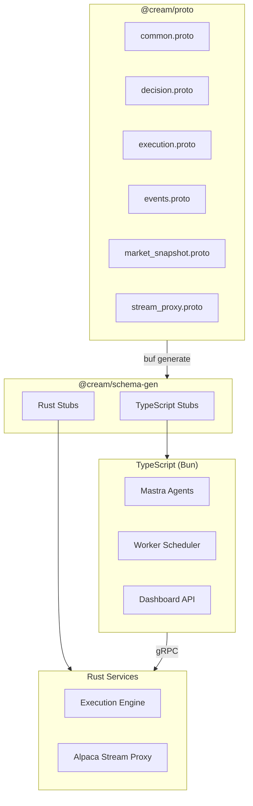
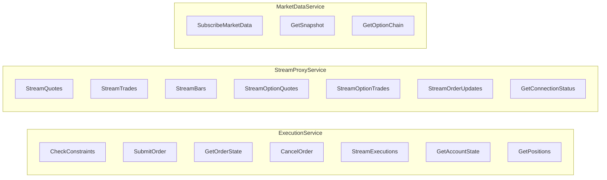
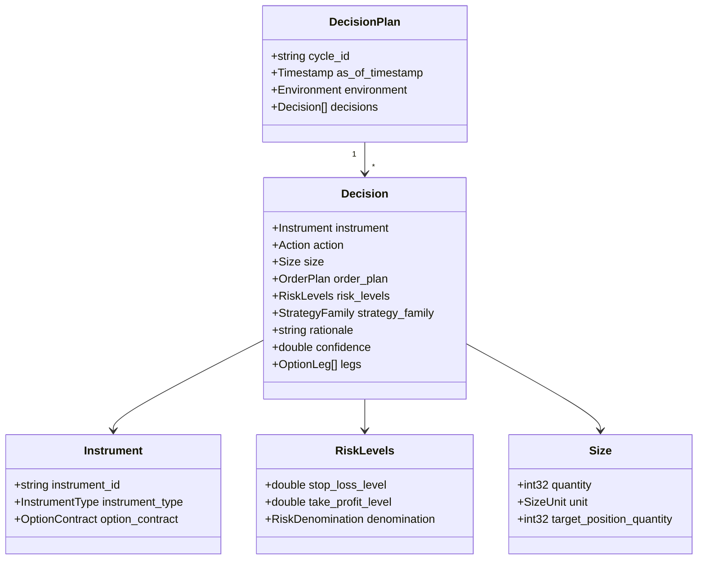
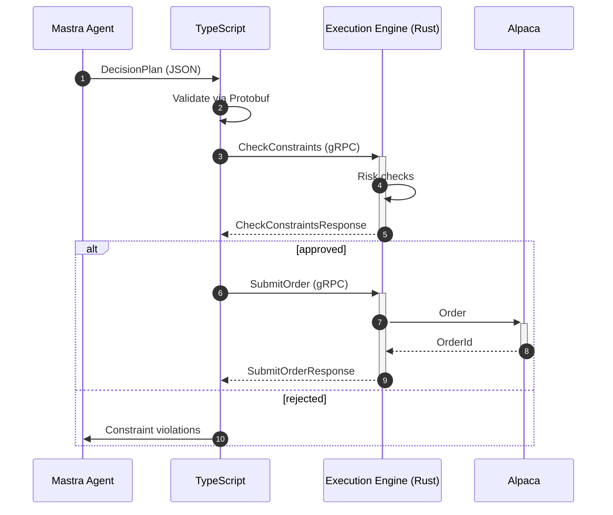
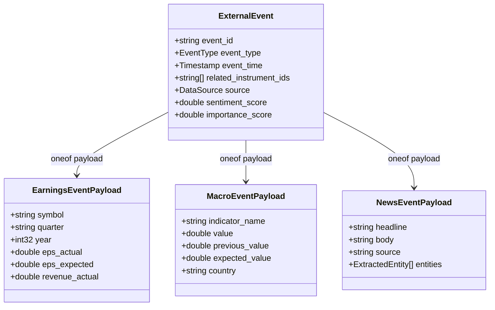
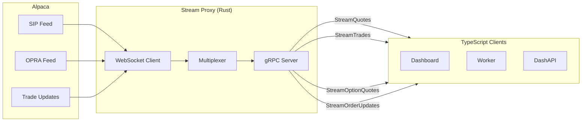

# @cream/proto

Protobuf schema definitions for cross-language communication between TypeScript services and the Rust execution engine.

## Schema Files

| File | Purpose |
|------|---------|
| `common.proto` | Shared enums (Action, Direction, OrderType) and base messages (Instrument, RiskLevels) |
| `decision.proto` | DecisionPlan and Decision messages - LLM agent output format |
| `execution.proto` | ExecutionService gRPC - constraint checking, order routing, account state |
| `events.proto` | External events - earnings, macro, news, sentiment with typed payloads |
| `market_snapshot.proto` | MarketDataService gRPC - quotes, bars, option chains |
| `stream_proxy.proto` | StreamProxyService gRPC - real-time SIP/OPRA feeds from Alpaca |

## Architecture



## Code Generation

```bash
# Generate TypeScript and Rust stubs
bun run generate   # runs: buf generate

# Lint proto files
bun run lint       # runs: buf lint

# Check breaking changes
bun run breaking   # runs: buf breaking against master
```

Output locations:
- TypeScript: `../schema-gen/ts/cream/v1/*_pb.ts`
- Rust: `../schema-gen/rust/cream/v1/*.rs`

## gRPC Services



## Core Message Relationships



## Execution Flow



## External Events



## Key Enums

### Trading Actions

| Action | Description |
|--------|-------------|
| `BUY` | Establish new long from flat |
| `SELL` | Establish new short from flat |
| `HOLD` | Maintain current position |
| `INCREASE` | Increase exposure in direction |
| `REDUCE` | Reduce exposure magnitude |
| `CLOSE` | Close an existing position |
| `NO_TRADE` | Remain flat |

### Order Types

| Type | Use Case |
|------|----------|
| `LIMIT` | Price-controlled entry/exit |
| `MARKET` | Immediate execution |
| `STOP` | Triggered at price level |
| `STOP_LIMIT` | Stop with limit protection |
| `TRAILING_STOP` | Dynamic stop level |

### Strategy Families

| Family | Description |
|--------|-------------|
| `EQUITY_LONG/SHORT` | Directional equity positions |
| `OPTION_LONG/SHORT` | Single-leg options |
| `VERTICAL_SPREAD` | Bull/bear spreads |
| `IRON_CONDOR` | Range-bound strategy |
| `STRADDLE/STRANGLE` | Volatility plays |
| `CALENDAR_SPREAD` | Time decay strategy |

## Risk Constraints

The execution engine validates decisions against configurable limits:

```protobuf
message RiskConstraints {
  // Per-instrument
  int32 max_shares = 1;
  int32 max_contracts = 2;
  int64 max_notional_cents = 3;
  int32 max_pct_equity_bps = 4;  // basis points

  // Portfolio-level
  int32 max_positions = 9;
  int32 max_concentration_bps = 10;
  int32 max_drawdown_bps = 12;

  // Options Greeks
  int64 max_delta_notional_cents = 13;
  int64 max_vega_cents = 15;
  int64 max_theta_cents = 16;
}
```

## Stream Proxy Data Flow



## Usage Examples

### Decision (Equity)

```json
{
  "instrument": {
    "instrumentId": "AAPL",
    "instrumentType": "INSTRUMENT_TYPE_EQUITY"
  },
  "action": "ACTION_BUY",
  "size": {
    "quantity": 50,
    "unit": "SIZE_UNIT_SHARES",
    "targetPositionQuantity": 50
  },
  "riskLevels": {
    "stopLossLevel": 179.5,
    "takeProfitLevel": 195.0,
    "denomination": "RISK_DENOMINATION_UNDERLYING_PRICE"
  },
  "confidence": 0.78
}
```

### Decision (Option)

```json
{
  "instrument": {
    "instrumentId": "AAPL250117C00200000",
    "instrumentType": "INSTRUMENT_TYPE_OPTION",
    "optionContract": {
      "underlying": "AAPL",
      "expiration": "2025-01-17",
      "strike": 200,
      "optionType": "OPTION_TYPE_CALL"
    }
  },
  "action": "ACTION_BUY",
  "size": {
    "quantity": 5,
    "unit": "SIZE_UNIT_CONTRACTS"
  },
  "riskLevels": {
    "stopLossLevel": 2.75,
    "takeProfitLevel": 11.0,
    "denomination": "RISK_DENOMINATION_OPTION_PRICE"
  }
}
```

## Toolchain

| Tool | Version | Purpose |
|------|---------|---------|
| Buf CLI | v2 | Linting, breaking detection, generation |
| protobuf-es | v2.x | TypeScript code generation |
| prost | - | Rust message types |
| tonic | - | Rust gRPC stubs |

## Dependencies

```yaml
# buf.yaml
deps:
  - buf.build/protocolbuffers/wellknowntypes  # Timestamp, Struct
```
