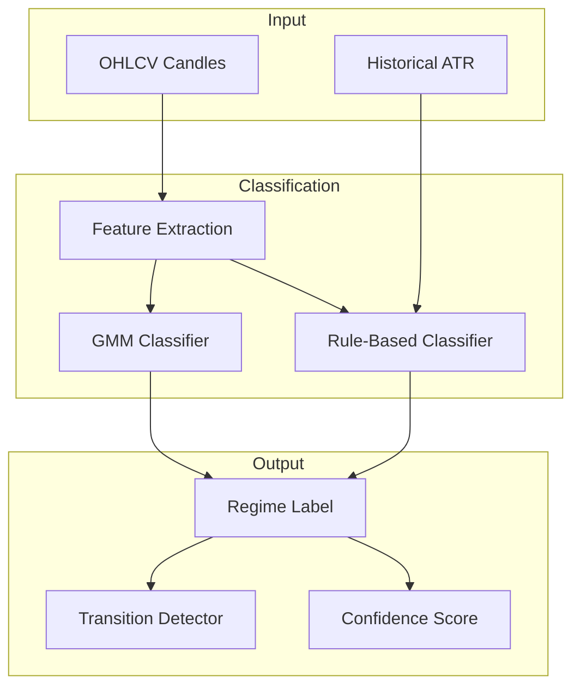
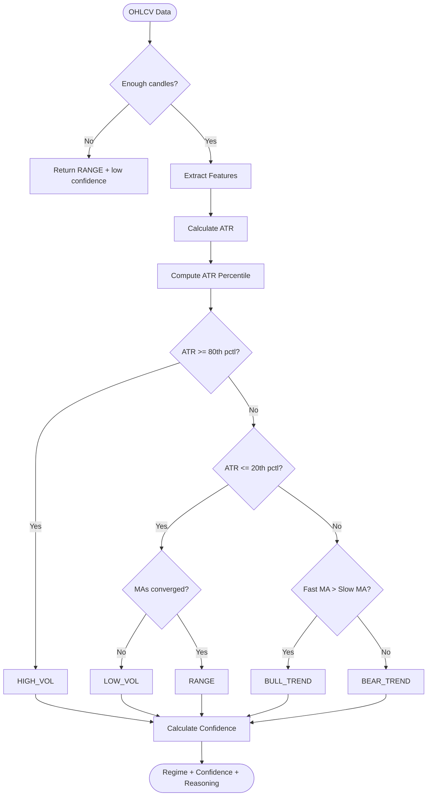
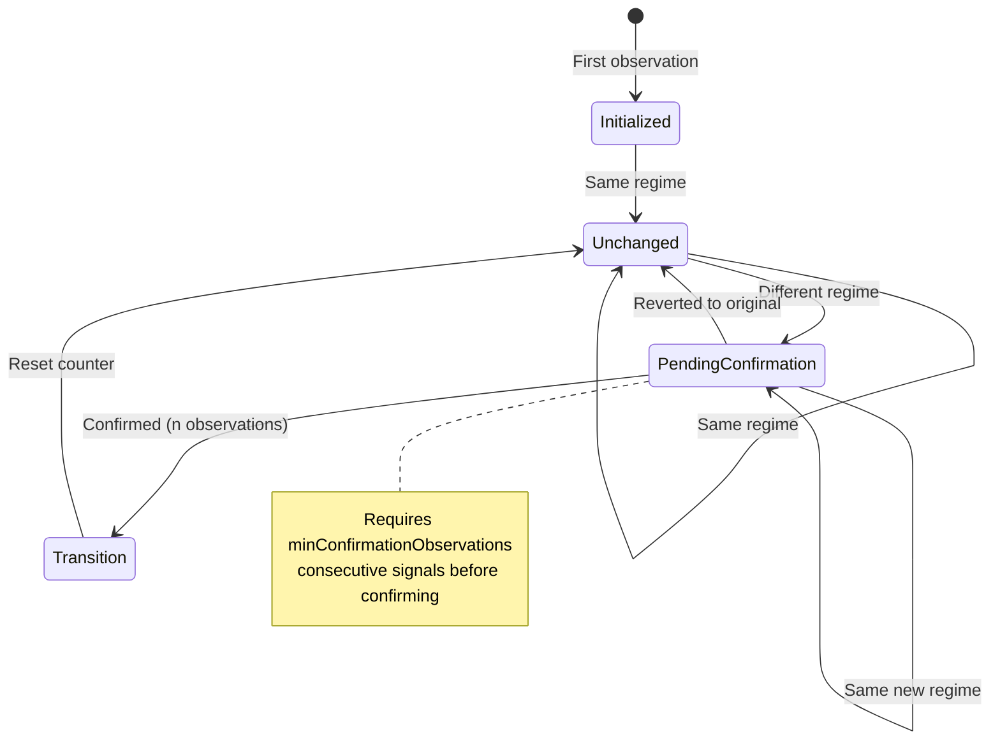
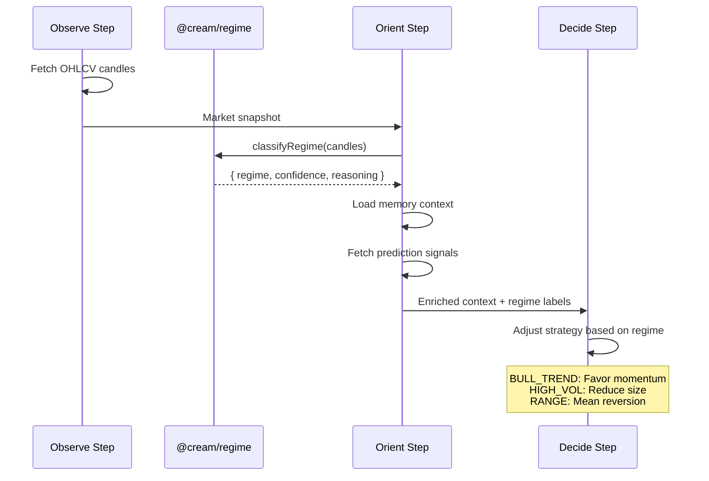

# @cream/regime

Market regime classification for the Cream trading system. Classifies market conditions into five regimes that inform position sizing, strategy selection, and risk management throughout the OODA trading cycle.

## Regime Taxonomy

| Regime | Characteristics | Trading Implications |
|--------|-----------------|---------------------|
| `BULL_TREND` | Fast MA > Slow MA, sustained upward momentum | Favor long positions, trend-following strategies |
| `BEAR_TREND` | Fast MA < Slow MA, sustained downward momentum | Reduce exposure, consider hedges, defensive positioning |
| `RANGE` | MAs converged (<0.5% diff), low-normal volatility | Mean-reversion strategies, tighter position sizing |
| `HIGH_VOL` | ATR >80th percentile of historical | Reduce position sizes, wider stops, volatility strategies |
| `LOW_VOL` | ATR <20th percentile of historical | Potential breakout setups, careful of low liquidity |

## Architecture



## Classifiers

### Rule-Based Classifier

Deterministic, interpretable classification using moving average crossovers and volatility percentiles.

```typescript
import { classifyRegime, type RegimeInput } from "@cream/regime";

const input: RegimeInput = {
  candles,           // OHLCVBar[] - minimum 51 candles for default config
  historicalAtr,     // number[] - optional, for volatility percentile calculation
};

const result = classifyRegime(input);
// {
//   regime: "BULL_TREND",
//   confidence: 0.85,
//   reasoning: "Bullish trend: Fast MA (152.30) > Slow MA (148.20), diff: 2.77%",
//   metrics: { fastMa, slowMa, maDiff, maDiffPct, currentAtr, atrPercentile }
// }
```

**Configuration:**

```typescript
import { DEFAULT_RULE_BASED_CONFIG } from "@cream/regime";

// Default thresholds
{
  trend_ma_fast: 20,              // Fast MA period
  trend_ma_slow: 50,              // Slow MA period
  volatility_percentile_high: 80, // HIGH_VOL threshold
  volatility_percentile_low: 20,  // LOW_VOL threshold
}
```

### GMM Classifier

Data-driven classification using Gaussian Mixture Models. Discovers regimes from feature distributions via Expectation-Maximization.

```typescript
import { trainGMM, classifyWithGMM, serializeGMMModel } from "@cream/regime";

// Train on historical data (minimum 50 samples)
const model = trainGMM(historicalCandles, {
  k: 5,              // Clusters (matches regime taxonomy)
  maxIterations: 100,
  tolerance: 1e-4,
  seed: 42,
});

// Classify new observations
const classification = classifyWithGMM(model, recentCandles);
// {
//   regime: "HIGH_VOL",
//   confidence: 0.72,
//   clusterProbabilities: [0.05, 0.08, 0.10, 0.72, 0.05],
//   features: { returns, volatility, volumeZScore, trendStrength }
// }

// Persist trained model
const json = serializeGMMModel(model);
```

## Classification Flow



## Feature Extraction

The GMM classifier uses four normalized features:

| Feature | Calculation | Signal |
|---------|-------------|--------|
| `returns` | Log return: `ln(close_t / close_{t-1})` | Direction of price movement |
| `volatility` | Rolling std of returns (20-period) | Market uncertainty |
| `volumeZScore` | `(volume - mean) / std` over 20 periods | Participation intensity |
| `trendStrength` | `returns / volatility` (clamped to [-3, 3]) | Risk-adjusted momentum |

```typescript
import { extractFeatures, extractSingleFeature } from "@cream/regime";

const features = extractFeatures(candles, {
  returnsPeriod: 1,
  volatilityPeriod: 20,
  volumePeriod: 20,
});
```

## Transition Detection

Tracks regime changes with confirmation requirements to filter noise.



```typescript
import { RegimeTransitionDetector } from "@cream/regime";

const detector = new RegimeTransitionDetector({
  minConfirmationObservations: 2,  // Require 2 consecutive signals
  maxHistoryLength: 100,           // Keep last 100 regime periods
  minTransitionConfidence: 0.3,    // Reject low-confidence transitions
});

// Update with each classification
const result = detector.update("AAPL", "BULL_TREND", timestamp, confidence);

switch (result.kind) {
  case "initialized":     // First observation for instrument
  case "unchanged":       // Same regime continues
  case "pending_confirmation":  // Potential transition, awaiting confirmation
  case "low_confidence":  // Transition rejected due to low confidence
  case "transition":      // Confirmed regime change
    console.log(result.transition); // { fromRegime, toRegime, previousRegimeDuration }
}

// Query state
detector.getCurrentRegime("AAPL");  // RegimeLabel | null
detector.getHistory("AAPL");        // Array of past regime periods
```

## Transition Analysis

Analyze historical transition patterns for regime persistence and common paths.

```typescript
import { analyzeTransitions, calculateTransitionMatrix } from "@cream/regime";

// Aggregate statistics
const analysis = analyzeTransitions(transitions);
// {
//   transitionCounts: { "BULL_TREND->RANGE": 15, ... },
//   averageDuration: { BULL_TREND: 12.5, BEAR_TREND: 8.2, ... },
//   mostCommonTransitions: [{ from, to, count }, ...]
// }

// Markov transition probabilities
const matrix = calculateTransitionMatrix(transitions);
// matrix.BULL_TREND.RANGE = 0.35  // P(RANGE | BULL_TREND)
// matrix.BULL_TREND.HIGH_VOL = 0.15
```

## Integration with OODA Cycle

The regime package feeds into the Orient step of Cream's hourly OODA trading cycle:



## Data Requirements

| Classifier | Minimum Candles | Recommended |
|------------|-----------------|-------------|
| Rule-based (default config) | 51 | 100+ with historical ATR |
| Rule-based (custom) | `max(slow_ma, 14) + 1` | 2x minimum |
| GMM training | `k * 10` (50 for k=5) | 300+ for robust clusters |
| GMM inference | 21 | Same as training data frequency |

```typescript
import { getRequiredCandleCount, hasEnoughData, getMinimumCandleCount } from "@cream/regime";

// Rule-based
const required = getRequiredCandleCount(config);  // 51 for default
const canClassify = hasEnoughData(candles, config);

// GMM features
const minForFeatures = getMinimumCandleCount();  // 21
```

## API Reference

### Rule-Based

| Export | Description |
|--------|-------------|
| `classifyRegime(input, config?)` | Classify regime from candles |
| `createRuleBasedClassifier(config?)` | Create reusable classifier function |
| `getRequiredCandleCount(config?)` | Minimum candles needed |
| `hasEnoughData(candles, config?)` | Check if classification is possible |
| `DEFAULT_RULE_BASED_CONFIG` | Default configuration object |

### GMM

| Export | Description |
|--------|-------------|
| `trainGMM(candles, config?)` | Train GMM model |
| `classifyWithGMM(model, candles)` | Classify with trained model |
| `classifySeriesWithGMM(model, candles)` | Classify time series |
| `serializeGMMModel(model)` | Serialize to JSON string |
| `deserializeGMMModel(json)` | Deserialize from JSON string |
| `DEFAULT_GMM_CONFIG` | Default GMM configuration |

### Features

| Export | Description |
|--------|-------------|
| `extractFeatures(candles, config?)` | Extract feature time series |
| `extractSingleFeature(candles, config?)` | Extract latest feature |
| `normalizeFeatures(features)` | Normalize for GMM training |
| `getMinimumCandleCount(config?)` | Minimum candles for features |

### Transitions

| Export | Description |
|--------|-------------|
| `RegimeTransitionDetector` | Stateful transition tracker |
| `analyzeTransitions(transitions)` | Aggregate transition statistics |
| `calculateTransitionMatrix(transitions)` | Markov transition probabilities |
| `DEFAULT_TRANSITION_CONFIG` | Default detector configuration |

## Dependencies

- `@cream/config` - Regime label types, configuration schemas
- `@cream/indicators` - SMA, ATR calculations, OHLCVBar type
- `@cream/logger` - Structured logging
