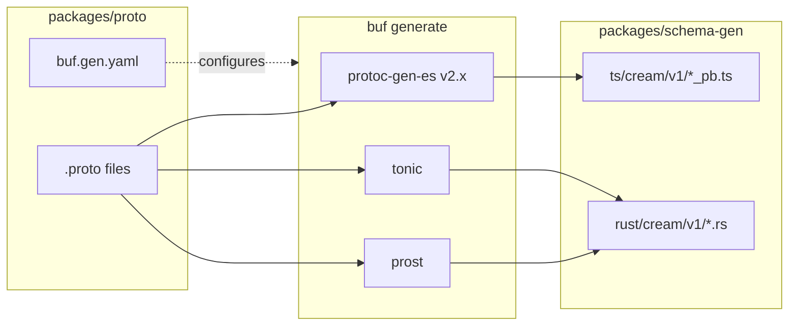
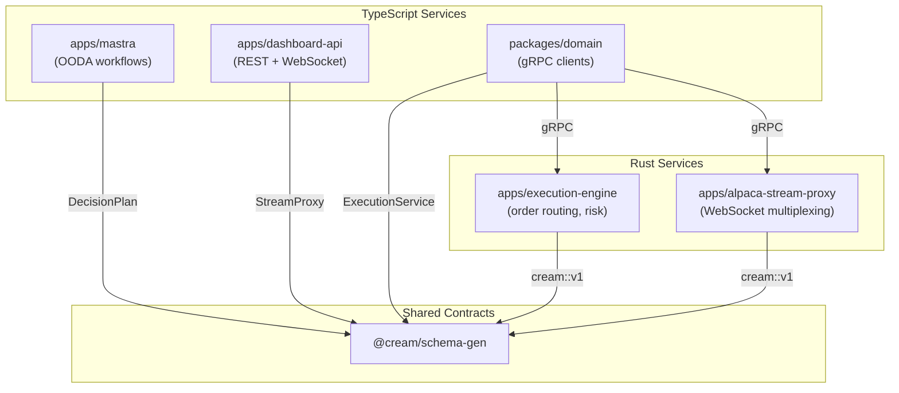

# @cream/schema-gen

Generated Protobuf stubs for TypeScript and Rust. This package contains no source code - all files are machine-generated from `.proto` definitions in `packages/proto`.

## Code Generation Flow



## Proto Modules

| Module | Purpose | gRPC Services |
|--------|---------|---------------|
| `common` | Shared enums and messages (Action, Direction, Instrument, Size, RiskLevels) | - |
| `decision` | Trading decisions from OODA loops (DecisionPlan, Decision, OrderPlan) | - |
| `execution` | Order lifecycle and risk constraints (SubmitOrder, CheckConstraints, Position) | ExecutionService |
| `market_snapshot` | Real-time quotes, bars, option chains | MarketDataService |
| `stream_proxy` | Alpaca WebSocket multiplexing (StockQuote, StockTrade, OrderUpdate) | StreamProxyService |
| `events` | External events (Earnings, Macro, News, Sentiment, M&A, Analyst ratings) | - |

## TypeScript Usage

```typescript
// Import message schemas and types
import {
  Action,
  Direction,
  InstrumentType,
  InstrumentSchema
} from "@cream/schema-gen/cream/v1/common";

import {
  DecisionPlanSchema,
  type DecisionPlan
} from "@cream/schema-gen/cream/v1/decision";

import {
  ExecutionService,
  SubmitOrderRequestSchema,
  OrderStatus
} from "@cream/schema-gen/cream/v1/execution";

// Create messages using @bufbuild/protobuf
import { create } from "@bufbuild/protobuf";

const instrument = create(InstrumentSchema, {
  instrumentId: "AAPL",
  instrumentType: InstrumentType.EQUITY,
});
```

### Exports

```
@cream/schema-gen/cream/v1/common
@cream/schema-gen/cream/v1/decision
@cream/schema-gen/cream/v1/execution
@cream/schema-gen/cream/v1/events
@cream/schema-gen/cream/v1/market_snapshot
@cream/schema-gen/cream/v1/stream_proxy
```

## Rust Usage

The Rust stubs are included in consuming crates via `build.rs` - not published as a separate crate.

```rust
// In apps/execution-engine or apps/alpaca-stream-proxy
use crate::infrastructure::grpc::proto::cream::v1::{
    Environment,
    Action,
    DecisionPlan,
    CheckConstraintsRequest,
    execution_service_server::ExecutionService,
};

// Enums have as_str_name() and from_str_name() methods
let action = Action::Buy;
assert_eq!(action.as_str_name(), "ACTION_BUY");
```

### Generated Services (Tonic)

```rust
// Server trait to implement
pub trait ExecutionService: Send + Sync + 'static {
    async fn check_constraints(&self, request: Request<CheckConstraintsRequest>)
        -> Result<Response<CheckConstraintsResponse>, Status>;
    async fn submit_order(&self, request: Request<SubmitOrderRequest>)
        -> Result<Response<SubmitOrderResponse>, Status>;
    // ...
}

// Client for making calls
let mut client = ExecutionServiceClient::connect("http://[::1]:50051").await?;
let response = client.check_constraints(request).await?;
```

## System Integration



## Regenerating

```bash
# From packages/proto
bun run build  # Lints then generates

# Or directly
buf generate
```

Output directories are cleaned before generation (`clean: true` in buf.gen.yaml).

## Key Types

### DecisionPlan

Central output of the OODA loop. Contains a list of `Decision` objects representing trading actions.

```
DecisionPlan
├── cycle_id: string
├── as_of_timestamp: Timestamp
├── environment: Environment (PAPER | LIVE)
├── decisions: Decision[]
│   ├── instrument: Instrument
│   ├── action: Action (BUY | SELL | HOLD | INCREASE | REDUCE | CLOSE)
│   ├── size: Size
│   ├── order_plan: OrderPlan
│   ├── risk_levels: RiskLevels (stop_loss, take_profit)
│   ├── strategy_family: StrategyFamily
│   ├── direction: Direction (LONG | SHORT | FLAT)
│   ├── confidence: double
│   └── legs: OptionLeg[] (for multi-leg strategies)
└── portfolio_notes: string?
```

### ExecutionService RPCs

| Method | Description |
|--------|-------------|
| `CheckConstraints` | Validate decision plan against risk limits |
| `SubmitOrder` | Send order to broker |
| `GetOrderState` | Query order status |
| `CancelOrder` | Cancel pending order |
| `StreamExecutions` | Server-streaming order updates |
| `GetAccountState` | Current equity, buying power, PDT status |
| `GetPositions` | Current portfolio positions |

### StreamProxyService RPCs

| Method | Description |
|--------|-------------|
| `StreamQuotes` | Real-time stock quotes (SIP feed) |
| `StreamTrades` | Real-time stock trades |
| `StreamBars` | Real-time OHLCV bars |
| `StreamOptionQuotes` | Real-time option quotes (OPRA feed) |
| `StreamOptionTrades` | Real-time option trades |
| `StreamOrderUpdates` | Order fill/cancel/reject events |
| `GetConnectionStatus` | Feed health and subscription counts |

## Dependencies

**TypeScript:**
- `@bufbuild/protobuf` - Runtime for Protobuf-ES v2
- `@connectrpc/connect` - Connect protocol for service calls

**Rust (in consuming crates):**
- `prost` - Message serialization
- `prost-types` - Well-known types (Timestamp, Duration)
- `tonic` - gRPC server/client

## Notes

- Proto3 syntax used until Prost supports Protobuf Editions
- TypeScript uses ES modules with `.js` import extensions
- Rust enums have `#[repr(i32)]` for wire compatibility
- All timestamps use `google.protobuf.Timestamp`
