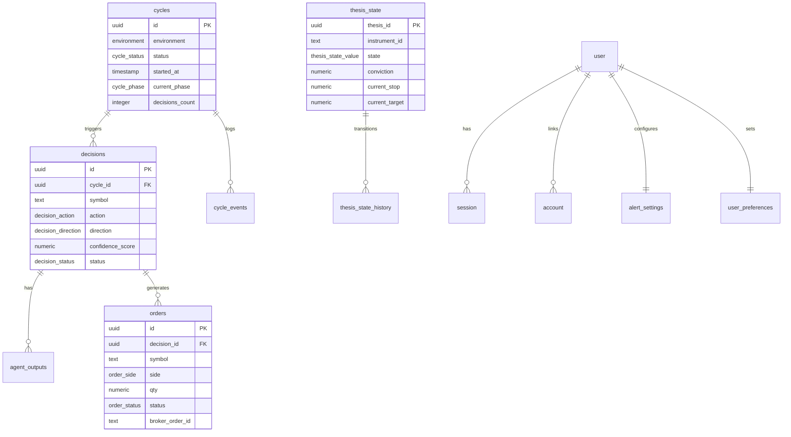

# @cream/storage

PostgreSQL persistence layer for the Cream trading system using Drizzle ORM. Provides type-safe database access, environment-isolated connections, and domain-specific repositories.

## Architecture


## Environment Isolation

All data is scoped by `CREAM_ENV` environment variable:

| Environment | Database | Purpose |
|-------------|----------|---------|
| `PAPER` | `cream_paper` | Paper trading, testing, development |
| `LIVE` | `cream` | Live trading with real money |

Connection routing:
- `CREAM_ENV=PAPER` uses `DATABASE_URL_PAPER` (fallback: `DATABASE_URL`)
- `CREAM_ENV=LIVE` uses `DATABASE_URL`
- `NODE_ENV=test` uses `TEST_DATABASE_URL`

## Database Schema



### Schema Modules

| Module | Tables | Purpose |
|--------|--------|---------|
| `core-trading` | decisions, orders, cycles, cycle_events, portfolio_snapshots | OODA loop execution |
| `thesis` | thesis_state, thesis_state_history | Position thesis tracking |
| `config` | trading_config, agent_configs, universe_configs, constraints_config | Runtime configuration |
| `auth` | user, session, account, verification, two_factor | Authentication (better-auth) |
| `market-data` | candles, corporate_actions, features, regime_labels, universe_cache | Price and indicator data |
| `indicators` | fundamental_indicators, short_interest_indicators, sentiment_indicators, options_indicators_cache | Computed signals |
| `external` | prediction_market_snapshots, external_events, filings, macro_watch_entries | External data sources |
| `dashboard` | alerts, system_state | UI state |
| `audit` | audit_log, parity_validation_history | Compliance tracking |
| `universe` | index_constituents, ticker_changes, universe_snapshots | Point-in-time universe |
| `user-settings` | alert_settings, user_preferences | Per-user preferences |

## Repository Pattern

Repositories provide domain-specific data access with type-safe queries:


### Usage

```typescript
import { getDb, DecisionsRepository, OrdersRepository } from "@cream/storage";

// Singleton database client (lazy initialization)
const db = getDb();

// Repository with injected database (testable)
const decisions = new DecisionsRepository(db);
const orders = new OrdersRepository(db);

// Create a decision
const decision = await decisions.create({
  cycleId: "...",
  symbol: "AAPL",
  action: "BUY",
  direction: "LONG",
  size: 100,
  environment: "PAPER",
});

// Query with filters
const { data, total } = await decisions.findMany(
  { status: "pending", environment: "PAPER" },
  { limit: 20, offset: 0 }
);

// Analytics
const analytics = await decisions.getDecisionAnalytics({
  environment: "PAPER",
  fromDate: "2024-01-01",
});
```

## Data Flow


## Configuration Tables

Runtime configuration uses a draft/test/active/archived workflow:


| Table | Purpose | Key Fields |
|-------|---------|------------|
| `trading_config` | Global trading parameters | kelly_fraction, conviction thresholds, timeouts |
| `agent_configs` | Per-agent settings | enabled, system_prompt_override |
| `universe_configs` | Trading universe | static_symbols, index_source, filters |
| `constraints_config` | Risk limits | max_positions, max_drawdown, greek limits |

Each config table enforces one active config per environment via partial unique index.

## Execution Engine Recovery

The Rust execution engine uses dedicated snapshot tables for crash recovery:

| Table | Purpose |
|-------|---------|
| `execution_order_snapshots` | Order state for recovery |
| `execution_position_snapshots` | Position state for recovery |
| `execution_recovery_state` | Recovery status tracking |

## Commands

```bash
# Install dependencies
bun install

# Push schema to database (no migration files)
CREAM_ENV=PAPER bun run db:push

# Reset database (DROP + CREATE + migrate)
bun run db:reset

# Seed configuration
bun run db:seed                  # Seed both environments
bun run db:seed --env=PAPER      # Seed PAPER only
bun run db:seed --force          # Overwrite existing

# Open Drizzle Studio (browser UI)
bun run dev

# Type checking
bun run typecheck

# Run tests
bun test
```

## Exports

```typescript
// Database client
import { db, getDb, closeDb, withTransaction } from "@cream/storage";
import type { Database } from "@cream/storage";

// Schema (for direct queries)
import * as schema from "@cream/storage/schema";
import { decisions, orders, thesisState } from "@cream/storage/schema";

// Repositories
import {
  DecisionsRepository,
  CyclesRepository,
  OrdersRepository,
  ThesisStateRepository,
  // ... 25+ repositories
} from "@cream/storage";

// Utilities
import { sql, RepositoryError, QueryBuilder, query } from "@cream/storage";
```

## Connection Pool

Default pool configuration:
- Max connections: 10
- Idle timeout: 20 seconds
- Connection timeout: 10 seconds

```typescript
import { getPoolStats, healthCheck } from "@cream/storage/db";

// Health check
const healthy = await healthCheck();

// Pool statistics
const stats = getPoolStats();
// { totalCount: 5, idleCount: 3, waitingCount: 0 }
```

## Type Safety

All repositories use Drizzle's inferred types with domain mapping:

```typescript
// Database row type (from schema)
type DecisionRow = typeof decisions.$inferSelect;

// Domain type (mapped in repository)
interface Decision {
  id: string;
  symbol: string;
  action: DecisionAction;  // Union type
  confidenceScore: number | null;  // Numeric converted
  metadata: Record<string, unknown>;  // JSONB typed
  createdAt: string;  // ISO string
}

// Row mapper handles conversions
function mapDecisionRow(row: DecisionRow): Decision {
  return {
    ...row,
    confidenceScore: row.confidenceScore ? Number(row.confidenceScore) : null,
    createdAt: row.createdAt.toISOString(),
  };
}
```

## PostgreSQL Features

- **UUIDv7** primary keys for time-ordered IDs (via `pg_uuidv7` extension)
- **Partial unique indexes** for enforcing one active config per environment
- **Check constraints** for data validation (confidence 0-1, positive quantities)
- **JSONB columns** for flexible metadata storage
- **Timestamp with timezone** for all temporal data

## Testing

Repositories accept optional database instance for dependency injection:

```typescript
import { getDb } from "@cream/storage";
import { DecisionsRepository } from "@cream/storage";

// Production: uses singleton
const repo = new DecisionsRepository();

// Testing: inject test database
const testDb = getDb(); // uses TEST_DATABASE_URL
const repo = new DecisionsRepository(testDb);
```
