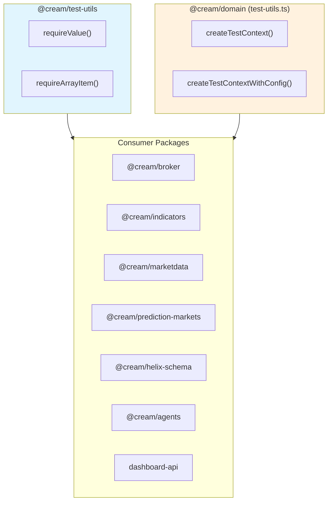
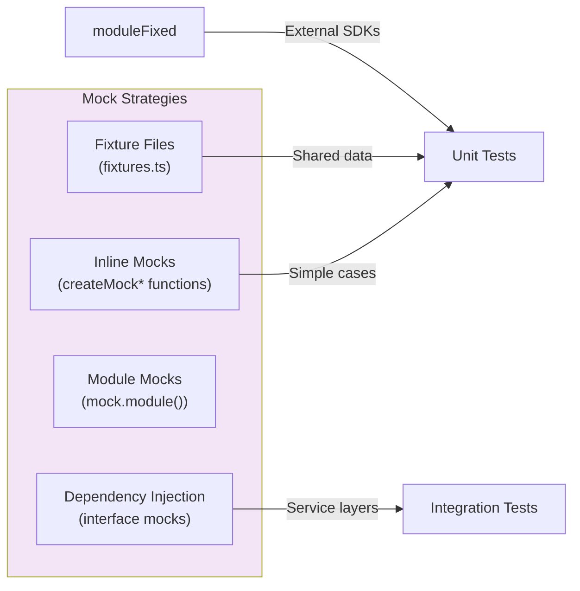
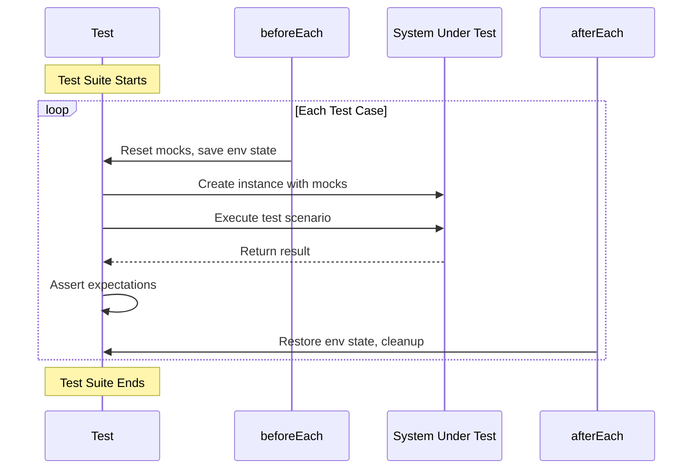
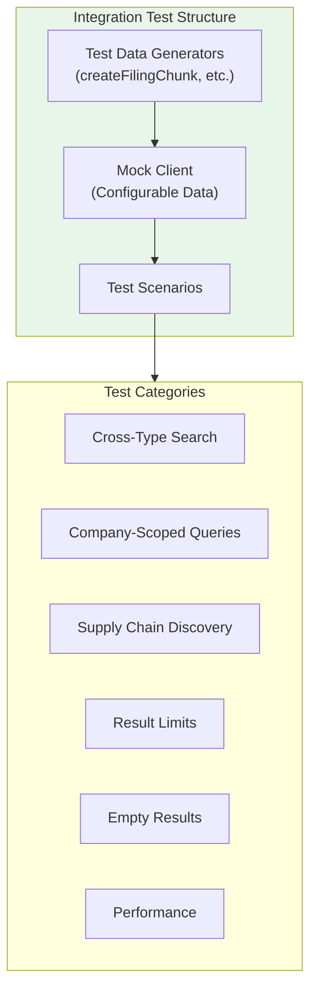

# @cream/test-utils

Shared test utilities for the Cream trading system monorepo. Provides type-safe assertion helpers that eliminate nullable type narrowing boilerplate in tests.

## Installation

```json
{
  "devDependencies": {
    "@cream/test-utils": "workspace:*"
  }
}
```

## API

### `requireValue<T>(value: T | null | undefined, label?: string): T`

Asserts a value is defined and returns it with narrowed type. Throws if `null` or `undefined`.

```ts
import { requireValue } from "@cream/test-utils";

const result = parseOptionSymbol("AAPL  251219C00200000");
const parsed = requireValue(result, "parsed option");
// parsed is now non-nullable - TypeScript knows it's defined
expect(parsed.underlying).toBe("AAPL");
```

### `requireArrayItem<T>(items: readonly T[], index: number, label?: string): T`

Safely accesses array element with type narrowing. Throws if index is out of bounds.

```ts
import { requireArrayItem } from "@cream/test-utils";

const results = await fetchMarkets();
const first = requireArrayItem(results, 0, "first market");
// first is guaranteed to exist
expect(first.ticker).toBeDefined();
```

## Architecture



## Testing Patterns in Cream

### Test File Organization

```
packages/
  {package}/
    src/
      {module}.ts
      {module}.test.ts        # Unit tests colocated with source
    tests/
      {feature}.test.ts       # Feature tests
      __tests__/
        fixtures.ts           # Shared fixtures
        {module}.test.ts      # Complex test suites
      integration/
        {feature}.integration.test.ts
```

### Mock Patterns



#### 1. Inline Factory Mocks

Used for simple, self-contained mocks within a test file.

```ts
// packages/indicators/src/service/indicator-service.test.ts
function createMockMarketDataProvider(bars: OHLCVBar[], quote: Quote | null): MarketDataProvider {
  return {
    async getBars() { return bars; },
    async getQuote() { return quote; },
  };
}

function createMockPriceCalculator(): PriceCalculator {
  return {
    calculate() {
      const indicators = createEmptyPriceIndicators();
      indicators.rsi_14 = 55.5;
      return indicators;
    },
  };
}
```

#### 2. Shared Fixture Files

Used when multiple test files need the same mock data or setup.

```ts
// packages/helix-schema/tests/__tests__/fixtures.ts
export function createNodeInfo(overrides: Partial<NodeInfo> = {}): NodeInfo {
  return {
    id: "test-node-1",
    nodeType: "TradeDecision",
    environment: "PAPER",
    createdAt: new Date(),
    accessCount: 0,
    edgeCount: 0,
    ...overrides,
  };
}

export function daysAgo(days: number): Date {
  const date = new Date();
  date.setDate(date.getDate() - days);
  return date;
}
```

#### 3. Module Mocking (External SDKs)

Used to mock entire external packages.

```ts
// packages/prediction-markets/src/providers/kalshi/__tests__/fixtures.ts
import { mock } from "bun:test";

export const mockGetMarkets = mock(() =>
  Promise.resolve({ data: { markets: [mockKalshiMarket] } })
);

mock.module("kalshi-typescript", () => ({
  Configuration: class Configuration {},
  MarketApi: class MarketApi {
    getMarkets = mockGetMarkets;
  },
}));

export function resetMocks(): void {
  mockGetMarkets.mockClear();
}
```

#### 4. Dependency Injection Mocks

Used for service-layer testing with full interface implementations.

```ts
// packages/indicators/src/service/indicator-service.test.ts
function createFullDependencies(): IndicatorServiceDependencies {
  return {
    marketData: createMockMarketDataProvider(createMockBars(200), createMockQuote()),
    optionsData: createMockOptionsDataProvider(),
    priceCalculator: createMockPriceCalculator(),
    liquidityCalculator: createMockLiquidityCalculator(),
    optionsCalculator: createMockOptionsCalculator(),
    fundamentalRepo: createMockFundamentalRepo(),
    cache: new IndicatorCache(),
  };
}

const service = new IndicatorService(createFullDependencies());
```

### ExecutionContext in Tests

The `@cream/domain` package provides `createTestContext()` for tests requiring an `ExecutionContext`:

```ts
import { createTestContext, createTestContextWithConfig } from "@cream/domain";

// Default: PAPER environment, source="test"
const ctx = createTestContext();

// Override environment for LIVE behavior testing
const liveCtx = createTestContext("LIVE");

// With config version tracking
const configCtx = createTestContextWithConfig("PAPER", "config-v1.2.3");
```

Key properties:
- `source` is always `"test"` (identifies test-originated contexts)
- `environment` defaults to `"PAPER"`
- Each call generates a unique `traceId`
- Context is frozen (immutable)

### Test Lifecycle Flow



### Environment Variable Testing

Pattern for testing env-dependent behavior:

```ts
import { afterEach, beforeEach, describe, expect, it } from "bun:test";

describe("requireEnv", () => {
  let originalBunEnv: string | undefined;

  beforeEach(() => {
    originalBunEnv = Bun.env.CREAM_ENV;
  });

  afterEach(() => {
    if (originalBunEnv !== undefined) {
      Bun.env.CREAM_ENV = originalBunEnv;
    } else {
      delete Bun.env.CREAM_ENV;
    }
  });

  it("returns PAPER when set", () => {
    Bun.env.CREAM_ENV = "PAPER";
    expect(requireEnv()).toBe("PAPER");
  });
});
```

### Fetch Mocking

Pattern for mocking `fetch` in API client tests:

```ts
// packages/marketdata/tests/helpers.ts
import { mock } from "bun:test";

export interface MockFetch {
  (...args: Parameters<typeof fetch>): ReturnType<typeof fetch>;
  preconnect: typeof fetch.preconnect;
  mock: {
    calls: [url: string | URL | Request, options?: RequestInit][];
  };
}

export function createMockFetch(implementation: () => Promise<Response>): MockFetch {
  const mockFn = mock(implementation);
  const typedMock = mockFn as unknown as MockFetch;
  typedMock.preconnect = () => {};  // Required by Bun's fetch type
  return typedMock;
}

export function createJsonResponse(data: unknown, status = 200): Response {
  return new Response(JSON.stringify(data), {
    status,
    headers: { "Content-Type": "application/json" },
  });
}
```

### Error Handling Tests

Pattern for testing graceful degradation:

```ts
test("handles partial failures gracefully", async () => {
  const deps = createFullDependencies();
  deps.fundamentalRepo = {
    async getLatest() {
      throw new Error("Database connection failed");
    },
  };

  const service = new IndicatorService(deps);
  const snapshot = await service.getSnapshot("AAPL");

  // Other indicators should still work
  expect(snapshot.price.rsi_14).toBe(55.5);
  // Failed data should be empty/null
  expect(snapshot.value.pe_ratio_ttm).toBeNull();
});
```

## Test Commands

```bash
# Run all tests (TypeScript + Rust)
bun run test

# Run TypeScript tests only
bun run test:ts

# Run Rust tests only
bun run test:rs

# Run integration/E2E tests
bun run test:e2e

# Run tests for a specific package
CREAM_ENV=PAPER bun test packages/broker/tests/
```

## Test Configuration

Tests run with:
- `NODE_ENV=test`
- `CREAM_ENV=PAPER`

The monorepo uses Turborepo for test orchestration. Package-specific `bunfig.toml` files can customize test behavior.

## Integration Test Patterns



Example from `graphrag.integration.test.ts`:

```ts
function createMockGraphRAGClient(testData: {
  filingChunks?: FilingChunkResult[];
  transcriptChunks?: TranscriptChunkResult[];
  newsItems?: NewsItemResult[];
}): MockGraphRAGClient {
  return {
    async searchGraphContext(options): Promise<GraphRAGSearchResult> {
      const { limit = 10, symbol } = options;
      let filingChunks = testData.filingChunks ?? [];

      if (symbol) {
        filingChunks = filingChunks.filter((c) => c.companySymbol === symbol);
      }

      return {
        filingChunks: filingChunks.slice(0, limit),
        executionTimeMs: performance.now() - startTime,
      };
    },
  };
}
```

## Best Practices

1. **Use `requireValue`/`requireArrayItem`** instead of non-null assertions (`!`) or type casts
2. **Colocate unit tests** with source files (`{module}.test.ts`)
3. **Use shared fixtures** for complex mock data across multiple tests
4. **Test graceful degradation** - services should handle partial failures
5. **Restore environment state** in `afterEach` when modifying `Bun.env`
6. **Use dependency injection** for service-layer testability
7. **Include performance assertions** for time-sensitive operations
