# @cream/tsconfig

Shared TypeScript configurations for the Cream monorepo. Provides strict, ES2024-based presets optimized for Bun runtime and React applications.

## Configuration Hierarchy

```mermaid
flowchart TB
    subgraph "@cream/tsconfig"
        BASE["base.json<br/>ES2024 + Strict Mode"]
        BUN["bun.json"]
        REACT["react.json"]
    end

    BASE --> BUN
    BASE --> REACT

    subgraph "Apps"
        DASHBOARD["dashboard<br/>(Next.js)"]
        DASHAPI["dashboard-api<br/>(Hono)"]
        WORKER["worker"]
        MASTRA["mastra"]
    end

    subgraph "Packages (Bun)"
        DOMAIN[domain]
        BROKER[broker]
        STORAGE[storage]
        AGENTS[agents]
        CONFIG[config]
        HELIX[helix]
        INDICATORS[indicators]
        REGIME[regime]
        UNIVERSE[universe]
        METRICS[metrics]
        FILINGS[filings]
        EXTERNAL[external-context]
        PREDICT[prediction-markets]
        HELIXSCHEMA[helix-schema]
        TESTUTILS[test-utils]
    end

    subgraph "Packages (Base)"
        LOGGER[logger]
        DASHTYPE[dashboard-types]
        MARKETDATA[marketdata]
    end

    REACT --> DASHBOARD
    BUN --> DASHAPI
    BUN --> WORKER
    BUN --> MASTRA
    BUN --> DOMAIN
    BUN --> BROKER
    BUN --> STORAGE
    BUN --> AGENTS
    BUN --> CONFIG
    BUN --> HELIX
    BUN --> INDICATORS
    BUN --> REGIME
    BUN --> UNIVERSE
    BUN --> METRICS
    BUN --> FILINGS
    BUN --> EXTERNAL
    BUN --> PREDICT
    BUN --> HELIXSCHEMA
    BUN --> TESTUTILS
    BASE --> LOGGER
    BASE --> DASHTYPE
    BASE --> MARKETDATA
```



## Configurations

### base.json

Foundation config with maximum type safety. All other configs extend this.

| Category | Settings |
|----------|----------|
| **Target** | ES2024 with `ESNext.Collection` |
| **Module** | `Preserve` with bundler resolution |
| **Strict** | All strict flags enabled |
| **Safety** | `noUncheckedIndexedAccess`, `noImplicitReturns`, `noImplicitOverride` |
| **Interop** | `verbatimModuleSyntax`, `allowImportingTsExtensions` |
| **Output** | Declaration maps, source maps, no emit |

```json
{
  "extends": "@cream/tsconfig/base.json"
}
```

**Use for**: Packages that need maximum portability or don't require Bun-specific types.

### bun.json

Extends base with Bun runtime types. Default choice for most packages.

```json
{
  "extends": "@cream/tsconfig/bun.json"
}
```

**Use for**: Backend services, CLI tools, packages using Bun APIs (`Bun.file()`, `Bun.serve()`, etc.).

### react.json

Extends base with DOM types and JSX support.

| Addition | Value |
|----------|-------|
| **JSX** | `preserve` (handled by Next.js/bundler) |
| **Lib** | Adds `DOM`, `DOM.Iterable` |
| **Types** | `react`, `react-dom` |

```json
{
  "extends": "@cream/tsconfig/react.json"
}
```

**Use for**: React/Next.js applications with browser APIs.

## Usage Patterns

### Standard Package

```json
{
  "extends": "@cream/tsconfig/bun.json",
  "compilerOptions": {
    "outDir": "dist",
    "rootDir": ".",
    "types": ["@types/bun"]
  },
  "include": ["src/**/*", "tests/**/*"],
  "exclude": ["dist", "node_modules"]
}
```

### Next.js App

```json
{
  "extends": "@cream/tsconfig/react.json",
  "compilerOptions": {
    "jsx": "preserve",
    "incremental": true,
    "plugins": [{ "name": "next" }],
    "paths": {
      "@/*": ["./src/*"]
    }
  },
  "include": ["next-env.d.ts", "**/*.ts", "**/*.tsx", ".next/types/**/*.ts"]
}
```

## Key Compiler Options

| Option | Value | Rationale |
|--------|-------|-----------|
| `noUncheckedIndexedAccess` | `true` | Forces handling of potentially undefined array/object access |
| `verbatimModuleSyntax` | `true` | Enforces explicit `type` imports, enables tree-shaking |
| `moduleDetection` | `force` | Treats all files as modules (required for Bun) |
| `isolatedModules` | `true` | Required for bundler compatibility |
| `allowImportingTsExtensions` | `true` | Allows `.ts` extensions in imports (Bun native) |

## Adoption by Package Type

| Config | Count | Packages |
|--------|-------|----------|
| `bun.json` | 19 | Most packages + apps (worker, dashboard-api, mastra) |
| `base.json` | 3 | logger, dashboard-types, marketdata |
| `react.json` | 1 | dashboard |
