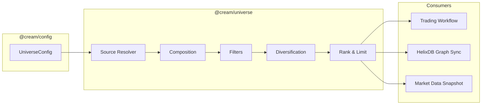
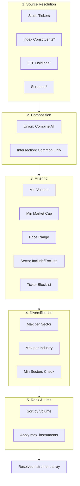
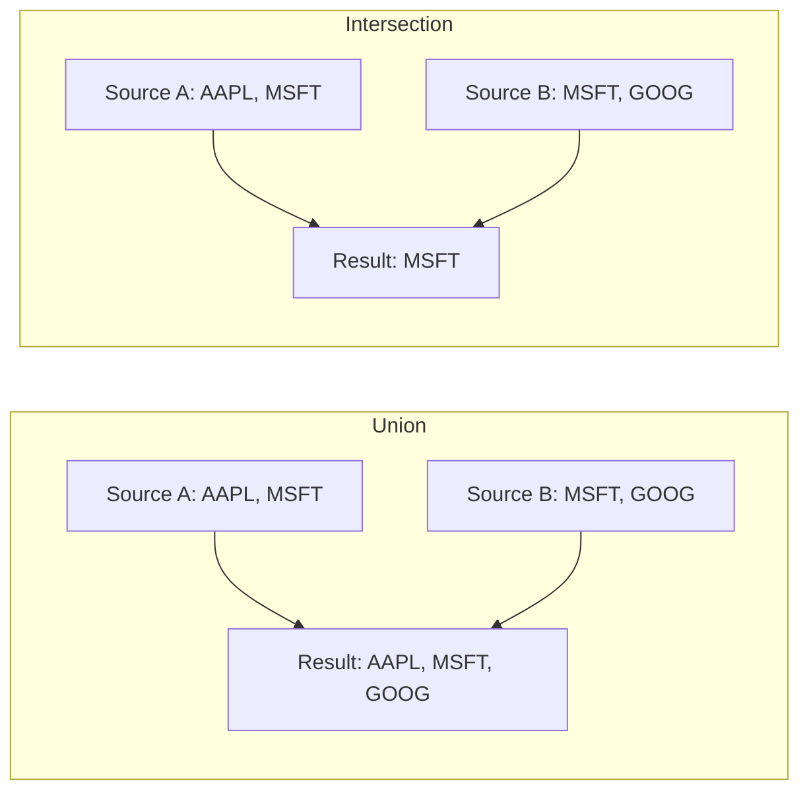
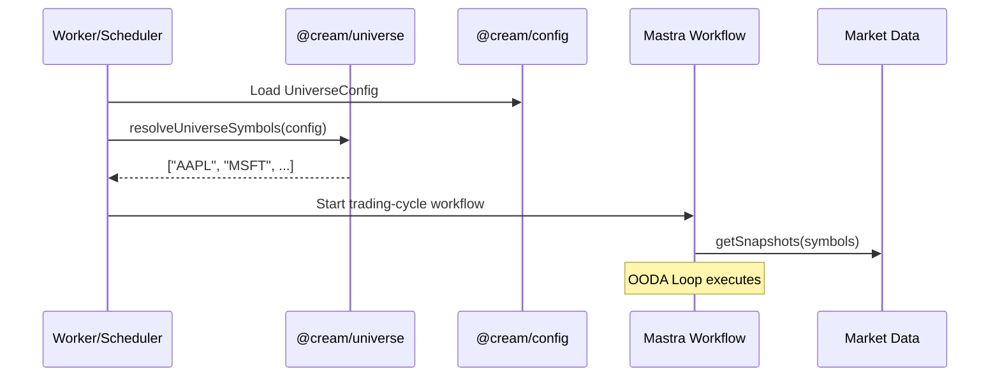

# @cream/universe

Trading universe resolution for Cream's OODA trading loop. Determines which instruments to trade before each cycle runs.

## Architecture



## Resolution Pipeline



*Index, ETF, and Screener sources are defined in schema but not yet implemented. Use static sources.

## Usage

```typescript
import { resolveUniverse, resolveUniverseSymbols } from "@cream/universe";
import type { UniverseConfig } from "@cream/config";

const config: UniverseConfig = {
  compose_mode: "union",
  sources: [
    {
      type: "static",
      name: "core_holdings",
      enabled: true,
      tickers: ["AAPL", "MSFT", "GOOG", "AMZN", "META", "NVDA"],
    },
    {
      type: "static",
      name: "watchlist",
      enabled: true,
      tickers: ["TSLA", "AMD", "CRM"],
    },
  ],
  filters: {
    min_avg_volume: 1_000_000,
    min_market_cap: 10_000_000_000,
    min_price: 10,
    max_price: 1000,
    exclude_tickers: ["BRKB"],
    include_sectors: ["Technology", "Communication Services"],
  },
  max_instruments: 50,
};

// Full resolution with metadata
const result = await resolveUniverse(config);
console.log(result.instruments);     // ResolvedInstrument[]
console.log(result.stats.final);     // Count after all stages
console.log(result.warnings);        // Filter/composition warnings

// Just symbols
const symbols = await resolveUniverseSymbols(config);
// ["AAPL", "MSFT", "GOOG", ...]
```

## Composition Modes

| Mode | Behavior |
|------|----------|
| `union` | Combine all sources, deduplicate by symbol. Metadata merged when symbol appears in multiple sources. |
| `intersection` | Only symbols present in ALL enabled sources survive. |



## Filters

Applied post-composition. All filters work with instrument metadata already present.

| Filter | Type | Description |
|--------|------|-------------|
| `min_avg_volume` | number | Minimum average daily volume |
| `min_market_cap` | number | Minimum market capitalization |
| `min_price` | number | Minimum share price |
| `max_price` | number | Maximum share price |
| `exclude_tickers` | string[] | Blocklist (case-insensitive) |
| `include_sectors` | string[] | Allowlist - only these sectors |
| `exclude_sectors` | string[] | Blocklist - exclude these sectors |

Filters require metadata on instruments. Static sources provide only symbols - use with enriched data or skip metadata-dependent filters.

## Diversification

Optional sector/industry concentration limits:

```typescript
const config = {
  sources: [...],
  max_instruments: 100,
  diversification: {
    maxPerSector: 10,      // No more than 10 per sector
    maxPerIndustry: 5,     // No more than 5 per industry
    minSectorsRepresented: 5,  // Warn if fewer sectors
  },
};
```

## Point-in-Time Resolution

Prevents survivorship bias in historical testing by resolving the universe as it existed on a past date:

```typescript
import {
  createPointInTimeResolver,
  PointInTimeUniverseResolver
} from "@cream/universe";

// Requires repository implementations from @cream/storage
const resolver = new PointInTimeUniverseResolver(
  constituentsRepo,
  tickerChangesRepo,
  snapshotsRepo,
  { useCache: true, maxCacheAgeDays: 30 }
);

// S&P 500 as it was on 2020-01-15
const result = await resolver.getUniverseAsOf("SP500", "2020-01-15");
console.log(result.symbols);  // Historical constituents
console.log(result.metadata.tickerChangesApplied);  // Ticker renames handled
```

Survivorship bias impact: 1-4% annual return inflation if not addressed.

## FRED Client

Access Federal Reserve Economic Data for macro context:

```typescript
import {
  createFREDClientFromEnv,
  FRED_RELEASES,
  FRED_SERIES,
  classifyReleaseImpact
} from "@cream/universe";

const client = createFREDClientFromEnv();

// Upcoming release dates
const dates = await client.getReleaseDates({ limit: 100 });

// Series observations
const cpi = await client.getObservations("CPIAUCSL", {
  observation_start: "2024-01-01",
});

// Latest value convenience method
const latest = await client.getLatestValue("UNRATE");
// { date: "2024-12-01", value: 4.2 }

// Impact classification
const impact = classifyReleaseImpact(FRED_RELEASES.FOMC.id);
// "high"
```

### Tracked Releases

| Key | Release | Impact |
|-----|---------|--------|
| CPI | Consumer Price Index | High |
| EMPLOYMENT | Employment Situation | High |
| GDP | Gross Domestic Product | High |
| FOMC | FOMC Press Release | High |
| RETAIL_SALES | Advance Monthly Retail Sales | High |
| PPI | Producer Price Index | Medium |
| JOLTS | Job Openings Survey | Medium |

## Integration with Trading Loop



## Types

```typescript
interface ResolvedInstrument {
  symbol: string;
  source: string;          // Source name(s) comma-separated
  name?: string;
  sector?: string;
  industry?: string;
  marketCap?: number;
  avgVolume?: number;
  price?: number;
}

interface UniverseResolutionResult {
  instruments: ResolvedInstrument[];
  sourceResults: SourceResolutionResult[];
  composeMode: "union" | "intersection";
  resolvedAt: string;
  warnings: string[];
  stats: {
    totalFromSources: number;
    afterComposition: number;
    afterFilters: number;
    afterDiversification: number;
    final: number;
    sectors: string[];
  };
}
```

## Testing

```bash
bun test
```

Tests cover:
- Static source resolution and uppercase normalization
- Union and intersection composition
- All filter types
- Diversification limits
- Ranking and max_instruments limit
- Metadata merging from multiple sources
